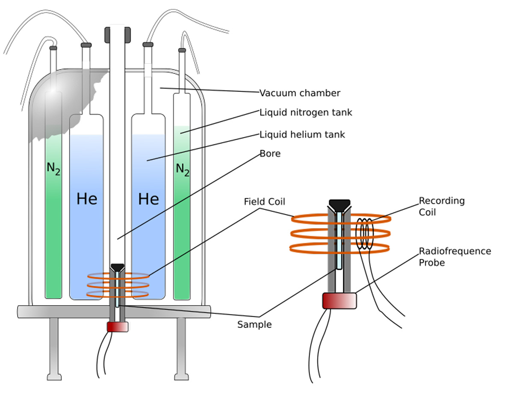

NMR spectrometers consist of three main components: a superconducting magnet, a probe and a complex electronic system 
(console) controlled by a workstation (Figure 3).

General design of an NMR spectrometer with its principal components - workstation, NMR console, magnet and probe section.

_General design of an NMR spectrometer with its principal components. Credit: Technology Networks._

The magnet is responsible for the generation of a strong magnetic field that aligns the nuclear spins of the atoms 
present in the sample. Nowadays, the magnets used in NMR spectroscopy are based on superconducting materials, and thus, 
they require very low temperatures to work (around 4 K). For this reason, NMR spectrometers contain a cooling system 
composed of an inner jacket filled with liquid helium which is refrigerated by an additional jacket filled with liquid 
nitrogen, and many layers of thermal isolating materials.

The superconducting magnet surrounds a cylindrical chamber known as the “probe”, which is a crucial component of the 
instrument. The sample is introduced into the probe and thus placed under the influence of the magnetic field. 
Additionally, the probe contains a series of magnetic coils that are also located around the sample. These 
coils have multiple purposes. On one hand, they are used to irradiate the radiofrequency pulses and to detect and 
collect the NMR signal emitted by the sample. On the other hand, they also enable control of the magnetic field 
homogeneity and the application of pulse gradients that are used in some NMR experiments.

Internal components of an NMR spectrometer, including a detailed view of the probe. The location of the probe and 
sample can be seen in relation to the cooling outer liquid helium and nitrogen coats.

_Internal components of an NMR spectrometer, including a detailed view of the probe. Credit: KissCC0._

Finally, the electronic system of the spectrometer controls all the experimental conditions and enables the set-up and 
modification of every parameter of the NMR experiment through the workstation. This system is also responsible for 
data acquisition and subsequent mathematical transformation into an NMR spectrum. The spectrum contains a series of 
peaks of different intensities as a function of a magnitude known as the chemical shift that is derived from the 
Larmor frequency of the different atomic nuclei present in the sample.