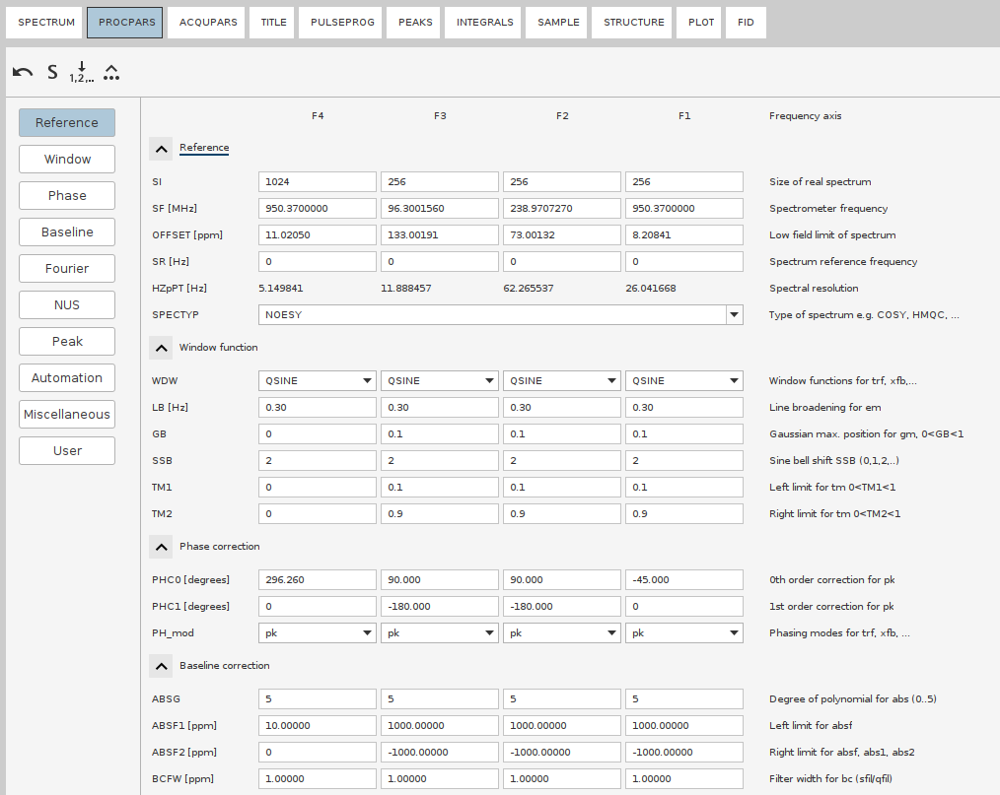
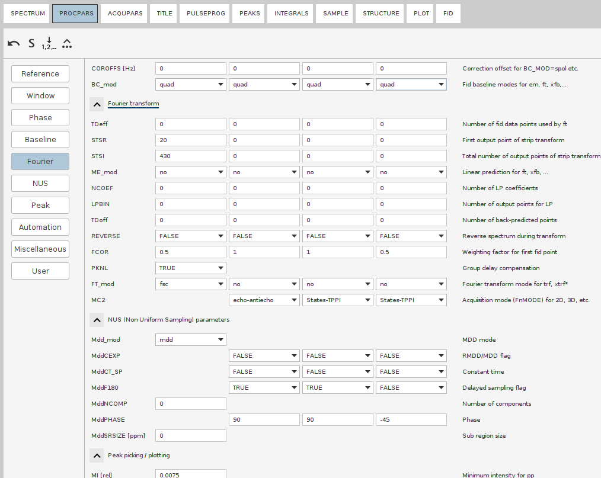
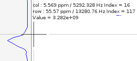
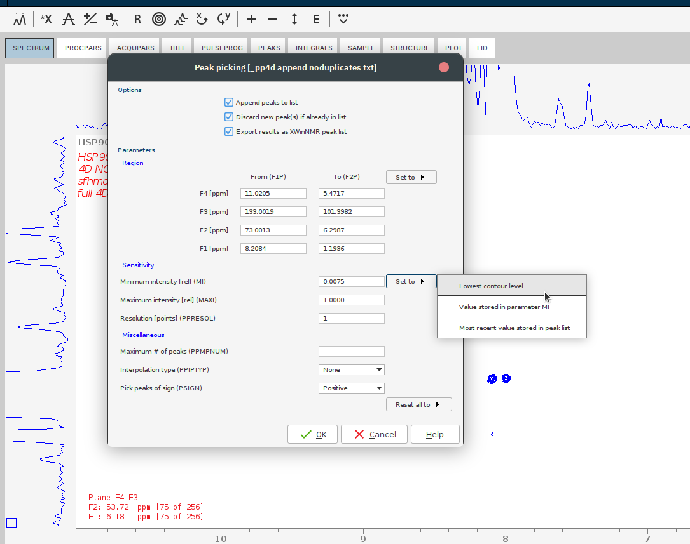
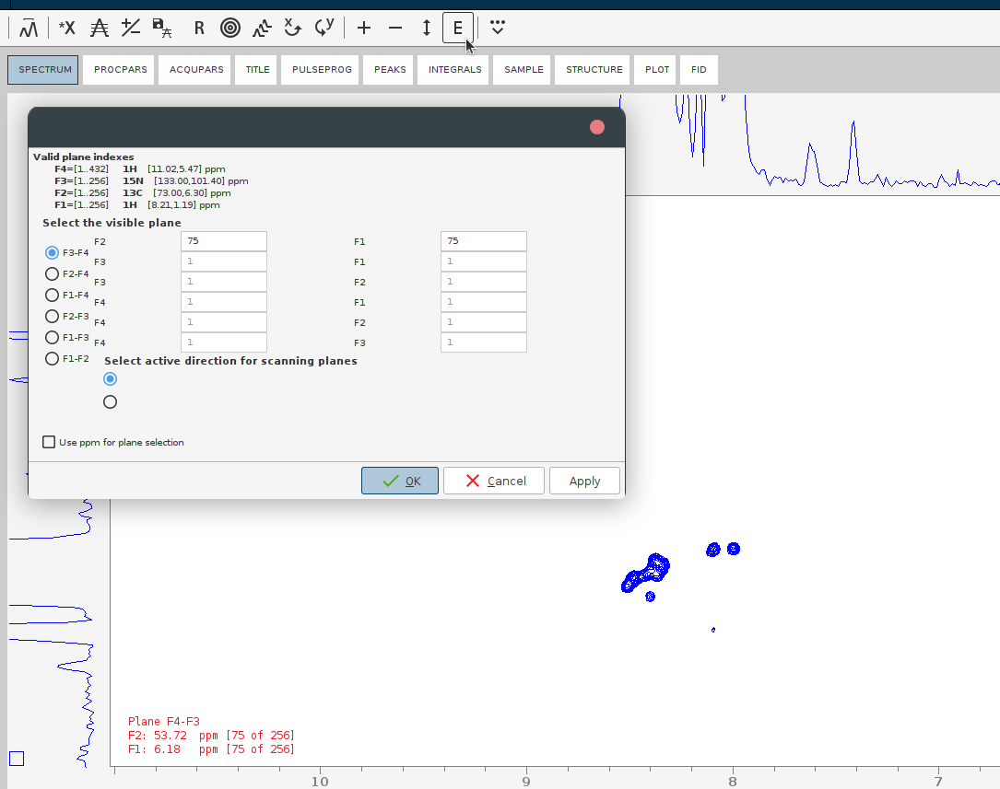

### Table of contents
- [General workflow](#general-workflow)
  - [Troubleshooting](#troubleshooting)
    - [Post-reconstruction phasing](#post-reconstruction-phasing)
    - [The reconstructed spectrum is left in the time domain](#the-reconstructed-spectrum-is-left-in-the-time-domain)
- [Examples](#examples)
  - [Bruker 4D HCNH NOESY](#bruker-4d-hcnh-noesy)
    - [Processing steps](#processing-steps)
  - [Simple alerts](#simple-alerts)

Tested environment:
* Topspin 4.4.0 *with commercial license* for NUS processing
* OS: AlmaLinux 9 (as an Oracle virtual machine)
* 20 CPU cores, 120 GB of RAM. 

> [!WARNING]
> Not everything is thoroughly tested yet

# General workflow

1. Copy the raw 4D spectrum in a new directory by executing `wrpa` command. This will make working with the 4D neat and safe.
> [!NOTE]
> NUS FIDs before reconstruction are not that heavy: the `ser` files are usually <1 Gb. 
2. Swich to the newly copied procedure; Open up the processing parameters (`edp` or the tab `PROCPAR`). 
3. Adjust the size of the dimensions in the final spectrum with the parameter `SI` - set it to `256`
> [!IMPORTANT]
> Even though the next power of 2 to the size of fully reconstructed spectrum would be most often 128, *in our hands* TopSpin behaves weirdly with SI set to 128, e.g. will leave indirect dimensions in time domain. This means, that the attept to save processing time by reducing the size of the reconstructed spectru *may be futile*, because Topspin just *may not complete the processing*. Use your best judgement whe deciding on the size of the final spectrum. 
4. If there were recorded test 2D **planes** (or 3D cubes) with **this exact** 4D pulse program, check their processing parameters:
    * Phasing in the direct and indirect dimensions
    * Window functions (rarely changes from default)
    * Baseline correction parameters (rarely changes from default)
    * Linear Prediction (LP), if you use it.
> [!TIP]
> Using linear prediction (LP) can enhance resolution, especially if the time domain (TD) values are small or if your FIDs are truncated. In TopSpin, you can use LP for improving resolution in particular dimensions during the Fourier Transform process by specifying the ME_mod and NCOEF parameters for those dimensions. Note that it may cause additional wiggles.

5. Set the `FnMODE` according to the acquisition mode (usually, it is `States-TPPI`)
6. Note down the signal region in the direct dimension. It can be extracted either from the test planes or the 2D experiments (HSQC, TOCSY, etc). 
    * Go to the 2D experiment. Zoom in such that the signal-free regions are trimmed as much as possible. Issue the `.ftf2region STSR` command, it will prompt to  `Save display region to Parameters STSR\SI`.
    * Issue the `STSR` command. Note down the values for the direct dimension. Same with `STSI`
> [!TIP]
> Those values may be obtained manually: in the 1D or 2D spectrum, note the "col Index" (`16` on the screenshot). Save it into `STSR`. Move the coursor to the right and calculate the width of the dimension in points, save that number into `STSI`.   

    
> [!IMPORTANT]
> If you copy the FT region from the planes, make sure the spectrum windows (SW) of the 4D and the test planes are the same. If they are not, the signal regions have to be adjusted manually. 
7. Go to the `NUS` section. Check that the NUS mode is `mdd` (default). Set the phasing of the indirect dimensions to the same values as in the `Phase` section (i.e. `PH0` and `PH1`). 
8. When everything is ready, issue 

    `ftnd 0 21234 dlp nusthreads 30`

* `ftnd` will run the NUS reconstruction, followed by FT all directions, with the Window Multiplication (WM), baseline correction and the LP as specified in the PROCPARS. `0` stands for "all dimensions", `21234` stands for the procedure number?, `dlp` stands for the region truncation???, `nusthreads 30` allocates 30 CPU cores for the process. 
> [!NOTE]
> Whereas NUS reconstruction is parallelized, FT stage uses only a single thread, therefore takes multiple hours.
9. *Optionally*: adjust baseline correction parameters and apply the automatic baseline correction to the whole reconstructed 4D spectrum by issuing `absnd`.
10. Evaluate the quality of the reconstructed spectrum by looking at the sum projections. You need to look at both positive and negative projections to identify the antiphase signals as well as the potentially misphased peaks. This is done by the command `projplp` and `projpln`. Run each and provide the parameters over the GUI or run the single lines such as `projplp 12 all all 21` 
    - `projplp` stands for positive projection; run `projpln` to get the negative one
    - `12` refers to keeping the first two dimensions (for standard Bruker HSQC NOESY, those are C and HC dimensions); that means, N (F3) and direct H (F4) will be summed up.
    - `all` indicates that all planes within these dimensions should be included.
    - `21` specifies the output PROCNO where the projection data will be stored. Adjust the PROCNO based on where you want to save the output.
11. Perform automatic baseline correction of the projections with `abs1` followed by `abs2`.
12. If the projections look good, evaluate the 4D spectrum. 
    * Perform a putative peak picking. For that, lower the countours such that the noise disappears, then issue `pp` and set the sensitivity to the lowest countour level. 
    
    
    * Jump to some position of the 4D which contains signals. For that, press the E button and give the plane numbers or the desired ppm.

    

13. If the phasing or other processing parameters are off, adjust them and repeat the reconstruction. If the projections looks good - congratulations!

## Troubleshooting 

### Post-reconstruction phasing
If the spectrum appears to be misphased, it has to be processed all over again. 
To determine the optimal phasing angles:
* Navigate to your peak list. Note down the positions of several peaks you want to phase (in points). 
  * If the specrum lines are in dispersion shape, i.e. misphased by 90°, you may have to fine tune the peak picking parameters to get the positions of the most strongest peaks.  
* `rpl` - to Read PLane from the 4D spectrum. Set the plane numbers to the positions of your selected peaks. 
  * As such, the command `rpl 34 75 70 347570` will extract a 34 (which is, usually, HN) plane at the point 75 in F1 and 70 in F2 and write it into the procedure 347570 
*  `xif1` and `xif2` to execute the inverse FT, thereby restoring the imaginary part necessary for phasing
*  `xfb` to execute FT and get back to the frequency domain
*  `.ph` to enter the interactive phasing mode
*  Note down the values of PH0 and PH1. Modify the `PHC0`, `PHC1` and `MddPHASE` paramenters accordingly. 
* Repeat the same in all dimensions (e.g. 21 planes) and do not rely on phasing the single peak: make sure to test several planes, and perhaps not only the planes with peak maxima but also peak borders!
* Reinitiate the NUS reconstruction. 

### The reconstructed spectrum is left in the time domain
* Run `ftnd 3`, `ftnd 2` and `ftnd 1` to reconstruct the dimensions one by one. 
  * This should not initiate NUS reconstruction, at least on the machines without the NUS license. 

# Examples

## Bruker 4D HCNH NOESY

`hsqcnoesyhsqccngp4d`

Dimensions:

|  |  |
|---|---|
|F1|C|
|F2|Hc|
|F3|N|
|F4|HN|

### Processing steps

1. Open the 4D; copy to a new procedure (i.e. 1000): `wrpa 1000`
2. `rep 1000` to switch to the procedure 1000
3. 
## Simple alerts
> [!NOTE]
> This is a note.

> [!TIP]
> This is a tip. (Supported since 14 Nov 2023)

> [!IMPORTANT]
> Crutial information comes here.

> [!CAUTION]
> Negative potential consequences of an action. (Supported since 14 Nov 2023)

> [!WARNING]
> Critical content comes here.
