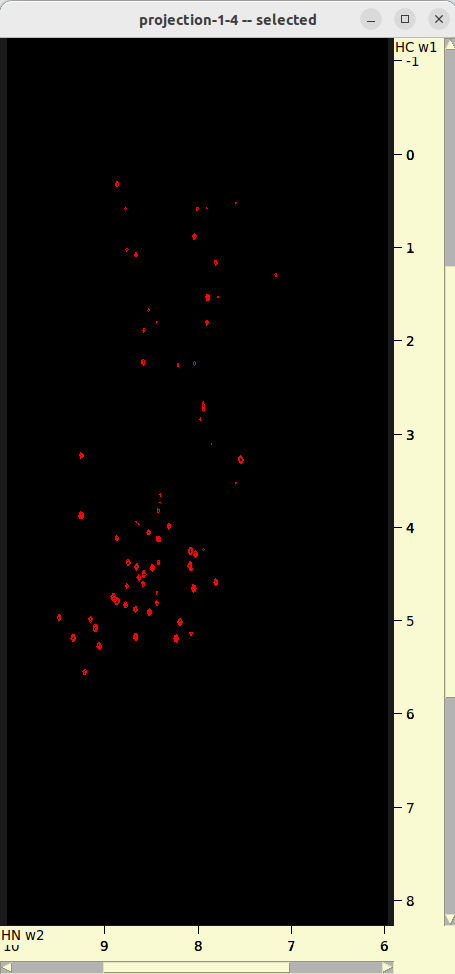
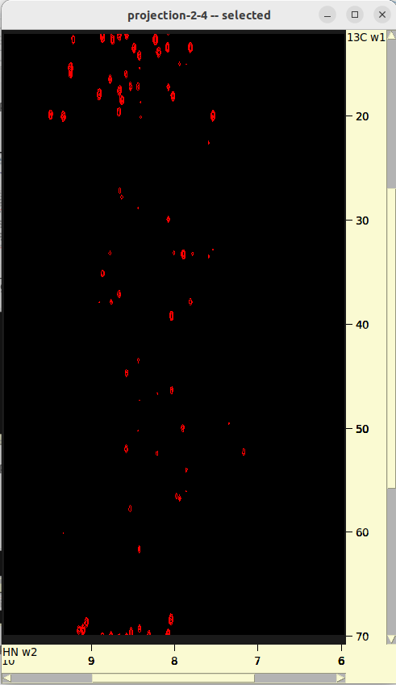
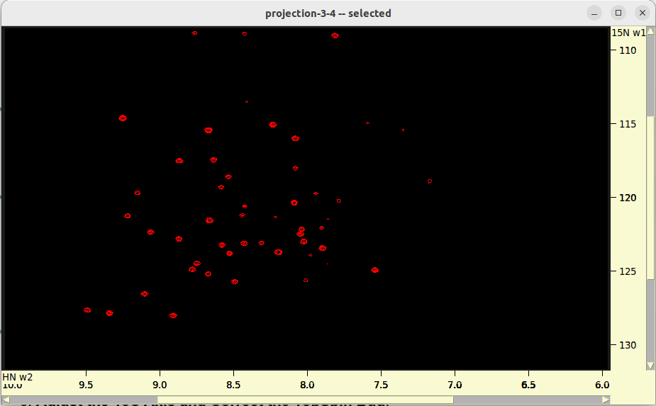
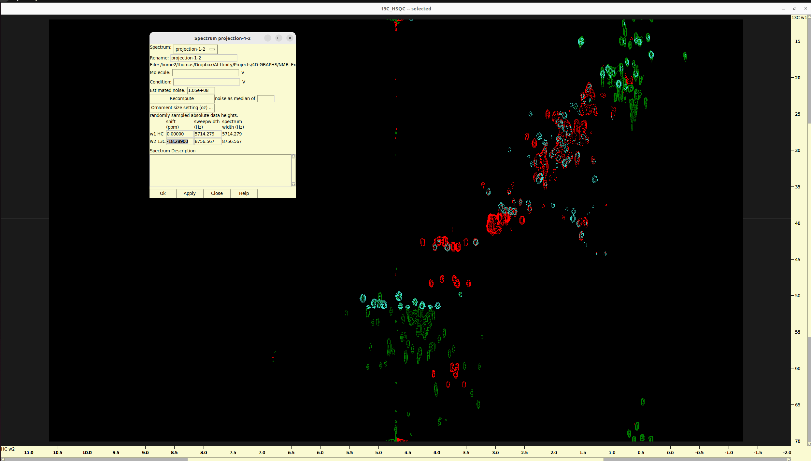
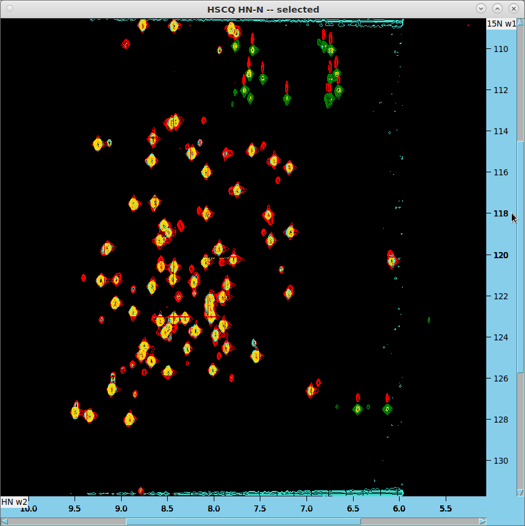
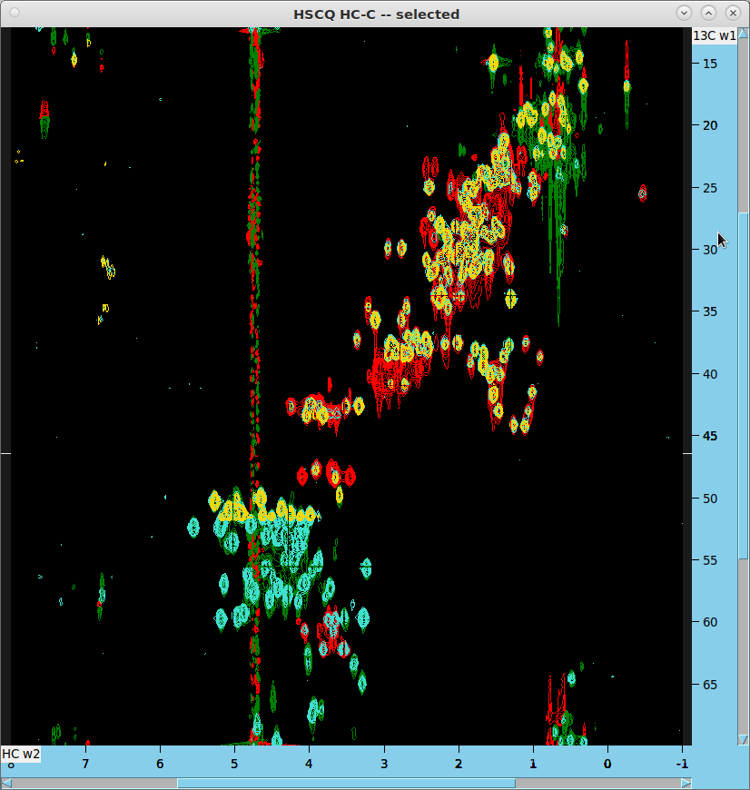

NUS Processing of Ubiquitin 4D NOESY
------------------------------------------------------------------

This guide outlines the process for handling Ubiquitin 4D NOESY data using a combination of `preprocSPARSE`, `nmrPipe`, `MFT`, and `SSA` on various UNIX-based systems. 

**Note:** The acquisition data (`.ser`) and the full 4D spectrum (`spectrum.ucsf`) are not included in this guide.

## Software Requirements

- `preprocSPARSE` v1.5
- `nmrPipe` v11.2
- `MFT` v1.87
- `SSA` v1046/1066

**Tested Environments:** Ubuntu 22.04, CentOS 7, Fedora 3X, Debian 10-11, FreeBSD 10-12

### Important Considerations

1. **preprocSPARSE Compatibility:** This script depends on several UNIX and NMRPipe programs and may not be compatible with all UNIX systems. It's distributed under GPL license in version 1.5. If licensing issues arise, consider using the original version (1.0), which requires manual edits of automatically generated files but has no license restrictions. For more details, visit the [preprocSPARSE homepage](http://nmrcf.ncbr.muni.cz/nus/).

2. **MFT/SSA Compatibility:** There are known issues with MFT/SSA binaries on some GNU/Linux systems, including crashes and empty spectra generation.

3. The license for MFT/SSA restricts use to non-commercial purposes.

4. **Some versions of Topspin incorrectly set the carrier frequency (CAR) values in the acquisition files (acqu*)**; for more information, 
   refer to step 2 below. This error should be corrected either before the Non-Uniform Sampling (NUS) reconstruction of the 4D spectrum, 
   as outlined below, or after that, during the peak picking process. While the most accurate method to fix this Topspin referencing error is before 
   NUS reconstruction, for automation purposes, it can also be manually adjusted during peak picking. This adjustment involves aligning 
   the HC-13C projection with the 13C HSQC using Sparky, as detailed in step 7 below. Although there are some numerical discrepancies 
   between these two methods, the resulting 13C axis shifts should be nearly identical and are generally negligible.
   

## Processing Workflow for AIffinity/101 with pulseprogram noehcnhwg4d_nove

### Initial Setup and Corrections

**native axis order:** HN-15N-13C-HC
**MFT/SSA axis order:** HN-HC-13C-15N

1. **Change Directory** to AIffinity/101:
   ```bash
   cd AIffinity/101
   ```
2. **Correct Known TopSpin Bugs** related to badly writren CAR values (average shifts of each nucleus):
   - For the 13C axis, change from 39.1096 ppm to 41 ppm.
   - For the HC axis, change from 6.666 ppm to 4.7 ppm.

   These corrections are included in the `preprocSPARSE.inp.1.5` file provided.
   
   - **How to calculate the correct 13C and HC CAR values and which version of Topspin generates this error?**

     **Answer:** The process involves some trial and error. Review all the SFO and BF values listed in the respective 
     acquisition files (acqu*) and try to determine which version of Topspin was used based on these values. 
     Additionally, other parameters, such as SW, might also be incorrect. The issue was initially reported a while ago, 
     and although Bruker has released about 2-3 patches to address it, the error still occurs randomly in various 
     versions, so there is no guaranteed way to predict which versions are error-free.


3. **Execute preprocSPARSE**:
   ```bash
   preprocSPARSE -nuft < preprocSPARSE.inp.1.5
   ```
4. **Navigate to the spectra Directory**:
   ```bash
   cd spectra/
   ```

### Running preprocSPARSE and Adjustments

1. **Create a `run.sh` Script** as indicated by the final message from `preprocSPARSE`:
   - Limit the HN axis to 6-10 ppm: add `--roi=10:6`
   - Flip HC and 13C axes: add `--flip=110` to cleaner; argument --flip flips selected INDIRECT dimensions; this is controled by the FLIP[234] parameters in proprocSPARSE.inp 
   - For no States-TPPI: optionally add `--tppi=000` to cleaner; argument --tppi applies States-TPPI sign inversions for odd increments; this is controled by the SWAP[234] parameters in proprocSPARSE.inp
   - Limit HC axis to 8 ppm: add `--limits=:8` to reconstructor
   
   **NOTE**: **States-TPPI (Time Proportional Phase Incrementation):** This is a method used to improve the resolution and sensitivity of NMR spectra, especially in multi-dimensional experiments. It involves acquiring multiple transients with different phase cycling schemes to effectively suppress unwanted signals and artifacts.
   **Sign Inversions for Odd Increments:** In the States-TPPI method, each FID (Free Induction Decay) is acquired with a specific phase cycling pattern. For odd increments, the phases of the FIDs are systematically inverted compared to those of the even increments. This inversion helps in canceling out certain artifacts or unwanted signals, improving the quality of the spectrum.
Putting it together, "States-TPPI sign inversions for odd increments" means that in the acquisition of the 4D NOESY spectrum, the States-TPPI method is employed, and for every odd increment, the phases of the acquired FIDs are systematically inverted compared to the even increments. This technique aids in enhancing the spectral quality by minimizing artifacts and improving signal resolution in the indirect dimensions of the spectrum.

2. **Edit `parameters.txt`**:
   - Change names to HN, HC, 13C, 15N.
   - Set `phases2` to "0.0 180.0" for a 1-point delay in 13C.

3. **Check for `test.fid`**, and if missing, execute:
   ```bash
   ./fid.com
   ```

4. **Perform a NUS Test Run** (fast, without NUS cleaning):
   ```bash
   ./run.sh
   ```
   - Review 2D projections in `roi_6_10-nuft/`.
   - Adjust `parameters.txt` and/or `run.sh` if necessary.
   
   
   
   

5. **Edit `run.sh`** to comment out the first part and uncomment the second part for a full NUS run (slow, with NUS cleaning):
   ```bash
   ./run.sh
   ```
   - Review 2D projections and the 4D spectrum in `roi_6_10/`.

6. **Clean Up Temporary Files**:
   ```bash
   rm test.fid cleaner_fid
   ```
   
7. **Adjust the 13C Axis and Correct the TopSpin Bug**:

   - The **13C axis is folded by 1/4*SW** and relevant peaks are aliased. The amount of folding is also influenced by 
   the mentioned TopSpin bug. For a definition of "aliasing" and "folding" read [this](https://sites.google.com/site/ccpnwiki/home/documentation/ccpnmr-analysis/core-concepts/folding-and-aliasing).
   An example of spectrum aliasing-unaliasing can be found [here](https://sopnmr.blogspot.com/2016/04/aliasing.html).
   To match the 13C axis in the 4D NOESY with the 2D HC-C HSQC (AIffinity/3/), 
   shift the 13C axis in Sparky by this amount: -(58.0333/4 + (41-39.1096)*2) = -18.289 ppm. Fortunately, when 
   exporting the shifted peaks from Sparky to a Sparky list file, they preserve the corrected 13C coordinates. 
   The most correct approach would be to do "circular shift" on the raw 4D spectrum, to unfold aliased peaks, as 
   it's impractical to do CS on a finished 4D (~10GB size). But this cannot be done in SSA programs or in Sparky. 
   It is typically compensated by the peak aliasing feature in Sparky during peak picking/assignment. NMRPipe and 
   nmrglue have "circular shift" functions.
   
     - http://nmrwiki.org/wiki/index.php?title=CS_-_circular_shift_%28nmrPipe_function%29
   
     - https://nmrglue.readthedocs.io/en/latest/reference/generated/nmrglue.process.proc_base.cs.html
   
   **Procedure in Sparky:**

   - Make sure than the name of nuclei in both the 2D projection and HSQC are the same. E.g. 13C and HC. If not,
     use `ucsfdata` command line utility from Sparky to rename them accordingly.
   - load the 2D projection and the 13C HSQC to Sparky.
   - `xa` on both widnows to view the axes names, and, if needed, `xr` to roll them and make both windows consistent.
   - `yt` and synchronize both axes.
   - `ct` to adjust the peak contours and colors
   - `ol` and create an overlay of the 2D projection to the 13C HSQC.
   - `st`, select the 2D projection and replace the `0.000` value in the `13C` row and under the `shift` column with `-18.289`. 
     Click apply and you are done!
   - Alternatively, if you don't know the exact shift, you can add with gradually increasing shift files in the `st` 
     table, type `al`, chose one reference peak in eachg spectrum, and use it to align the two spectra. To do that, 
     switch to peak selection mode with `F1`, hold the "shift" button and select the 13C HSQC peak on the overlaid 
     spectra window and the other peak in the 2D projection window. Once the are both selected, click the `Align` 
     button. Then check the shift offset values in spectrum settings (`st`)

   
   
   *Overlay of HC-C plane and 13C HSQC*


8. **Unalias Peaks in Sparky and Export them to a File**

**Identify folded or alias peaks**: an experienced eye can easily do that, but for a beginner chemical shift prediction 
from a PDB file (e.g. AlphaFold structure) could provide insights about where and wich peaks to expect. You can use the 
following online tool:

https://shiftx2.ca/
http://carbon.structbio.vanderbilt.edu/index.php/servers/show?s_id=9

For maximum performance I recommend installing and running locally [UCBShift](https://github.com/THGLab/CSpred/blob/master/CSpred.py) 

**Aliased Peaks:** To correct peaks that read at incorrect chemical shifts (i.e. folded peaks) right click on the peak
which will open a view menu. On the view menu click “Alias” and select the command (Add a sweepwidth,
Subtract a sweepwidth, Reflect upfield.....etc. )that will correct the peak. To confirm that a peak has been corrected
unselect a peak and then reselect it and confirm the chemical shift has changed on the Assignment Menu “at”. If you
have made a mistake “unalias a peak” by selecting Unalias Selected Peak on the Alias Menu or use “ua” accelerator
this will restore the original chemical shift, confirm as above. Aliased Peaks can be corrected on HSQC or strips of
3D data sets, correcting the HSQC will no necessary correct the chemical shifts on the strip data.

Spectra acquired in TPPI mode can create aliased peaks that are reflected about the up field or down field edge of the
spectrum. The u1 command gives the selected peak an alias by reflecting the peak w1 position about the up field 
spectrum edge. Using the u1 command a second time removes the alias from the selected peak. The u2, u3 and u4 commands 
mark selected peaks as aliased in the w2, w3 and w4 dimensions. The d1, d2, ... commands perform the reflection about 
the down field edge of the spectrum.

**Sparky Commands for Peak Unaliasing:**
add sweepwidth a1 a2 a3 a4: Adjust peak w1,w2,w3,w4 frequency one sweepwidth downfield.
subtract sweepwidth A1 A2 A3 A4: Adjust peak w1,w2,w3,w4 frequency one sweepwidth upfield.
reflect upfield u1 u2 u3 u4: Reflect (aka unfold) peak w1,w2,w3,w4 frequency about the upfield boundary.
reflect downfield d1 d2 d3 d4: Reflect (aka unfold) peak w1,w2,w3,w4 frequency about downfield boundary.
center peaks pc: center selected peaks at local maxima or minima.
get linewidths pe: Get linewidth of selected peaks as width at half max.
group peaks pg: create a peak group from selected peaks
undo eu: undo last peak move, deletion, or integration.


Once you make sure that the shift value `-18.289` is the correct one, then go to the 4D spectrum to unalias the aliased peaks.
- Load again both 15N HSQC and 13C HSQC, to alias peaks on the 15N, HN and on 13C,HC dimensions, respectively.
- Create groups of peaks on which you must apply the same aliasing operation with `pg`.
- unfold them using the commands for Peak Aliasing mentioned above. Always control if peaks are translate by selecting
  one and clicking `at`. BEWARE that peaks remaing visually unchanged.
- Once you are done, export the peak list to a Sparky list file with `lt`.

# Processing of data/AIffinity_2024/12 for 4D HSQC-NOESY-HSQC Analysis

This tutorial details the steps for processing NMR data from the pulse program `hsqcnoesyhsqccngp4d` (oficial Bruker 
pulse sequence), focusing on the Ubiquitin sample in the context of data/AIffinity_2024/12.

**native axis order:** HN-15N-HC-13C
**MFT/SSA axis order:** HN-13C-HC-15N

## Processing Steps

### Initial Setup

1. **Change Directory** to your project folder:
   ```bash
   cd data/AIffinity_2024/12
   ```
2. **Execute preprocSPARSE** to preprocess the data:
   ```bash
   preprocSPARSE -nuft < preprocSPARSE.inp.1.5
   ```
3. **Navigate** to the `spectra` directory:
   ```bash
   cd spectra/
   ```

### Configuration and Execution

1. **Create and Configure `run.sh`** script based on the final message from `preprocSPARSE`:
   - Limit HN axis to 6-10 ppm: add `--roi=10:6`
   - Flip HC and 13C axes: add `--flip=110` to cleaner
   - Implement States-TPPI in HC and 13C: add `--tppi=110` to cleaner
   - Since HC is folded, set no limit the HC axis.

2. **Edit `parameters.txt`** to refine axis names and settings:
   - Update axis names to HN, 13C, HC, 15N.
   - No changes needed for phases as the 1-point delay in 13C is not used here.

3. **Perform a NUS Test Run** (fast, without NUS cleaning):
   ```bash
   ./run.sh
   ```

4. **Prepare for Full NUS Processing** by editing `run.sh`, commenting out the initial test part, and uncommenting the section for the full run.

5. **Execute Full NUS Run** (slow, with NUS cleaning):
   ```bash
   ./run.sh
   ```

### Adjustments and Cleanup

1. **Adjust the HC Axis** to match with HC-C HSQC (data/AIffinity_2024/13):
   - This time the HC axis is folded by 1/4*SW, with no additional offset. To
      match with HC-C HSQC (data/AIffinity_2024/13) the HC axis can be shifted in
      Sparky by this amount: -(11.9037/4) = -2.976 ppm.

2. **Clean Up Temporary Files**:
   ```bash
   rm test.fid cleaner_fid
   ```

## Visual Comparison of NUS reconstructed 4D Spectra with 2D HSQC spectra

### HN-N HSQC Analysis

- Overlay 2D projections from SSA on HN-N HSQC (data/AIffinity_2024/14 in red/green). The projection from data/AIffinity_2024/12 
   should appear in turquoise, and the projection from AIffinity/101 in gold.



### HC-C HSQC Analysis

1. Generate additional 2D HC-C projection from 4D spectrum:
   ```bash
   ucsfdata -p4 -o projection-1-2-3.ucsf spectrum.ucsf
   ucsfdata -p3 -o projection-1-2.ucsf projection-1-2-3.ucsf
   ```
2. In Sparky, read the resulting projections and shift the C or HC axes as previously described.
3. Overlay these projections on the HC-C HSQC (data/AIffinity_2024/13 in red/green). The projection from data/AIffinity_2024/12 
   will be in turquoise, with the AIffinity/101 projection in gold. Note that the missing part of AIffinity/101 (gold) 
   got shifted outside the HSQC window but the peaks there can be correctly handled with the peak aliasing feature in Sparky.



### 15N HSQC Analysis

1. Generate additional 2D N-HN projection from 4D spectrum:
   ```bash
   ucsfdata -p1 -o projection-2-3-4.ucsf spectrum.ucsf
   ucsfdata -p1 -o projection-3-4.ucsf projection-2-3-4.ucsf
   ```
2. In Sparky, read the resulting projections and reference the N or HN axes as previously described.
3. Overlay these projections on the 15N HSQC.


*Authors: Petr Padrta & Thomas Evangelidis, 8.4.2024*

