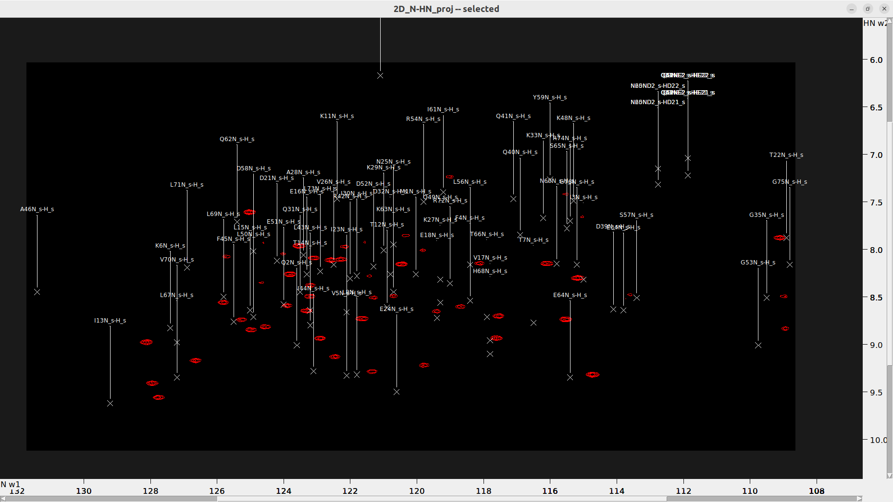

* Extract the N-HN projection from the 4D HCNH NOESY.

`ucsfdata -p4 -r -o 3D_HC-C-N_proj.ucsf 4D_HCNH_NOESY_NUS_reconstructed.ucsf`
`ucsfdata -p1 -r -o 2D_N-HN_proj.ucsf 3D_C-N-HN_proj.ucsf`

* Load 2D_N-HN_proj.ucsf and execute the vt command to open the "View Settings" dialog. Adjust the "Aspect (ppm)" value to set the scale of each axis and improve the view (e.g. 0.35).

## Important Preliminary Step
**Before transferring labels from a BMRB entry, ensure that the HSQC spectra are properly referenced.** In NMR spectroscopy, referencing is crucial as it calibrates the chemical shifts of all signals relative to a known standard. The most commonly used direct reference standard in liquid state NMR is DSS (sodium 2,2-dimethyl-2-silapentane-5-sulfonate) for 1H, which serves as a universal, primary reference for all NMR spectra. Other nuclei such as 13C and 15N are referenced indirectly through their gyromagnetic ratios. The reference values from Bruker, based on DSS, are:
- **1H:** 0.066 ppm
- **13C:** 2.734 ppm
- **15N:** 0.089 ppm

These values are for an 850 MHz spectrometer, and it's advisable to use the Topspin macros as described in [....]

5. **Transfer Assignments:**
   - Use `ta` to select the spectrum type loaded and click `Transfer`. Note: You can load the original NMRSTAR3 file directly, but be aware that assignments will have an "_s" suffix.
   

OPTIONALLY: "_s" tags can be removed by "ut" (untag _s) or "cu" (untag _s and center)
