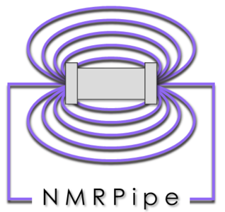

# NMR Tutorials

  

  
  

  

    
This is the collection of tutorials which aims to help one setting up, running, and processing NMR experiments. 
    Click <a href="./quick_search.md">here</a> for instructions on how to quickly search the contents of the tutorials.

  

Of all the online video resources on NMR, we highly recommend the following 4 courses. They cover the fundamentals and 
gradually build up to more advanced concepts. Despite the titles mentioning MRI, they are focused mostly on NMR.

**NMR Basics:** https://youtu.be/TQegSF4ZiIQ?si=FJkY8QicmrN8pQs4  
**The Spin Echo:** https://youtu.be/M7yh0To6Wbs?si=vxmjIrKAKAasia8z  
**Fourier Transform and K-Space:** https://youtu.be/R_4GuyJTzMo?si=s9EUCBIMQLvLlb1S  
**The Gradient Recalled Echo (GRE):** https://youtu.be/vapJRr6gAds?si=cMejtjccdaCWiZ6G

Description of [components of an NMR spectrometer](NMR_theory/NMR_Spectrometer.md).

## Contents
<table>
  <tr>
    <td style="vertical-align: middle;">
      
    </td>
    <td style="vertical-align: middle;">
      <a href="TOPSPIN/Setup_NMR_Experiments_for_4D-GRAPHS">Setting up 4D NMR experiments for 4D-GRAPHS.</a>
    </td>
  </tr>
  <tr>
    <td style="vertical-align: middle;">
      
    </td>
    <td style="vertical-align: middle; ">
      <a href="./NMR_Pipe">General tips on navigating NMRPipe ecosystem.</a>
    </td>
  </tr>
  <tr>
    <td style="vertical-align: middle;">
      
    </td>
    <td style="vertical-align: middle; ">
      <a href="./Non_Uniform_Sampling">Processing NUS data.</a>
    </td>
  </tr>
  <tr>
    <td style="vertical-align: middle; width: 100px;">
      
    </td>
    <td style="vertical-align: middle;">
      <a href="./TOPSPIN">How to record and process 2D, 3D and 4D spectra with TopSpin.</a>
    </td>
  </tr>
  <tr>
    <td style="vertical-align: middle; width: 100px;">
      
    </td>
    <td style="vertical-align: middle;">
      <a href="./SPARKY_and_POKY">How to analyze spectra in SPARKY.</a>
    </td>
  </tr>
  <tr>
    <td style="vertical-align: middle; width: 100px;">
      
    </td>
    <td style="vertical-align: middle; ">
      <a href="./SPARKY_and_POKY">How to analyze spectra in POKY - the successor of NMRFAM SPARKY.</a>
    </td>
  </tr>
</table>
