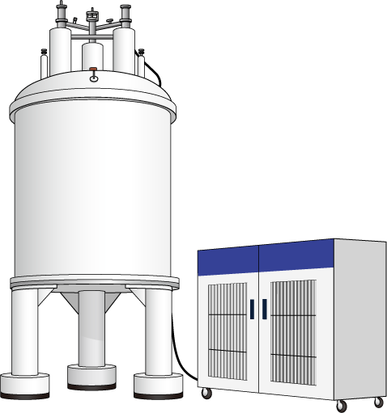
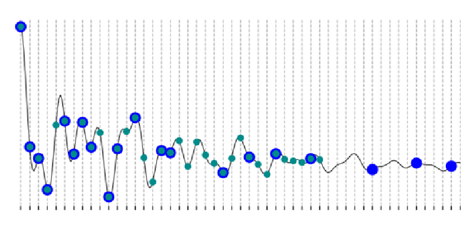
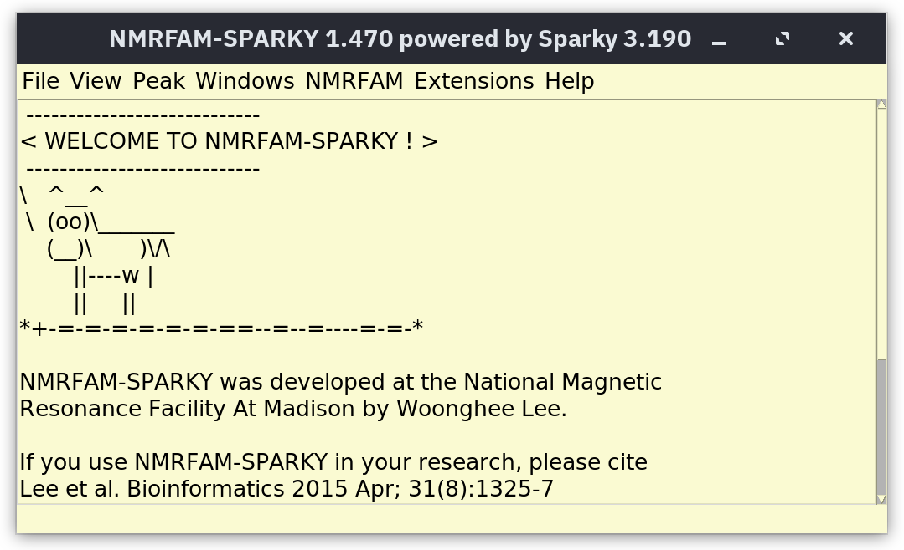
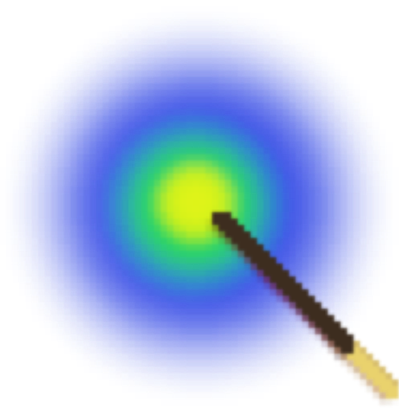

# NMR Tutorials

  

    
This is the collection of tutorials which aims to help one setting up, running and proessing NMR experiments. 

  

  

    
  

## Table of Logos and Descriptions

<table>
  <tr>
    <td style="vertical-align: middle;">
      
    </td>
    <td style="vertical-align: middle;">
      <a href=./Setup_NMR_Experiments_for_4D-GRAPHS>Setting up 4D NMR experiments for 4D-GRAPHS.

    </td>
  </tr>
  <tr>
    <td style="vertical-align: middle; width: 100px;">
      
    </td>
    <td style="vertical-align: middle;">
      <a href=./Non_Uniform_Sampling>Processing NUS data

    </td>
  </tr>
  <tr>
    <td style="vertical-align: middle;">
      
    </td>
    <td style="vertical-align: middle;">
      <a href=./TOPSPIN>How to process spectra in TopSpin.</a>
    </td>
  </tr>
  <tr>
    <td style="vertical-align: middle;">
      
    </td>
    <td style="vertical-align: middle;">
      <a href=./SPARKY>How to process spectra in SPARKY.</a>
    </td>
  </tr>
  <tr>
    <td style="vertical-align: middle;">
      
    </td>
    <td style="vertical-align: middle;">
      <a href=./POKY>How to process spectra in POKY - the successor on NMRFAM SPARKY.</a>
    </td>
  </tr>
</table>
