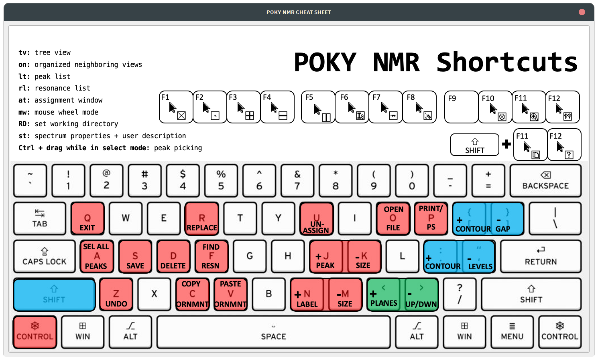

# POKY User Manual




## Common Commands

Sparky offers a variety of two-letter accelerators to streamline your workflow. Below, you'll find a categorized list 
of these commands along with brief descriptions of their functionalities.

- **cf** opens the command finder window

### File IO

- **fo** to open a spectrum or a Sparky / POKY save file
- **jo** to open a Sparky / POKY project
- **fs** to create a Sparky .save file (a config file with various display settings)
- **js** to save the project (also a config file for window layout etc.)


### Spectra display and looks
- **xa:** Show nucleus type on axis.
- **xe:** Special Python command for saving the peak list in Xeasy format.
- **xr:** Roll axes. Useful for navigating 3D and 4D spectra.
- **xx:** Axis transpose. Swaps the axes.
- **yt:** Synchronize axes of various spectra. Ideal for peak picking in 3D and 4D spectra using a 2D as a reference.
- **zf, zi, zo, zp:** Zoom full spectrum, zoom in, zoom out, and zoom to the previous view, respectively.
- **ec:** Easy contour dialog allowing you to adjust all loaded spectra. **RECOMMENDED**
- **ct:** Adjust contour levels and colors. Better use **ec**.
- **cl:** Adjust the color of an ornament.
- **oz:** Adjust the size of an ornament.
- **ol:** Overlays spectra.
- **ci:** "Inverse background color": *in fact, this dialogue allows changing the color of the selected peak (POKY build 29. Aug 2024)*
- **vt:** View settings. Adjusts various spectral settings, including aspect ratio of axes (e.g. expand one axis by increasing `Aspect`).

### Peak and Spectrum Manipulation

- **a1, a2, a3:** Add spectral width (SW) to a peak in the F1, F2, or F3 dimension. Useful for aliased spectra.
> **NOTE:** **sweepwidth** is an term incorectly used to refer to **spectral width**.
- **A1, A2, A3:** Subtract SW from a peak in the F1, F2, or F3 dimension. For handling aliased spectra.
- **at:** Assignment tool. Assists in assigning peaks.
- **dr:** Delete resonances not used in any peak assignment. Cleans up the resonance list.
- **eu:** Undo the last peak manipulation.
- **it:** Integration tool for peak integration.
- **kr:** Restrictive peak picking tool. Allows using one peak list as a guidance for peak picking in another spectrum. E.g. 1H-15N HSQC -> 4D HCNH NOESY.
- **lt:** Opens the peak list for a given spectrum, offering various options.
- **oc:** Ornament copy. Copies assignment/label information between spectra.
- **op:** Ornament paste.
- **pa:** Select all peaks in a spectrum.
- **pc:** Peak center. Refines the centering of peaks.
- **pv:** Provides a list of sizes and peak counts in all open spectra.
- **rl:** Opens the resonance list for the project, offering various functions and displays.
- **rp:** Read in a list of peaks in Sparky format from external tools like AutoAssign or PINE, aka load sparky list file with assignments to existing spectrum:
    ```
    Assignment         w1         w2  
      Q47NE2-HE22    110.585      6.621 
      Q77NE2-HE22    111.920      6.782 
      N29ND2-HD22    111.860      6.792 
      N73ND2-HD22    111.747      6.806 
      N39ND2-HD22    111.951      6.842 
      N85ND2-HD22    111.527      6.876 
      N64ND2-HD22    114.934      6.913 
           G50N-H    106.253      7.121 
      Q47NE2-HE21    110.576      7.267 
            85N-H    110.658      7.322 
    ```
 
Note: For peaks with assignments not following the convention [A-Z][0-9]+[A-Z0-9']+-[A-Z0-9'], use a custom script that modifies the .save file to ensure compatibility.

- **rr:** Resonance rename. Renames resonances for consistency.
- **st:** Spectrum tool. Useful for global axes shift corrections (e.g. "referencing").
- **tb:** Table of resonances for the project. Helps in identifying missing assignments.
- **vc:** View centering. Centers the view on a specific peak, especially useful when have associated peaks in 2D with 3D or 4D spectra.
- **vd:** View duplicate. Duplicates the view of a spectrum into another window.
- **vR:** Show assignments on the edge of the spectrum.
- **vS:** Show 1D slice on the edge of the spectrum.
- **vz:** Set the visible depth - useful for unfolding/unaliasing in the 4D HCNH NOESY.


## Pointer Modes

- **F1:** Selection mode. Selects elements within the spectrum.
- **F6:** Add a label to your spectrum.
- **F7:** Draw a line, useful for marking or measuring.
- **F8:** Peak picking mode. Identifies peaks within the spectrum.
- **F10:** Integration mode. For integrating areas under peaks.
- **F11:** Zoom mode. Zoom in and out of specific areas of the spectrum.

## Tips for Handling Peaks

When using the **rp** command to load a list of peaks, ensure the assignments follow the conventional format 
([A-Z][0-9]+[A-Z0-9']+-[A-Z0-9']). For peaks with non-conventional names, consider using a custom script that 
modifies the .save file to ensure compatibility.

