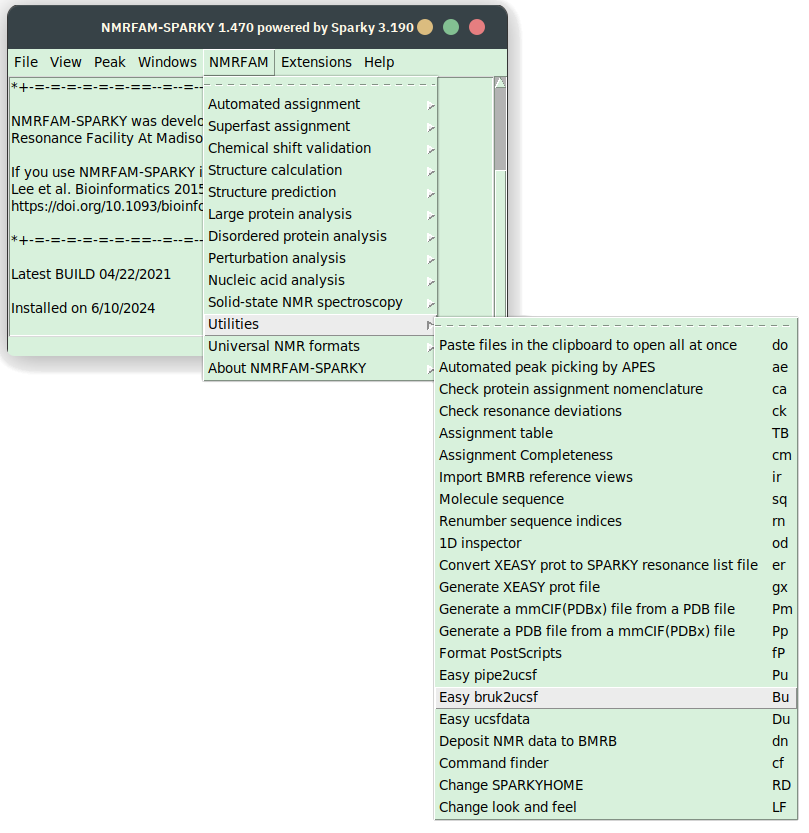

You should be able to directly open the Bruker files with the `fo` command (make sure to display All types of files in 
the pop-up browser). If you can't, convert them to the .ucsf format first.

|                                                                 |                                                                      |
|-----------------------------------------------------------------|----------------------------------------------------------------------|
|  |  |

*Initiating the conversion from Bruker format explicitly*

- In Poky or Sparky, click on the Import button (see the screenshot). In the pop-up window, click "All files".
- Paste the path to the file and hit "convert". This will take several minutes.
- Open the file. In POKY, type `fo` to bring up the file browser. Open the ucsf file.

Conversion utility will create the .ucsf file of roughly the same size in the same directory.