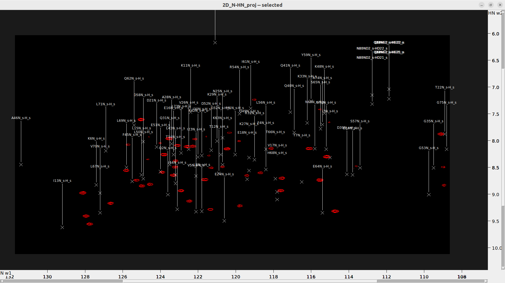

# Transferring BMRB Assignments

* Extract the N-HN projection from the 4D HCNH NOESY. (Make sure the `poky_[linux]/bin` directory is in your PATH).
  * `ucsfdata -p4 -r -o 3D_HC-C-N_proj.ucsf 4D_HCNH_NOESY_NUS_reconstructed.ucsf`
  * `ucsfdata -p1 -r -o 2D_N-HN_proj.ucsf 3D_C-N-HN_proj.ucsf`

* Load 2D_N-HN_proj.ucsf and execute the `vt` command to open the "View Settings" dialog. Adjust the "Aspect (ppm)" value to set the scale of each axis and improve the view (e.g. 0.35).
  
## Important Preliminary Step
**Before transferring labels from a BMRB entry, ensure that the HSQC spectra are properly referenced.** In NMR spectroscopy, referencing is crucial as it calibrates the chemical shifts of all signals relative to a known standard. The most commonly used direct reference standard in liquid state NMR is DSS (sodium 2,2-dimethyl-2-silapentane-5-sulfonate) for 1H, which serves as a universal, primary reference for all NMR spectra. Other nuclei such as 13C and 15N are referenced indirectly through their gyromagnetic ratios. The reference values from Bruker, based on DSS, are:
- **1H:** 0.066 ppm
- **13C:** 2.734 ppm
- **15N:** 0.089 ppm

These values are for an 850 MHz spectrometer, and it's advisable to check if they apply to your specific equipment.

## Steps for Label Transfer

1. **Load the HSQC Spectrum:**
   - Load your spectrum into Sparky or POKY.

2. **Shift Axes:**
   - Use the command `st` to shift the axes by the reference values mentioned above.

3. **Download BMRB Assignments:**
   - Ensure you have the assignments in NMRSTAR3 file format.

4. **Load Assignments:**
   - Load **NMRSTAR3** Use `ns` to convert the NMRSTAR3 file to a Sparky '.list' file.
   - Load the converted file with `rl`.

5. **Transfer Assignments:**
   - Use `ta` to select the spectrum type loaded and click `Transfer`. Note: You can load the original NMRSTAR3 file directly, but be aware that assignments will have an "_s" suffix. 
  
   > OPTIONALLY: "_s" tags can be removed by "ut" (untag _s) or "cu" (untag _s and center) `lr` followed by `lu` to offset the labels to the right and up if they overlap with each other.

6. **Adjust Label Visibility:**
   - Use `lc` to center the labels.
   - Use `lu` to adjust labels to prevent overlap.

7. **Modify Label Size:**
   - If labels are too small and hard to read, type `oz` and adjust the size properties in the popup window.

8. **Cleanup Resonance List:**
   - Use `dr` to clean up the Resonance list.

9. **Shift Resonances:**
   - Use `mv` to manually move a selected peak to its appropriate location. This action will shift all other peaks assigned to the same resonance along that axis by the same amount.

10.  **Center Peaks:**
    - Use `pa` to select all peaks, then `pc` to center them at their resonances.

11. **Final Adjustments:**
    - Manually align each label with its corresponding peak. Use `pc` to automatically center it, or adjust the label positions manually, select all (`pa`), and center (`pc`).

