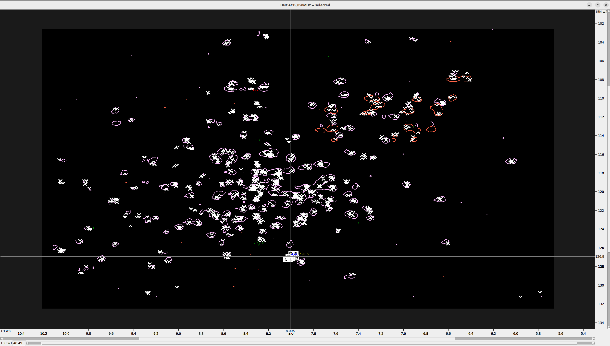
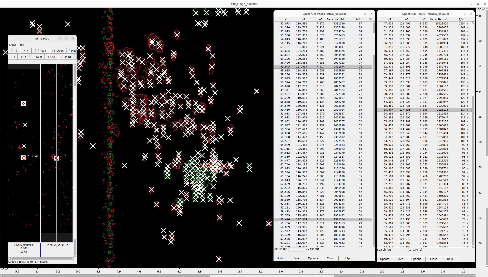
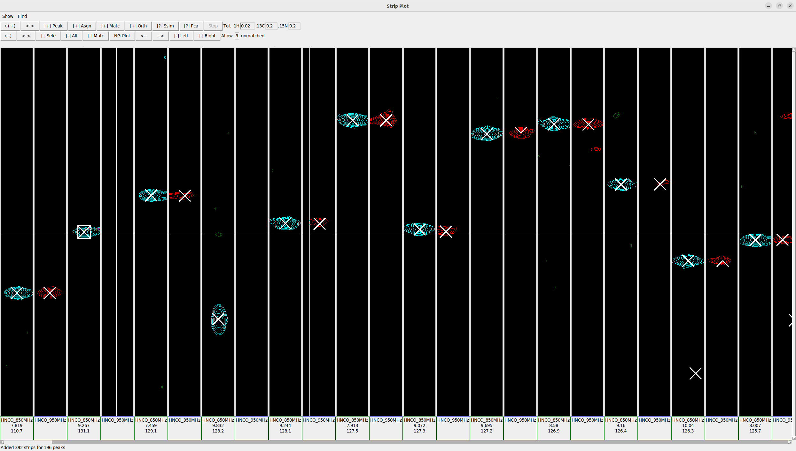

# Peak Picking in a 3D Spectrum with **POKY**

## Overview

This tutorial’s workflow begins with **referencing and converting** the spectra to **POKY/Sparky** format. Next, we **create a 2D projection** from the 3D spectrum, which aids not only proper referencing but also more accurate peak picking.

For **peak picking**, we will follow a **systematic strategy** that—although more involved—allows for **higher‑precision** identification of peaks in the 3D spectrum while minimizing noise. Because the **N‑HN projection is derived directly from the 3D spectrum**, it provides a more accurate reference than a standalone <sup>15</sup>N‑HSQC spectrum, whose peak centers may deviate slightly from those in the N‑HN projection.

To ensure **accurate peak selection**, we will use the **N‑HN projection as an intermediate reference point** for restricted peak picking in the 3D spectrum. The workflow is as follows:

1. **Load and adjust** the appearance of all spectra.
2. Use the <sup>15</sup>N‑HSQC spectrum as a reference to perform **restricted peak picking** in the 3D spectrum.
3. **Unfold or unalias** peaks as necessary.
4. **Remove noise peaks** from the 3D spectrum.

By following this approach, the final set of peaks picked in the **3D spectrum** will be as accurate and noise‑free as possible.

---

### Step 1. Rename Axes

Rename the axes in the `1H-15N HSQC` and `1H-13C HSQC` spectra; otherwise strip plotting (`sp`) will not work:

```bash
ucsfdata -a1 15N -a2 1H 15N_HSQC.ucsf
ucsfdata -a1 13C -a2 1H 13C_HSQC.ucsf
```

Print the axis values of the `3D HNCO` spectrum:

```bash
ucsfdata HNCO.ucsf
```

Example output:

```text
axis                          w1          w2          w3
nucleus                      13C         15N          1H
matrix size                  512         256         560
block size                    32          16          35
upfield ppm              169.233     100.089       6.488
downfield ppm            183.233     135.089      10.274
spectrum width Hz       3346.171    3370.900    3597.862
transmitter MHz          239.012      96.311     950.374
```

Rename the axes for easier spectrum manipulation:

```bash
ucsfdata -a1 13C -a2 15N -a3 1H HNCO.ucsf
```

> **Important:** Ensure that the axes are named consistently across **all** spectra; otherwise you will encounter problems during peak picking.

### Step 2. Load the Spectra

**Load the spectra**

* Open the UCSF files with the `fm` command (make sure the pop‑up browser is set to display **POKY Spectrum** files), navigate to the folder, and select your spectra.
* Use `xa` to show the nucleus types on the axes, `xr` to roll the axes, and `xx` to transpose them.
* Fix the aspect ratio by pressing `vt`, increasing **Aspect (ppm)**—for example, to `18`—and then click **Apply**.

---

### Step 3. Adjust the Spectra

**Synchronize spectra**

* Click `yt` to synchronize the `15N` axes of the `1H‑15N HSQC` and `HNCO` spectra.
* Next, synchronize the `1H` axes of those same spectra. *Synchronize one axis at a time!*

**Correct the contour levels and colors**

* Type `ec` to open the Easy Contour dialog, which lets you adjust all loaded spectra, including their colors and contour levels.
* Double‑click a spectrum in the dialog to bring up its individual Contour Level dialog (equivalent to the `ct` command).
* Adjust both positive and negative contour levels in the `15N_HSQC` spectrum to optimize peak visibility.

**Overlay spectra**

* Switch to the `HNCO` spectrum, press `ol`, and overlay `15N_HSQC` onto it.
* Type `ec` again and set the positive and negative contour level values of `15N_HSQC` to `1` to view the HNCO peaks more clearly in the overlay.

> **Note:** This tutorial assumes that both `HNCO` and `15N_HSQC` spectra are already referenced.
> If they are not, align them using the `2D_N‑HN_proj` (see the other tutorial).

### Step 4. Peak Picking

#### Adjusting Contour Levels and Preparing Reference Peaks

* Press **`F8`** to enter peak‑picking mode and select all visible peaks in **`15N HSQC`**.
* Use the following Python function to estimate the expected number of N–H (in‑phase) peaks from the amino‑acid sequence in a **multiplicity‑edited 15N HSQC**:

```python
def estimate_15N_hsqc_peaks(sequence: str) -> int:
    # Count backbone amides: total residues minus prolines and the N‑terminus
    backbone_peaks = sum(1 for aa in sequence if aa != "P") - 1

    # Count side‑chain peaks from
    #   R (NE–HE), K (NZ–QZ), W (NE1–HE1), and H (ND1–HD1)
    sidechain_peaks = (
        sequence.count("R")
        + sequence.count("K")
        + sequence.count("W")
        + sequence.count("H")
    )

    return backbone_peaks + sidechain_peaks
```

* Gradually raise or lower the contour levels until the **number of in‑phase (positive‑intensity) peaks** you pick is close to the expected total ( ≈ 149 for AR‑V7; ≈ 254 for NatD).

---

#### Restricted Peak Picking — Round 1

1. Type **`pa`** to select all peaks in **`15N HSQC`**.
2. Type **`kr`** to open the **Restricted Peak Picking** window.
3. Under **Find peaks**, choose the **`HNCO`** spectrum.
4. Under **Using peaks in**, choose **`15N_HSQC`**.
5. Start with low thresholds: **0.1 ppm** for <sup>15</sup>N and **0.01 ppm** for <sup>1</sup>H.
6. Click **Pick Peaks**.

---

#### Manual Refinement with Strip Plots

1. In the **`HNCO`** window press **`vz`** and set **“w1 C”** to **`9999`**.
2. Resize the windows so that **`HNCO`** and **`15N HSQC`** sit side by side.
3. Select all **`15N HSQC`** peaks again (`pa`) and then type **`sp`** to open the **Strip Plot** window.
4. In the Strip Plot toolbar choose **Show ▶ HNCO**, then click **\[+] Peaks**.
   Also type **`lt`** to display the peak‑list window and monitor peak intensities.
5. Delete **`HNCO`** peaks with **negative** intensity.
   If you still have far more than the expected number of N–H peaks, remove additional low‑intensity peaks until you reach a “safe” count of potential true peaks.
6. Go through every strip and remove noise peaks based on intensity, expected count, position in the N–H plane of **`HNCO`**, and your judgement.
   A strip may contain more than one real peak (e.g., two residues with identical N–H shifts but different Cʹ shifts).
7. For each remaining strong peak, press **`nt`**, enter **`s`**, and confirm.
   The **“s”** note will appear in the **`lt`** window if the **Note** radio‑button is enabled under **Options …**.

---

#### Manual Refinement with the `15N HSQC`↔`HNCO` Overlay

1. Identify a group of **`HNCO`** peaks that should correspond to a single **`15N HSQC`** peak.

   

2. In the **`HNCO`** window press **`lt`**.
   Hold **Ctrl** and **left‑click** the peak with the highest **Data Height** to deselect it, then press **Delete** to remove the weaker peaks so that only the strongest remains.

3. With the strong peak selected, press **`nt`**, enter **`r`**, and confirm.
   The **“r”** note appears in **`lt`** when the **Note** radio‑button is active.

4. Repeat for every group of **`HNCO`** peaks.

---

#### Restricted Peak Picking — Round 2

1. In **`15N HSQC`** select only those peaks **without** an **`HNCO`** match from Round 1.
2. Open **Restricted Peak Picking** (`kr`) and use higher thresholds: **0.2 ppm** for <sup>15</sup>N and **0.02 ppm** for <sup>1</sup>H.
3. Pick peaks and perform the same manual‑refinement steps as above.

---

### Step 5. Exporting Peak Lists

**Export picked peaks for 4D‑GRAPHS**

1. Switch to the **`15N HSQC`** spectrum, type **`lt`** to open the peak list, click **Options**, and display only the columns **Assignment**, **w1**, **w2**, and **Data Height**.
2. Export the peak list to a file.
3. Switch to the **3D** spectrum and repeat the same procedure.

---

# Peak Picking a Combination of Two 3D Spectra with **POKY**

When peak‑picking the combination **HNcoCA / HNCA**, we use the same overall workflow as for **HNCO**. However, because **HNcoCA** yields Cα(i‑1), N(i), HN(i) and **HNCA** yields Cα(i‑1), Cα(i), N(i), HN(i), we will pick **one spin system at a time** with strip plots. In summary:

1. Perform **restricted peak picking** in two rounds for both spectra, removing negative peaks and low‑intensity positive peaks as described for **`HNCO`**.

2. In addition to **`15N HSQC`**, load and adjust the **`13C HSQC`** spectrum.

3. Select all peaks in **`HNcoCA`** (the more sensitive experiment) with **`pa`**, then open strip plots with **`sp`** and display both spectra.

4. For each pair of strip plots, look for characteristic peak patterns like the one below:

   

5. Select the real peaks, mark them with **“s”** via **`nt`**, and delete the noise peaks.

6. Repeat the process for all strips, then select all peaks in **`HNCA`** and perform the same refinement.

---

# Merging Peaks from a 3D Spectrum Measured on Two Spectrometers

1. Load and adjust both spectra as in previous steps.

2. Select all peaks in **`HNCO 850 MHz`** with **`pa`**, open strip plots with **`sp`**, and display both spectra.

3. For each pair of strip plots, search for peaks unique to one spectrum, as illustrated below:

   

4. Select each unique peak, press **`nt`**, and mark it with **“u”** so you can identify it later.

5. After finishing all strip plots for **`HNCO 850 MHz`**, select all peaks in **`HNCO 950 MHz`** and repeat the same steps.

6. Finally, export both HNCO peak lists, including the **Note** column, and manually merge them by adding the **`HNCO 850 MHz`** peaks marked with **“u”** to the **`HNCO 950 MHz`** list.

