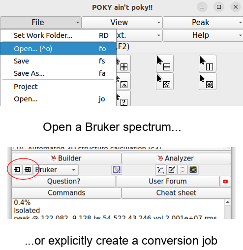
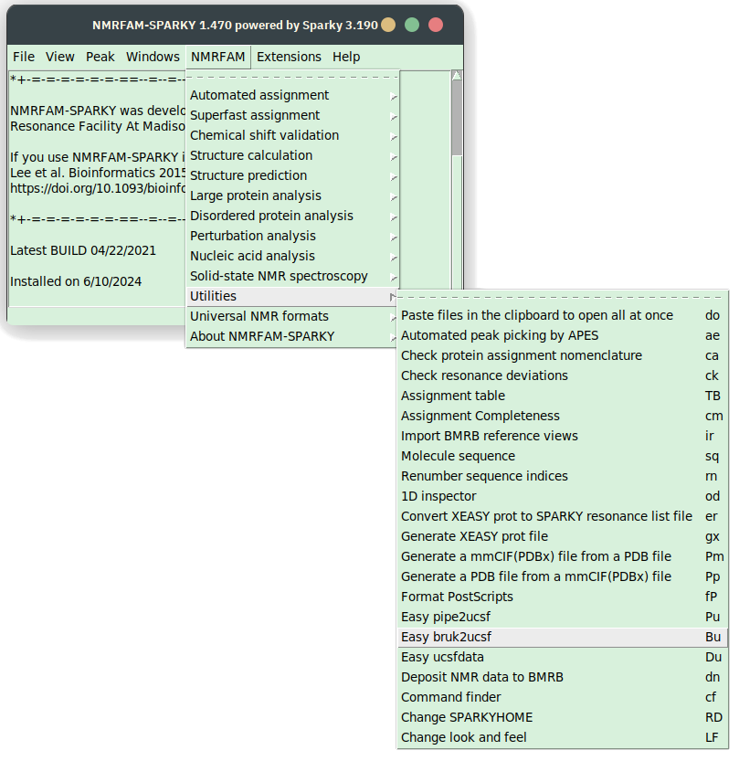

# Peak Picking in 4D Spectrum with POKY

This tutorial guides you through the process of peak picking in Poky or Sparky. We demonstrate in on an example of a 4D HCNH NOESY spectrum and its HN projection. 

## Prerequisites

- Installation of POKY or NMRFAM-Sparky; license for POKY.
- Access to the specified Ubiquitin 4D and 15N HSQC spectrum files.

## Steps

### Loading the spectra

1. **Load the Bruker spectra and convert them to a `.ucsf` files**. 
You should be able to directly open the Bruker files with the `fo` command (make sure to display All types of files in the pop-up browser). If you can't, convert them to the .ucsf format first. 

|||
|---|---|
|||

*Open any file*
- In your system file explorer, find the spectrum (`4rrrr` or `3rrr`) and copy its path (`Ctrl+Alt+C` on Linux, KDE Plasma as a DE).
- In Poky or Sparky, type `fo` and paste the path. Click **Open**. 

*Initiating the conversion from Bruker format explicitly*

There is no benifit of converting the files explicitly.

- In Poky or Sparky, click on the Import button (see the screenshot). In the pop-up window, click "All files". 
- Paste the path to the file and hit "convert". This will take several minutes. 
- Open the file. In POKY, type `fo` to bring up the file browser. Open the ucsf file. 

Do the same with the 2D HN projection (F3-F4) or an HSQC spectrum

> [!TIP]
> See how to make a projection in TopSpin [here](/TOPSPIN/Common_Topspin_Commands.md)

Conversion utility will create the .ucsf file of roughly the same size in the same directory.

### Adjusting the Spectra

2. **Correct the Contour Levels of HSQC** Type `vC` to bring up the countor level controls. Adjust the contour levels for the HN spectrum as well as for the 4D. Additionaly, you can type `ct` to control the contour colors and the other parameters. 

3. **Align the spectra** Especially if you are using HSQC as a reference, the axes have to be aligned. 
	- For that, manually pick the most "trustworthy" peak in the HSQC (F8 to enter the peak picking mode, F1 to exit it) and find it in the 4D. 
	- Type `al`; in the pop-up, select the 2D as a reference. Hit Auto align.

### Peak Picking

4. **Pick all peaks in the reference 2D** Go to the 2D, hit F8 to enter the peak picking mode, and drag a box around all signals. This will pick all the visible peaks. Hit F1 to enter the default mode. 

> [!TIP]
> Use `lt` to view the peak list. 

5. **Use those peaks to find peaks in the 4D** Type `kr` to  enter the peak transfer dialogue. 
    - Set the HN spectrum as the peak source:	
    - Adjust the tolerances: typically, 0.05 ppm for the *direct* 1H an 0.2 ppm for 15N is fine. For the *indirect* NOE-1H dimension, set the tolerance to 999: we want to find all NOE crosspeaks, not just the diagonals! 
    - Finally, hit the `Pick peaks` button.

> The picking will take a while: about 25 minutes for 118 2D peaks on AMD Ryzen 3 1300 @ 3.5 GHz. (POKY uses a single CPU core).

### Validation tips

6. **View the C-H Plane in the 4D Spectrum**
   - Click `xr` twice on the 4D spectrum to focus on the C-H plane. Type `xx` to make the H axis horizontal and C - vertical.
	- You can type `xa` to show the nucleus types on the axes.

8. **Synchronize Spectra** Click `yt` to synchronize the 15N of the HSQC and 4D NOESY first, and then synchronize the 1H of the same spectra. Remember, synchronize one nucleus at a time!

9. Bring up the `lt` windows for the 2D as well as the 4D; sort the peaks by the direct 1H or 15N frequency and select the useful columns to display:

LINEWIDTH SHOULD BE UNCHECKED!

Click on each peak in the 2D list and validate the peaks. 

10. **If you wish to start all over again,** type `pa` to select all peaks and hit Delete to delete all peaks. 

11. **If you want to find new peaks to the list**, *don't forget to check the `Use selected peaks only?` box in the ` kr` dialogue!*

> **View the nD spectrum from different C-H Planes** To open multiple C-H planes, click `vd` to duplicate the view of a 4D spectrum into another window. In each window, you can focus on different C-H planes by selecting a different 15N HSQC peak with `F1` and clicking `vc` to center it.

12. If you wish to discard the peaks which are too close to noise: `ss` command is helpful, which selects all peaks which are less intense than the selected one.
Note: it compares intensities with their signs, so the negative peaks with large absolute intensity will be selected too! Go over them manually and deselect: hold `Ctrl` and drag over the
selected peaks with your mouse. 

(Should be a gif here!)

### Exporting Picked Peaks

13. **Export Picked Peaks for 4D-GRAPHS** Go to the 4D peak list (type `lt`) and select the columns `w1`, `w2`, `w3`, `w4`, and `Data Height`. Click "Apply", then "Save...".

## Notes for special cases

### Crowded 2D spectra

If there is too muchpeak overlap in the 2D spectra (or planes, or projections), it is helpful to use 
an orthogonal plane (for example, or 13C-HSQC in addition to the 15N-HSQC) to 

### Unaliasing peaks in POKY
  
* When you use restricted peak picking (`kr`), POKY will automatically check for possible aliased peaks.
If the spectrum width of the source 2D is larger than that of the nD (n=[3,4]), than
POKY will find and mark the peaks in the 3D as aliased.
  
Below are examples of the 13C-HSQC spectra with aliased peaks (in yellow boxes)

| Protein 1                                                        | Example 13C-HSQC - Protein 2                                       |
|------------------------------------------------------------------|--------------------------------------------------------------------|
|  |  |
 
----------------------------
