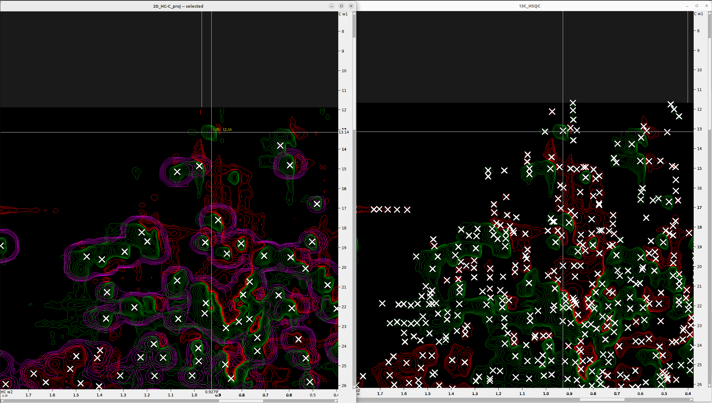

# Peak Picking in 4D Spectrum with POKY

## Overview

The general workflow of this tutorial starts with **referencing and converting** the spectra to **POKY/Sparky** format. Then, we will **create 2D projections** from the 4D spectrum, which will help us reference it properly.

For **peak picking**, we will follow a **systematic strategy** that, although more involved, will allow for **higher precision** in identifying peaks in the 4D spectrum while minimizing noise. Since the **2D projections are derived directly from the 4D spectrum**, they provide a more accurate reference than the HSQC spectra, whose peak centers may deviate slightly from those in the projections.

To ensure **accurate peak selection**, we will use the **2D projections as intermediate reference points** for restricted peak picking in the 4D spectrum. The workflow is as follows:

1. **Overlay the projections onto the corresponding HSQC spectra**
2. **Identify peak centers** by using the **HSQC spectra as references**  
3. **Use these peak centers** to perform **restricted peak picking** in the 4D spectrum  
4. **Unfold or unalias peaks** as necessary  
5. **Remove noise peaks** from the 4D spectrum  

By following this approach, we ensure that the final set of picked peaks in the **4D spectrum** is as accurate and noise-free as possible.

## Prerequisites

- Installation of POKY or NMRFAM-Sparky; license for POKY.
- Copy the enhanced **Restricted Peak Pick** POKY plugin that reads the tolerance values from the peak's "Note" field from
`nmr_tutorials/SPARKY_and_POKY/POKY/scripts/restrictedpick.py` to your `POKY/poky_linux/modules/poky/` folder.
- Access to the specified CA2 protein 4D HCNH NOESY, 15N HSQC and 13C HSQC spectrum files.

## Steps

### Step 1. Reference the HSQC Spectra in Topspin

Follow [these instructions](../TOPSPIN/Referencing_shifts/Referencing_Spectra.md) to reference the `1H-15N` and `1H-13C HSQC` spectra in Topspin using BioTop.

---

### Step 2. Spectrum Conversion and Preparation

#### 2.1 Convert Spectra to UCSF Format

Navigate to the directory containing your Bruker-formatted spectra and use `bruk2ucsf` for conversion. Note that `bruk2ucsf` must be executed from the spectrum directory to function correctly.

For example, to convert the `1H-15N HSQC`, `1H-13C HSQC`, and the `4D HCNH NOESY`:

```shell
bruk2ucsf_run 6/pdata/1/2rr /srv/NMR/Peak_Picking/Nanoluc/15N_HSQC.ucsf
bruk2ucsf_run 7/pdata/1/2rr /srv/NMR/Peak_Picking/Nanoluc/13C_HSQC.ucsf
bruk2ucsf_run 5/pdata/1/4rrr /srv/NMR/Peak_Picking/Nanoluc/4D_HCNH_NOESY.ucsf
```

> **Note:** You can also [convert spectra from Bruker to UCSF format within POKY/Sparky](Miscellaneous/convert_spectra_POKY.md), but axis renaming is not supported during that process.

#### 2.2 Rename Axes

Consistent axis naming is critical for automated peak picking. Rename the axes in the `1H-15N` and `1H-13C HSQC` spectra as follows:

```shell
ucsfdata -a1 N -a2 HN 15N_HSQC.ucsf
ucsfdata -a1 C -a2 HC 13C_HSQC.ucsf
```

To identify the axes in the `4D HCNH NOESY`, print its metadata:

```shell
ucsfdata 4D_HCNH_NOESY.ucsf
```

Example output:

```shell
axis                          w1          w2          w3          w4
nucleus                       1H         13C         15N          1H
matrix size                  256         256         256         416
block size                     8           8           8          13
upfield ppm                1.194       6.301     101.402       5.279
downfield ppm              8.208      73.001     133.002      10.622
spectrum width Hz       6666.667   15939.978    3043.445    5078.125
transmitter MHz          950.374     238.980      96.311     950.374
```

Using the `upfield` and `downfield` values, you can distinguish between the `HC` and `HN` axes (amidic protons typically have higher chemical shifts than aliphatic ones). Rename them accordingly:

```shell
ucsfdata -a1 HC -a2 C -a3 N -a4 HN 4D_HCNH_NOESY.ucsf
```

> ⚠️ **Important:** Ensure axes are named identically across all spectra to avoid errors during peak picking.

#### 2.3 Create C-HC and N-HN Projections

For a detailed guide, see the [tutorial on creating 2D projections](../SPARKY_and_POKY/Create_2D_projections_from_4D_spectrum.md). Briefly, extract the projections from the 4D NOESY (adjust `-p` flags as needed based on your dimension order):

**N-HN Projection:**
```shell
ucsfdata -p1 -r -o C-N-HN.ucsf 4D_HCNH_NOESY.ucsf
ucsfdata -p1 -r -o 2D_N-HN_proj.ucsf C-N-HN.ucsf
```

**C-HC Projection:**
```shell
ucsfdata -p4 -r -o HC-C-N.ucsf 4D_HCNH_NOESY.ucsf
ucsfdata -p3 -r -o 2D_HC-C_proj.ucsf HC-C-N.ucsf
```

---

### Step 3. Loading the Spectra

1. Open the UCSF files using the `fo` command. Ensure the file browser is set to display **Poky Spectrum** files.
2. Load the 4D NOESY, 2D projections, and both HSQC spectra.
3. Use `xa` to display nucleus types on the axes, `xr` to rotate axes, and `xx` to transpose them.
4. Set a comfortable aspect ratio by pressing `vt`, increasing the **Aspect (ppm)** value (e.g., to `12`), and clicking **Apply**.

---

### Step 4. Spectrum Alignment and Referencing

#### 4.1 Synchronize Axes

- Press `yt` to synchronize the `N` axes of the `15N HSQC` and `4D_HCNH_NOESY`, then synchronize their `HN` axes. **Synchronize only one axis at a time.**
- Repeat this for the `13C HSQC` and the 4D spectrum, and finally for each HSQC and its corresponding 2D projection.

#### 4.2 Adjust Contours and Colors

- Use `vC` to open the contour level scrollbars for fine adjustment.
- Use `ec` to open the Easy Contour dialog for broad control over all loaded spectra, including color schemes.
- Double-clicking a spectrum in the `ec` dialog opens its specific contour settings (equivalent to the `ct` command).

#### 4.3 Align Projections to HSQC Reference

The 4D spectrum axes often require alignment to the high-resolution HSQC references. Use the 2D projections for this purpose:

1. Overlay (`ol`) the `2D_N-HN_proj.ucsf` onto the `15N_HSQC`.
2. Adjust contour thickness and peak marker visibility if needed (`oz`).
3. Identify a well-resolved, "trustworthy" peak in the `15N_HSQC`.
4. Press `al` to open the alignment tool:
   - Set **Align spectrum** to `2D_N-HN_proj`.
   - Set **using peak in** to `15N_HSQC`.
5. Hold `Shift` and click the corresponding peak in both spectra to select them for alignment.
6. Click **Align**.
7. Repeat this process for the `2D_HC-C_proj` and the `13C_HSQC`.

#### 4.4 Reference the 4D Spectrum

1. Press `st` to open the spectrum status/referencing window.
2. Copy the shift values from the aligned `2D_N-HN_proj` to the `4D_HCNH_NOESY`.
3. **Important:** Click **Apply** after copying each value to ensure it is saved.
4. Repeat for the `2D_HC-C_proj` values.
5. Click **OK** to finalize the referencing of the `4D_HCNH_NOESY`.

---

### Step 5. Peak Picking

Peak shapes, particularly their spectral widths, are primarily determined by the T2 (transverse) relaxation rate of the nucleus. Rapidly relaxing nuclei produce broad peaks, while slowly relaxing nuclei yield sharp, narrow signals. Additionally, the local chemical environment and protein dynamics influence peak morphology. For instance, in an HSQC spectrum, methyl groups experiencing dynamic interactions may exhibit broader signals. Consequently, peak width is not always strictly proportional to the variance in resonance frequency for a given atom pair.

When performing restricted peak picking, exercise caution when setting tolerances. Avoid using values that encompass the entire visible signal from the center to the edge of the contour; instead, adopt a more conservative approach to ensure precision.

#### 5.1 Adjusting Contour Levels and Preparing Reference Peaks

- Adjust the contour levels (both positive and negative) in the `15N HSQC` spectrum to optimize peak visibility.
- Press `F8` to enter peak picking mode and select all visible peaks.
- Use the following Python function to estimate the expected number of N-H (in-phase) peaks from the amino acid sequence in the **multiplicity-edited 15N HSQC**:

```python
def estimate_15N_hsqc_peaks(sequence: str) -> int:
    # Count backbone amides = total residues minus any prolines and the N-terminus
    backbone_peaks = sum(1 for aa in sequence if aa != 'P') - 1
    # Count side-chain peaks from R (NE–HE), K (NZ–QZ), W (NE1–HE1), and H (ND1-HD1)
    sidechain_peaks = sequence.count('R') + sequence.count('K') + sequence.count('W') + sequence.count('H')
    return backbone_peaks + sidechain_peaks
```

- Gradually adjust the contour levels until the number of in-phase (positive intensity) peaks approximately matches the expected count (e.g., 292 for the CA2 protein). 
- For example, a contour level of `1.4e+06` may capture approximately 274 in-phase peaks while minimizing noise.

  

- Press `lt` to open the peak list and export the `15N HSQC` peak list to a file.
- Switch to the `2D N-HN projection` window, press `ol`, and overlay the `15N_HSQC` onto the `2D_N-HN_proj`.
- Delete any existing peaks from the `2D N-HN projection`.
- Press `rp` to load the `15N HSQC` peak list, or copy (`Ctrl+C`) and paste (`Ctrl+V`) the peaks directly from one spectrum to the other.
- Press `pa` to select all peaks.
- Press `pc` to center the peak positions on the **contour maxima** of the `2D projection`.
- Manually inspect the peak markers and adjust their positions to the center of the contour hills in the `2D_N-HN_proj`. 
- To identify overlapping peaks, open the peak list (`lt`), sort by frequency, and look for identical coordinates. Double-click entries to visualize them and refine their positions using the `15N_HSQC` as a guide.
- Finally, verify that the peak counts in both spectra are identical using `lt`. Overlapping peaks with identical coordinates may be counted as one.
- These peaks will serve as **reference points** for **restricted peak picking** in the 4D spectrum.

The figure below shows the final peak selection on the `N-HN_proj` (orange) adjusted to the peak centers, with the `15N_HSQC` overlaid in cyan and yellow. Some peaks not visible in the less sensitive `N-HN_proj` were added from the `15N_HSQC`, and vice versa.


#------------------------------------------

#### 5.2 Picking Peaks in the HC-C Projection

Because the `1H-13C HSQC` is often crowded, it is not ideal for setting landmarks independently. Instead, use it in combination with the `2D_HC-C_proj`. 

1. Overlay the two spectra (`ol`).
2. Use `F8` to pick all peaks in the `2D_HC-C_proj`.
3. Manually add peaks that align with the density regions of the `1H-13C HSQC` but are not clearly defined as noise. 
4. Synchronizing the axes (`yt`) and viewing the spectra side-by-side can assist in this process.

The figure below demonstrates adding a peak to the `2D_HC-C_proj` based on the `1H-13C HSQC` signal density.



These peaks in the `2D_HC-C_proj` will serve as landmarks for subsequent restricted peak picking.


#### 5.3 Optimizing Restricted Peak Picking for Higher Accuracy

To improve accuracy and minimize noise, it is recommended to use variable tolerances based on peak radius:

1. Open each projection spectrum and sort the peaks by **Data Height** in the peak list (`lt`).
2. Starting with the lowest intensity peaks, double-click them to visualize.
3. Use the `ms` command to measure the peak radius along both axes.
4. Group peaks with similar dimensions and assign appropriate tolerance values that will encompass the corresponding 4D signals. Generally, peaks with similar intensities can be grouped together.
5. Once tolerances are determined for a group, select them in the `lt` window and use the `nt` command to record these values in the peak's "Note" field.


#### 5.4 Executing Restricted Peak Picking

For large proteins, it is efficient to perform restricted peak picking in two rounds. This avoids performance degradation caused by frequent screen updates during the automated process.

**Round 1: First Half of the N-HN Peaks**

1. Select approximately half of the peaks in the **N-HN projection**.
2. Press `kr` to open the **Restricted Peak Picking** window (ensure the enhanced plugin is installed as per the **Prerequisites**).
3. Enable the following options:
   - `Use selected peaks only`
   - `Use tolerance values from note`
4. In the **Find peaks** dropdown, select the **4D NOESY** spectrum.
5. In the **Using peaks in** dropdown, select the **N-HN projection**.
6. Click **Pick Peaks**.
7. Once complete, perform a second pass within the same round:
   - Set **Using peaks in** to the **HC-C projection**.
   - Disable `Use selected peaks only`.
   - Click **Select Peaks**.
8. Switch to the **4D NOESY** window, press `I` (capital `i`), and click **Delete** to remove irrelevant peaks.
9. The resulting peak list on the HC-C plane of the 4D NOESY should now be cleaner.
10. Press `pa` (select all), then `nt`, and enter a keyword (e.g., `matched`) in the **Note** field. Click **Apply**.

**Round 2: Remaining Half of the N-HN Peaks**

1. Return to the **N-HN projection** and select the remaining half of the peaks.
2. Open the `kr` window again and repeat the **Pick Peaks** process (Steps 3-6 above) with the same settings.
3. After picking, set **Using peaks in** to the **HC-C projection**, disable `Use selected peaks only`, and click **Select Peaks**.
4. In the **4D NOESY** window, press `nt`, enter `matched`, and click **Apply**.

> ⚠️ **Caution:** Do not delete peaks immediately during the second round, as this may remove valid peaks identified in Round 1.

**Final Cleanup of the 4D Peak List**

1. Open the peak list (`lt`) for the 4D spectrum.
2. In the **Options** menu, enable the **Note** column, sort the list by **Note**, and click **Apply**.
3. Identify and select peaks that lack the `matched` note. These represent irrelevant signals.
4. Use `Page Up`/`Page Down` to select large blocks of these peaks efficiently.
5. Switch to the **4D NOESY** window and press **Delete** to remove the selected entries.

> 💡 **Tip:** For datasets containing tens of thousands of peaks, deleting them in multiple smaller batches can prevent application lag.

The final peak selection on the HC-C plane of the 4D NOESY should appear as shown below.

[FIGURE]


### Step 6. Unalias and Unfold 4D Peaks

Unalias or unfold peaks as necessary. For a detailed explanation, refer to the [dedicated article](Unfold_Peaks.md). Aliased peaks typically appear in the chemical shift ranges of `C < 25` ppm and `HC > 3` ppm.

1. Press `F1` to enter selection mode.
2. Select the aliased peaks (often appearing at the edge of the spectral window).
3. Press `a1` to unalias them along the **C axis (W1)**.


[FIGURE here]

---

### Step 7. Manual Refinement of the 4D Peak List

Manually inspect the remaining peaks and remove any that do not align with density regions in either the **HC-C** or **N-HN** projections.

#### 7.1 Setting up Multiple Views

1. Open the 4D spectrum in a new window using `fo`.
2. In the new window, use `xr` and `xx` to bring the **N and HN axes** into view.
3. Adjust the aspect ratio with `vt`.
4. Use `vz` to set the slice thickness:
   - **N and HN axes**: 0
   - **C and HC axes**: 9999
   - Click **Apply**.
5. Adjust peak marker sizes with `oz` if necessary.
6. Overlay (`ol`) the **N-HN projection** and the **15N HSQC** onto this window.
7. Rename the window to **4D_HCNH_NOESY - N-HN proj** using `st`.

You now have two complementary views of the 4D spectrum:
1. Peaks on the **HC-C plane**.
2. Peaks on the **N-HN plane**.

Inspect the peaks in both views. Remove those that lack corresponding signal density. This step requires manual supervision and cannot be fully automated.

#### 7.2 Discarding Noise Peaks using Signal-to-Noise (S/N) Ratio

1. Open the spectrum settings (`st`).
2. In the **"noise as median of"** field, enter a high value (e.g., `10000`).
3. Click **Recompute** several times. If the **Estimated noise** value fluctuates significantly, increase the median value and recompute.
4. Once a stable noise estimate is obtained, open the peak list (`lt`).
5. In **Options**, enable the **S/N** column and sort by **Data Height**.
6. Select and delete peaks with an absolute S/N ratio below the threshold. For more stringent results, use a cutoff of 3x or 5x the estimated noise.

#### 7.3 Optional: Noise Removal using a Reference Weak Peak

Alternatively, you can use a known weak peak as an intensity threshold:

1. Overlay the `N-HN_proj` onto the `15N_HSQC`.
2. Increase contour levels until noise peaks begin to appear.
3. Identify a weak `15N_HSQC` signal and locate its corresponding position in the 4D spectrum (`vc`).
4. Adjust the 4D contour levels until the peak is clearly visible.
5. Select the weakest valid peak in the 4D spectrum and press `ss`. This command selects all peaks with lower intensity.
6. Verify the selection in the peak list (`lt`) and click **Delete**.

> **Note:** Since intensity is signed, large negative peaks may also be selected. Manually deselect any valid negative peaks by holding `Ctrl` and dragging the mouse over them before deleting.


*(GIF showing handling of large negative peaks should be inserted here)*

---

### Step 8. Exporting and Refining Peak Lists

#### 8.1 Exporting the 4D Peak List for 4D-GRAPHS

1. Open the 4D peak list (`lt`).
2. In **Options**, select the following columns: `w1`, `w2`, `w3`, `w4`, `Data Height`, and `Note`.
3. Click **Apply**, then **Save...** to export the list.

#### 8.2 Improving 13C HSQC Precision using 4D Data

Since the `13C HSQC` is often noisy and subject to dispersion, its peak centers may deviate from the more accurate 4D coordinates. Refining the `13C HSQC` list using 4D markers improves assignment accuracy in 4D-GRAPHS, particularly for methylene groups.

1. Export the finalized peak list from the **HC-C projection**.
2. Open the `13C HSQC` spectrum in a new window (`fo`).
3. Rename the window to **13C HSQC - 4D Peak List** (`st`).
4. Press `rp`, enable **Auto detect dimensions**, and load the **4D HCNH NOESY peak list**. POKY should automatically handle unaliased/unfolded peaks.
5. Open the peak list (`lt`), enable **Data Height** in **Options**, and export the refined list as `13C_HSQC_with_4D_HCNH_NOESY_peaks.list`.

#### 8.3 Improving 15N HSQC Precision using Projection Data

To ensure the `15N HSQC peak list` contains only one peak per spin system for 4D-GRAPHS, repeat the refinement process described above using the **N-HN projection peak list** instead of the full 4D list.

---

## Notes for Special Cases

#### Unaliasing Peaks in POKY

When performing restricted peak picking (`kr`) using reference peaks that have not been unaliased or unfolded, POKY automatically checks for potential aliasing. If the spectral width of the source 2D spectrum is greater than that of the nD spectrum (where n=3 or 4), POKY will identify and mark the corresponding nD peaks as aliased.

**Caution:** If your reference peaks are already unaliased or unfolded, POKY may fail to correctly match peaks in the target spectrum unless they share the same state. This can result in the identification of irrelevant peaks. To avoid this, **do not unalias or unfold peaks in the 2D HC-C and N-HN projections**. Instead, perform all unaliasing and unfolding operations directly on the **4D HCNH NOESY** spectrum.

Below are examples of the `13C-HSQC` spectra with aliased peaks (in yellow boxes):

| Protein 1 | Example 13C-HSQC - Protein 2 |
|------------------------------------------------------------------|--------------------------------------------------------------------|
|  |  |

---

# Authors
- Thomas Evangelidis  
- Ekaterina Burakova
