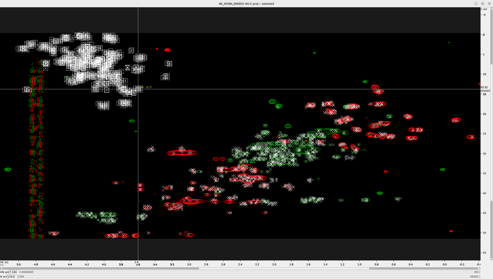

# Peak Picking in 4D Spectrum with POKY

## Overview

The general workflow of this tutorial starts with **referencing and converting** the spectra to **POKY/Sparky** format. Then, we will **create 2D projections** from the 4D spectrum, which will help us reference it properly.

For **peak picking**, we will follow a **systematic strategy** that, although more involved, will allow for **higher precision** in identifying peaks in the 4D spectrum while minimizing noise. Since the **2D projections are derived directly from the 4D spectrum**, they provide a more accurate reference than the HSQC spectra, whose peak centers may deviate slightly from those in the projections.

To ensure **accurate peak selection**, we will use the **2D projections as intermediate reference points** for restricted peak picking in the 4D spectrum. The workflow is as follows:

1. **Overlay the projections onto the corresponding HSQC spectra**
2. **Identify peak centers** by using the **HSQC spectra as references**  
3. **Use these peak centers** to perform **restricted peak picking** in the 4D spectrum  
4. **Unfold or unalias peaks** as necessary  
5. **Remove noise peaks** from the 4D spectrum  

By following this approach, we ensure that the final set of picked peaks in the **4D spectrum** is as accurate and noise-free as possible.

## Prerequisites

- Installation of POKY or NMRFAM-Sparky; license for POKY.
- Copy the enhanced **Restricted Peak Pick** POKY plugin that reads the tolerance values from the peak's "Note" field from
`nmr_tutorials/SPARKY_and_POKY/POKY/scripts/restrictedpick.py` to your `POKY/poky_linux/modules/poky/` folder.
- Access to the specified CA2 protein 4D HCNH NOESY, 15N HSQC and 13C HSQC spectrum files.

## Steps

---

### Step 1. Reference the `HSQC` Spectra in Topspin

Follow [the instructions](../TOPSPIN/Referencing_shifts/Referencing_Spectra.md) to reference the `1H-15N` and `1H-13C HSQC` in Topspin with BioTop.

---

### Step 2. Convert and Prepare Spectra

#### 2.1 Convert Spectra to UCSF Format

Enter the directory where each spectrum is saved in Bruker format and run `bruk2ucsf` from there—running it from another directory will fail.  
For example, to convert the `1H-15N`, `1H-13C HSQC` spectra, and the 4D HCNH NOESY:

```shell
 bruk2ucsf_run 6/pdata/1/2rr /srv/NMR/Peak_Picking/Nanoluc/15N_HSQC.ucsf
 bruk2ucsf_run 7/pdata/1/2rr /srv/NMR/Peak_Picking/Nanoluc/13C_HSQC.ucsf
 bruk2ucsf_run 5/pdata/1/4rrr /srv/NMR/Peak_Picking/Nanoluc/4D_HCNH_NOESY.ucsf
```

> Note: You can also [convert the spectra from Bruker to UCSF format in POKY/Sparky](Miscellaneous/convert_spectra_POKY.md), 
> but you cannot rename the axes in that process.

#### 2.2 Rename Axes

Rename the axes in the `1H-15N` and `1H-13C HSQC` spectra:

```shell
ucsfdata -a1 N -a2 HN 15N_HSQC.ucsf
ucsfdata -a1 C -a2 HC 13C_HSQC.ucsf
```

Print the axis values of the `4D HCNH NOESY`:

```shell
ucsfdata 4D_HCNH_NOESY.ucsf
```

Example output:

```shell
axis                          w1          w2          w3          w4
nucleus                       1H         13C         15N          1H
matrix size                  256         256         256         416
block size                     8           8           8          13
upfield ppm                1.194       6.301     101.402       5.279
downfield ppm              8.208      73.001     133.002      10.622
spectrum width Hz       6666.667   15939.978    3043.445    5078.125
transmitter MHz          950.374     238.980      96.311     950.374
```

From the `upfield` and `downfield` rows, you can guess which axis is `HC` and which is `HN`. In this example, the following 
command renames them properly—amide protons have higher shift values than the aliphatic protons:

```shell
ucsfdata -a1 HC -a2 C -a3 N -a4 HN 4D_HCNH_NOESY.ucsf
```

> **IMPORTANT:** Make sure that axes are named consistently in all spectra; otherwise, you will encounter problems during peak picking.

#### 2.3 Create C-HC and N-HN Projections

For a detailed tutorial, see [Create_2D_projections_from_4D_spectrum](../SPARKY_and_POKY/Create_2D_projections_from_4D_spectrum.md).
Briefly, extract the `N-HN projection` from the `4D HCNH NOESY`. You may need to adjust the `-p[1-4]` values according 
to your 4D spectrum dimension order:

```shell
ucsfdata -p1 -r -o C-N-HN.ucsf 4D_HCNH_NOESY.ucsf
ucsfdata -p1 -r -o 2D_N-HN_proj.ucsf C-N-HN.ucsf
```

Similarly, for the `C-HC projection`:

```shell
ucsfdata -p4 -r -o HC-C-N.ucsf 4D_HCNH_NOESY.ucsf
ucsfdata -p3 -r -o 2D_HC-C_proj.ucsf HC-C-N.ucsf
```

---

### Step 3. Loading the Spectra

**Load the spectra**
- Open the UCSF files with the `fo` command (make sure to display **Poky Spectrum** type of files in the pop-up browser), 
navigate to the folder, and select your spectra. Alternatively, you can copy the full path to each spectrum (for 
example, `realpath 4D_HCNH_NOESY.ucsf` in the Shell) and paste it into the pop-up browser.
- Do the same with the 2D projections and the `HSQC` spectra.
- Use `xa` to show the nucleus types on the axes; `xr` to roll the axes and `xx` to transpose them.
- Fix the aspect ratio by hitting `vt` and increasing the **Aspect (ppm)**, for example, to `12`, and then **Apply**.

---

### Step 4. Adjusting the Spectra

**Synchronize Spectra**  
- Click `yt` to synchronize the `N` axes of the `1H-15N HSQC` and `4D_HCNH_NOESY` first, and then synchronize the `HN` 
axes of those same spectra. Remember to synchronize one axis at a time!  
- Do the same for the `1H-13C HSQC` and `4D_HCNH_NOESY`, and then for both `HSQC` spectra and the respective 2D projections.

**Correct the contour levels and colors**  
- Type `vC` to bring up the contour level control scrollbars and adjust the contour levels.
- Type `ec` to bring up the easy contour dialog allowing you to adjust all loaded spectra, including their colors.
- If you double-click on a spectrum in the dialog it will open up the contour level dialog (equivalent to the `ct` command).

**Align the `2D_N-HN_proj` to the `15N_HSQC`**  
- The 4D axes are usually completely off and must be aligned to the reference HSQC spectra. To achieve this, use the 2D 
projections.   
- Hit `ol` to overlay `2D_N-HN_proj.ucsf` onto `15N_HSQC`.
- You may reduce the contour number to 1 for one of the two spectra for better visibility. Also hit `oz` to increase the contour thickness and the peak marker thickness.
- Manually pick the most "trustworthy" peak in the `15N_HSQC` (`F8` to enter peak picking mode, `F1` to exit it) and find the 
same peak in the 4D.  
- Type `al`, and in the pop-up:  
  - Set **Align spectrum** to `2D_N-HN_proj`  
  - Set **using peak in** to `15N_HSQC`  
  - The axes should match, thanks to the renaming we did earlier.  
  - Now hold the `Shift` key and select one "trustworthy" peak in each spectrum for alignment.  
  - Hit **Align**.
  - Alternatively pick a set of matching peaks (button `F8`) in both spectra and click the **Auto align** option (slower and does not always work well).


**Align the `2D_HC-C_proj` to the `13C_HSQC`**  
Follow the same procedure described in the previous step.


**Reference the `4D_HCNH_NOESY`**  
- Hit `st` and copy the shift values from the aligned `2D_N-HN_proj` to `4D_HCNH_NOESY`.  
- Make sure that every time you copy a shift value from one spectrum to the other, you click **Apply**, or else the value is not saved.  
- Similarly, copy the shift values from the aligned `2D_HC-C_proj` to `4D_HCNH_NOESY`.  
- When you finish, click **OK**, and the `4D_HCNH_NOESY` will be referenced!  

---

### Step 5. Peak Picking

#### 5.1 Adjusting Contour Levels and Preparing Reference Peaks

- Adjust the contour levels (both positive and negative) in the `15N HSQC` spectrum to optimize peak visibility.
- Press `F8` to enter peak picking mode and select all visible peaks.
- Use the following Python function to estimate the expected number of N-H (in-phase) peaks from the amino acid 
sequence in the **15N HSQC**:
```python
def estimate_15N_hsqc_peaks(sequence: str) -> int:
    # Count backbone amides = total residues minus any prolines and the N-terminus
    backbone_peaks = sum(1 for aa in sequence if aa != 'P') -1
    # Count side-chain peaks from R (NE–HE), K (NZ–QZ), W (NE1–HE1), and H (ND1-HD1)
    sidechain_peaks = sequence.count('R') + sequence.count('K') + sequence.count('W') + sequence.count('H')
    return backbone_peaks + sidechain_peaks
```
- Gradually increase or decrease the contour levels until the number of in-phase (positive intensity) picked peaks 
is approximately the expected number of N-H peaks (292 for CA2 protein).
I set the contour level to 1.4e+06, which captured 274 in-phase peaks, as below that a lot of noise peaks were emerging.

  

- Press `lt` to open the peak list and export the peak list from the `15N HSQC` spectrum by saving it to a file.
- Press `Ng` to open the "Nucleate grid" plugin GUI, create and refine grid points for restricted peak picking as
described below.

#### 5.2 Optimizing Restricted Peak Picking for Higher Accuracy

For more accurate restricted peak picking, use the "Nucleate Grid" plugin in POKY. This tool helps generate artificial 
peaks in the form of a grid lattice, seeded from original peaks in your 2D reference spectra—in this context, from 
the 15N-HSQC and 13C-HSQC spectra.

> **How to install the "Nucleate grid" POKY plugin:** copy the file [nucleategrid.py](POKY/scripts/nucleategrid.py) to 
> `poky_linux/modules/poky` and inside `poky_linux/modules/poky/poky_site.py` add the following line under `('restrictedpick','show_dialog')),`:
> `    ('Ng', 'Nucleate grid', ('nucleategrid', 'show_dialog')),`.


The grid is generated starting from these reference (or "seed") peaks and is expanded until an elliptical shape is 
formed, as defined by the parameters `r1` and `r2`. You can also add spacing between grid points using the `w1_step` 
and `w2_step` padding parameters. To select the optimal `r1` and `r2` values for your spectra, focus on a few representative
peaks and hit `ms` to measure their radius in both axes.


Once the artificial peaks are created, press `lt` to select and delete the low-intensity ones. This step refines the 
grid so that it covers only regions in the 2D spectra with high signal-to-noise ratios, as shown in the figures below.


You can then use all these peaks—including the real seed peaks and the newly generated artificial ones—for restricted 
peak picking. This helps capture more peaks in the target 4D NOESY spectrum, which is beneficial because 4D-GraFID 
can automatically handle noisy peaks and refine the selection using heuristic criteria. It's better to capture more 
peaks at this stage to avoid missing real, informative inter-residual peaks that help build the NH-map. 4D-GraFID will remove 
the noise peaks automatically later.

---
#### 5.3 Pick peaks in the 1H-13C HSQC
Repeat the same peak picking procedure for **1H-13C HSQC** and create grid points for restricted peak picking.

#### 5.4 Perform Restricted Peak Picking using **15N HSQC** and **1H-13C HSQC** as reference

Since this protein is large, we will perform restricted peak picking in **two rounds**.  
This is necessary because the screen updates every time a picking cycle completes, and for large proteins, this 
eventually becomes **terribly slow**.

- First, select approximately **half** of the peaks in the **15N-HSQC**.
- Press `kr` to open the **Restricted Peak Picking** window. Make sure you copied our enhanced plugin to your POKY 
distribution (see **Prerequisites**)!
- Activate the toggle options:
  - `Use selected peaks only`
  - `Use tolerance values from note`
- Under **Find peaks**, select the **4D NOESY** spectrum.
- Under **Using peaks in**, select the **15N-HSQC**.
- Click the **Pick Peaks** button.
- Once it finishes, repeat **restricted peak picking**, this time:
  - Set **Using peaks in** to the **13C-HSQC**
  - **Deactivate** the toggle `Use selected peaks only`
  - Click the **Select Peaks** button.

- Then, switch to the **4D NOESY window**, press `Ip` (capital i), and then the **Delete** button to remove all irrelevant peaks.
- The remaining peak list displayed on the **HC-C plane** of the 4D NOESY should now look clean.
- Press `pa` (select all), then `NT`, and write a word like `matched` to mark these peaks.
- Click **Apply**.

- Now go back to the **15N-HSQC window**.
- Select the **remaining half** of the peaks.
- Open the **Restricted Peak Picking** window again.
  - Set **Using peaks in** to the **15N-HSQC**.
  - Activate both toggle options:
    - `Use selected peaks only`
    - `Use tolerance values from note`
  - Click the **Pick Peaks** button.

- Change **Using peaks in** to the **13C-HSQC**.
- Deactivate `Use selected peaks only`.
- Click **Select Peaks**.
- Switch to the **4D NOESY window**, press `NT`, write the word `matched`, and click **Apply**.

> ⚠️ **Important:** Do **not delete any peaks yet**, as we did in the first round—otherwise, you will 
> lose some of the peaks identified earlier.

- Press `lt` to display the **pick list** in the 4D spectrum.
- Click **Options**, sort the list by **Note**, activate the **Note** toggle, and click **Apply**.
- Our goal is to delete only those peaks that do **not have a note**. The **good peaks** are those with the 
word `matched` in the **Note** column.
- Use the `Page Up` and `Page Down` keyboard buttons to scroll quickly and select large portions of peaks without notes.
- Once a significant portion is selected, switch to the **4D NOESY window** and press the **Delete** key to 
remove the selected irrelevant peaks.

> 💡 For large proteins with **tens of thousands of peaks**, it is recommended to **delete them in two batches** rather 
> than all at once.

This is how the final **peak selection** on the **HC-C plane** of the **4D NOESY** (overlaid on the 13C-HSQC for clarity) should look.


### Step 6. Unalias/Unfold 4D Peaks (if necessary)

Next, we will perform **unaliasing/unfolding of peaks** - if there are any. For more details, please read the [respective article](Unfold_Peaks.md).

Aliased peaks usually occur in the ranges `C < 25` ppm and `HC > 3` ppm. 

For demonstration, I show you the 4D spectrum of another protein, which has many **aliased peaks** that appear on top.  
- Press `F1` to switch to **selection mode**, select the aliased peaks, and then press `a1` to unalias them along the **C axis (W1)**.
- Hover over the aliased peaks and you will notice the word "aliased" appearing along the **C axis (W1)**.



---

### Step 7. Manual Refinement of 4D Peak List

**Discard the 4D noise peaks using an S/N cutoff**
- Hit `st` and in the text box **"noise as median of"** write 10000 or another high number.
- Click **"Recompute"** several times.
- If the **"Estimated noise:"** changes a lot, increase the **"noise as median of"** and repeat the process.
- Once you settle on an **"Estimated noise:"** value, open the peak list by hitting `lt`, display the **S/N** and sort by **Data Height**.
- Select all peaks with absolute **S/N** value less than the **"Estimated noise:"**, like in the Figure below, and delete them. For stricter peak 
picking, you can set the cutoff to 2x or 3x the "Estimated noise:". **Do not set the threshold high because 4D-GraFID 
can identify and remove the noise NOESY peaks automatically.**


**Discard the noise peaks using the 13C-HSQC and the 15N-HSQC**

Next, we will manually inspect all the **4D peaks** and remove those that are **not located in density regions**—neither of 
the **13C-HSQC** nor of the **15N-HSQC**.

- Type `fo` and load the 4D spectrum again, this time to a new window.
- In the new window double-click `xr` followed by `xx` to bring the **N and HN axes** into view.
- Adjust the view by pressing `vt` and increasing the **aspect**.
- Press `vz`, set the values to:
  - **N and HN axes** = 0
  - **C and HC axes** = 9999
  - Click **Apply**.
- You might need to adjust the **peak sizes** by typing `oz`.
- Hit `ol` and overlay:
  - First the **15N-HSQC** onto the 4D
- Hit `st` and rename this window to **4D_HCNH_NOESY - 15N-HSQC**

You should now have **two different views** of the 4D spectrum:
1. One showing the selected peaks on the **HC-C plane**
2. The other showing the selected peaks on the **N-HN plane**

What you must do next is **manually inspect** the peaks and **delete those not in density regions**. This requires a 
bit of **intuition** and a **sharp eye**. Unfortunately, it **cannot be automated**—it must be **supervised manually** 
by pressing `st`. Below are shown two obvious noise peaks on the HC-C plane view.


---

### Step 8. Exporting Peak Lists for 4D-GraFID

#### 8.1 Export Picked 4D Peaks
Go to the 4D peak list (type `lt`) and select the columns `w1`, `w2`, `w3`, `w4`, `Data Height`. Click **Apply**, then **Save...**.

#### 8.2 Enhance the 13C-HSQC peak list with multiplicity information (which C–H is methylene)

- Once you have finalized the **peak list** from the **standard 13C-HSQC**, **export it to a file**.  
- Press `fo` and reopen the **13C ME-HSQC spectrum** in a **new window**.  
- Press `st` and **rename** that window to **"refined 13C HSQC Peak List"**.  
- Hit `rp`, toggle on **Auto detect dimensions** and load the **standard 13C-HSQC peak list**. 
- Verify that the **aliased/folded peaks** are unaliased/unfolded, just as on the standard 13C-HSQC spectrum (POKY does this automatically).  
- Hit `lt` and through the "Options" display the "Data Height".
- **Export the updated peak list** to a new file named `standard_13C_HSQC_with_ME_peaks.list`.

We follow this approach because the **13C ME-HSQC spectrum** is **very noisy**, with **large dispersion effects**, meaning 
that the **peak centers deviate** from those identified in **standard 13C-HSQC spectrum**, which provides the maximum 
possible resolution and S/N. As such, we end with a near-complete aliphatic C-H peak list with information on whether 
a peak corresponds to a **methylene group**, which improves both **accuracy and coverage** for **chemical shift 
assignment** in **4D-GraFID**.


#### 8.3 Enhance the 15N-HSQC peak list with multiplicity information (which peak comes from N–H and which from N–H2)
Apply the previous trick but on the `standard 15N-HSQC peak list` using the **15N ME-HSQC** spectrum. Export the new peak
list to a file including the intensity column of **15N ME-HSQC**, which tells which peaks originate from
an N-H and which from an N-H2 group. This information is used by **4D-GraFID** to identify the side-chain amide peaks.

---

## Notes for Special Cases

**Unaliasing Peaks in POKY**  
When you do restricted peak picking (`kr`) using as a reference peaks that have not been unaliased or unfolded, POKY 
will automatically check for possible aliased peaks. If the spectrum width of the reference 2D is larger than that of the 
target 3D/4D spectrum, POKY will find and mark the peaks in the 3D/4D as aliased.

However, **BEWARE** that when your reference peaks are unaliased or unfolded, POKY won't match the correct peaks in the 
target spectrum unless they are also unalias/unfolded. It may catch some peaks but they will be irrelevant. Therefore, 
do not unalias/unfold the peaks in the 2D HC-C and N-HN projections! Do the unaliasing/unfolding directly on the 4D 
HCNH NOESY.

Below are examples of the `13C-HSQC` spectra with aliased peaks (in yellow boxes):

| Protein 1 | Example 13C-HSQC - Protein 2 |
|------------------------------------------------------------------|--------------------------------------------------------------------|
|  |  |

---

## Authors
- Thomas Evangelidis  
- Ekaterina Burakova
