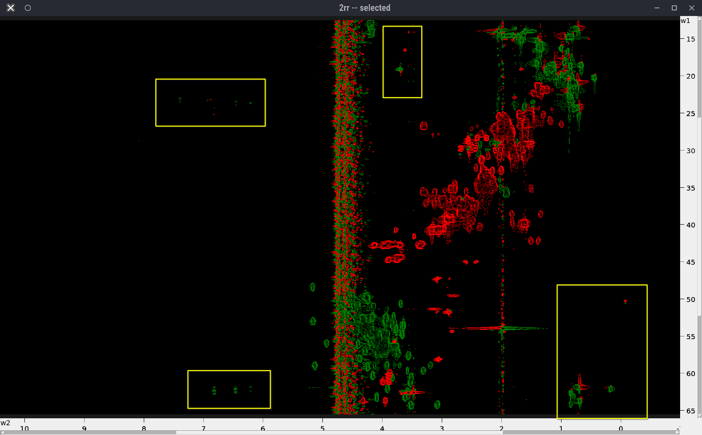

# Peak Picking in 4D Spectrum with POKY

This tutorial guides you through the process of peak picking in Poky or Sparky. We demonstrate it on an example of a 
4D HCNH NOESY spectrum and its HN projection.

## Prerequisites

- Installation of POKY or NMRFAM-Sparky; license for POKY.
- Access to the specified Ubiquitin 4D and 15N HSQC spectrum files.

## Steps

---

### Step 1. Reference the `HSQC` Spectra in Topspin

Follow [the instructions](../TOPSPIN/Referencing_shifts/Referencing_Spectra.md) to reference the `1H-15N` and `1H-13C HSQC` in Topspin with BioTop.

---

### Step 2. Prepare the Spectra Files

#### 2.1 Reference the HSQC spectra in Topspin

- If you don't have the **BioTop** Topspin extension, install the spectrometer-related dependencies by running `expinstall` and keeping the default values. 
- Open the `1H-15N HSQC` spectrum and issue the command `btproc biorefonly`. If the temperature is not `298 K`, then you have to manually do spectral referencing by setting it in the `btproc` browser window.
- Do the same for the `1H-13C HSQC`. The `2rr` files will be updated automatically.
- You do not need to reference the `4D HCNH NOESY` because this will be compensated for by aligning to the HSQC spectra
  during peak picking.

#### 2.2 Convert Spectra to UCSF Format

Enter the directory where each spectrum is saved in Bruker format and run `bruk2ucsf` from there—running it from another directory will fail.  
For example, to convert the `1H-15N`, `1H-13C HSQC` spectra, and the 4D HCNH NOESY:

```shell
 bruk2ucsf_run 6/pdata/1/2rr /srv/NMR/Peak_Picking/Nanoluc/15N_HSQC.ucsf
 bruk2ucsf_run 7/pdata/1/2rr /srv/NMR/Peak_Picking/Nanoluc/13C_HSQC.ucsf
 bruk2ucsf_run 5/pdata/1/4rrr /srv/NMR/Peak_Picking/Nanoluc/4D_HCNH_NOESY.ucsf
```

> Note: You can also [convert the spectra from Bruker to UCSF format in POKY/Sparky](Miscellaneous/convert_spectra_POKY.md), 
> but you cannot rename the axes in that process.

#### 2.3 Rename Axes

Rename the axes in the `1H-15N` and `1H-13C HSQC` spectra:

```shell
ucsfdata -a1 N -a2 HN 15N_HSQC.ucsf
ucsfdata -a1 C -a2 HC 13C_HSQC.ucsf
```

Print the axis values of the `4D HCNH NOESY`:

```shell
ucsfdata 4D_HCNH_NOESY.ucsf
```

Example output:

```shell
axis                          w1          w2          w3          w4
nucleus                       1H         13C         15N          1H
matrix size                  256         256         256         416
block size                     8           8           8          13
upfield ppm                1.194       6.301     101.402       5.279
downfield ppm              8.208      73.001     133.002      10.622
spectrum width Hz       6666.667   15939.978    3043.445    5078.125
transmitter MHz          950.374     238.980      96.311     950.374
```

From the `upfield` and `downfield` rows, you can guess which axis is `HC` and which is `HN`. In this example, the following 
command renames them properly—amidic protons have higher shift values than the aliphatic protons:

```shell
ucsfdata -a1 HC -a2 C -a3 N -a4 HN 4D_HCNH_NOESY.ucsf
```

> **IMPORTANT:** Make sure that axes are named consistently in all spectra; otherwise, you will encounter problems during peak picking.

#### 2.4 Create C-HC and N-HN Projections

For a detailed tutorial, see [Create_2D_projections_from_4D_spectrum](../SPARKY_and_POKY/Create_2D_projections_from_4D_spectrum.md).
Briefly, extract the `N-HN projection` from the `4D HCNH NOESY`. You may need to adjust the `-p[1-4]` values according 
to your 4D spectrum dimension order:

```shell
ucsfdata -p1 -r -o C-N-HN.ucsf 4D_HCNH_NOESY.ucsf
ucsfdata -p1 -r -o 2D_N-HN_proj.ucsf C-N-HN.ucsf
```

Similarly, for the `C-HC projection`:

```shell
ucsfdata -p4 -r -o HC-C-N.ucsf 4D_HCNH_NOESY.ucsf
ucsfdata -p3 -r -o 2D_HC-C_proj.ucsf HC-C-N.ucsf
```

---

### Step 3. Loading the Spectra

**Load the spectra**
- Open the UCSF files with the `fo` command (make sure to display **Poky Spectrum** type of files in the pop-up browser), 
navigate to the folder, and select your spectra. Alternatively, you can copy the full path to each spectrum (for 
example, `realpath 4D_HCNH_NOESY.ucsf` in the Shell) and paste it into the pop-up browser.
- Do the same with the 2D projections and the `HSQC` spectra.
- Use `xa` to show the nucleus types on the axes., `xr` to roll the axes and `xx` to transpose them.
- Fix the aspect ratio by hitting `vt` and increasing the **Aspect (ppm)** for example to `12`, and then **Apply**.

---

### Step 4. Adjusting the Spectra

**Correct the contour levels and colors**  
- Type `vC` to bring up the contour level control scrollbars and adjust the contour levels.
- Type `ec` to bring up the easy contour dialog allowing you to adjust all loaded spectra, including their colors.
- If you double-click on a spectrum in the dialog it will open up the contour level dialog (equivalent to the `ct` command).

**Align the `2D_N-HN_proj` to the `15N_HSQC`**  
- The 4D axes are usually completely off and must be aligned to the reference HSQC spectra. To achieve this, use the 2D 
projections.   
- Hit `ol` to overlay `2D_N-HN_proj.ucsf` onto `15N_HSQC`.  
- Manually pick the most "trustworthy" peak in the `15N_HSQC` (`F8` to enter peak picking mode, `F1` to exit it) and find the 
same peak in the 4D.  
- Type `al`, and in the pop-up:  
  - Set **Align spectrum** to `2D_N-HN_proj`  
  - Set **using peak in** to `15N_HSQC`  
  - The axes should match, thanks to the renaming we did earlier.  
  - Now hold the `Shift` key and select one "trustworthy" peak in each spectrum for alignment.  
  - Hit **Auto align**.

**Align the `2D_HC-C_proj` to the `13C_HSQC`**  
Follow the same procedure described in the previous step.

**Reference the `4D_HCNH_NOESY`**  
- Hit `st` and copy the shift values from the aligned `2D_N-HN_proj` to `4D_HCNH_NOESY`.  
- Make sure that every time you copy a shift value from one spectrum to the other, you click **Apply**, or else the value is not saved.  
- Similarly, copy the shift values from the aligned `2D_HC-C_proj` to `4D_HCNH_NOESY`.  
- When you finish, click **OK**, and the `4D_HCNH_NOESY` will be referenced!  
- You no longer need the 2D projections; feel free to close the `2D_N-HN_proj` and `2D_HC-C_proj` windows if they distract you.

---

### Step 5. Peak Picking

**Synchronize Spectra**  
- Click `yt` to synchronize the `N` axes of the `1H-15N HSQC` and `4D_HCNH_NOESY` first, and then synchronize the `HN` 
axes of those same spectra. Remember to synchronize one axis at a time!  
- Do the same for the `1H-13C HSQC` and `4D_HCNH_NOESY`.

**Pick all peaks in the reference 1H-15N HSQC**  
Go to the `15N_HSQC`, hit `F8` to enter peak picking mode, and drag a box around all signals. This will pick all the visible peaks. Hit `F1` to return to selection mode. Select and delete all peaks that you deem to be noise.

> **TIP:** Use `lt` to view the peak list.

**Use those peaks to find peaks in the 4D**  
- While you have only real peaks in `15N_HSQC`, type `lt` and export the peak list to a file.
- Switch to the `2D_N-HN_proj` window and hit `rp` to load the list of peaks.
- Select **Auto detect dimensions** and click **Create peaks**.
- Hit `pa` to select all loaded peak markers and then `pc` to center them to the contour hills of `2D_N-HN_proj`.
- Hit `ol` and overlay `15N_HSQC` to `2D_N-HN_proj`.
- Go through all the peak markers, visualize them and adjust their position manually to be at the center of the contours hills
in the `2D_N-HN_proj`. To help you spot the overlapping peak parkers, hit `lt`, **sort by frequency** and go through the list
search for peaks with identical coordinates. Double click on them and adjust their position based on the `15N_HSQC`.
 
  **THIS IS FOR 3D SPECTRA:** For the indirect NOE-HC dimension, set the tolerance to **999** because we want to find 
all NOE cross peaks, not just the diagonals!  

> The picking will take a while, but you can see its progress in the window:


**Pick all peaks in the HC-C projection that match with reference 1H-13C HSQC**  
Since `1H-13C HSQC` is very crowded and is not ideal for setting landmarks for restricted peak selection, we will use it in 
combinations ith the `2D_HC-C_proj`. Overlay the two spectra and select the peaks in `2D_HC-C_proj` that you believe are
within the general boundaries defined by the `1H-13C HSQC` and are not noise - a bit of intuition will be helpful here. 
Inspect visually the selected peaks in the `2D_HC-C_proj` and add/remove peaks by holding the **Shift** button.
These will be your landmarks for restrictive peak selection. Repeat the previous step to select the relevant peaks in the
`4D_HCNH_NOESY` (hit the **Select peaks** button this time). Keep only those peaks that you deem to be real by hitting `pI`
for inverted selection followed by **Delete** button.

**Use those peaks to delete noise peaks in the 4D**  
While you have only real peaks in `13C_HSQC`, type `kr` to enter the peak transfer dialogue:  
- Set **Find peaks in** to `4D_HCNH_NOESY`  
- Set **Using peaks in** to `13C_HSQC`  
- Adjust the tolerances: use higher tolerances because the `1H-13C HSQC` spectrum is very crowded. For example, 0.4 ppm for `C` and 0.04 ppm for `HC`.  
- This time, hit the **Select peaks** button.  
- Once the selection is finished, type `pI` to invert the peak selection and click **Delete** to remove those noise peaks.  
- In the end, you should see only peaks that are close to the `13C_HSQC` contours, but there may still be many peaks that fall outside and are noise. Refine your peak selection by repeating restricted peak picking with gradually lower tolerances, inverting the selection, and deleting the peaks that you deem to be noise.

Tolerances for `kr`:
2D_N-HN_proj -> 4D_HCNH_NOESY: N=0.2 ppm and HN=0.02 ppm
2D_HC-C_proj -> 4D_HCNH_NOESY: C=0.4 ppm and HN=0.04 ppm because the HC-C projection is more crowded. You want to add peaks manually (`F8` button) at crowded regions (e.g. CA) where no peak markers were created with `13C_HSQC`->`2D_HC-C_proj` restricted peak selection.

Aliased Peaks:
`C < 25` ppm and `HC > 3` ppm. 

[FIGURE here]

---

### Step 6. Validation Tips

**View the C-H Plane in the 4D Spectrum**  
- Click `xr` twice on the 4D spectrum to focus on the C-H plane. Type `xx` to make the H axis horizontal and C vertical.  
- You can type `xa` to show the nucleus types on the axes.

**Open the peak lists**  
Bring up the `lt` windows for both the 2D and the 4D; sort the peaks by the direct `HN` or `N` frequency, and select the useful columns to display:


(Linewidth should be unchecked!)

Click on each peak in the 2D list and validate them.

**If you wish to start over completely**  
Type `pa` to select all peaks, and hit **Delete** to remove all peaks.

**If you want to find new peaks to add**  
Don't forget to check the **Use selected peaks only?** box in the `kr` dialogue!

**View the nD spectrum from different C-H planes**  
To open multiple C-H planes, click `vd` to duplicate the view of a 4D spectrum into another window. In each window, you 
can focus on different C-H planes by selecting a different `15N HSQC` peak with `F1` and clicking `vc` to center it.

**Discard the noise peaks**  
- Overlay the `N-HN_proj` onto the `15N_HSQC` and increase the contour levels until noise peaks start to emerge.  
- Select a `15N_HSQC` peak with weak signal in `N-HN_proj` and check its HC-C plane by switching to `4D_HCNH_NOESY` and hitting `vc`.  
- Review the picked peaks (previously found by `kr`), adjusting the contour levels until all visible peaks are captured.  
- If you cannot achieve this, pick another weak peak in the `15N_HSQC` and repeat the process.  
- Once you succeed, select the **weakest picked peak** and hit `ss`. This command will select all 4D peaks that have lower intensity than the selected one. Type `lt` to check that.  
- Click **Delete** to remove them.

> **Note**: This comparison is made using signed intensities: negative peaks with large absolute intensity will also be 
selected! Check them manually and deselect if needed: hold `Ctrl` and drag over the selected peaks with your mouse.


(^ There should be a GIF here showing large negative peaks.)

---

### Step 7. Exporting Picked Peaks

**Export Picked Peaks for 4D-GRAPHS**  
Go to the 4D peak list (type `lt`) and select the columns `w1`, `w2`, `w3`, `w4`, and `Data Height`. Click **Apply**, then **Save...**.

---

## Notes for Special Cases

**Crowded 2D Spectra**  
If there is too much peak overlap in the 2D spectra (or planes or projections), it is helpful to use an orthogonal plane 
(for example, a `13C-HSQC` in addition to the `15N-HSQC`) to ...

**Unaliasing Peaks in POKY**  
When you use restricted peak picking (`kr`), POKY will automatically check for possible aliased peaks. If the spectrum 
width of the source 2D is larger than that of the nD (n = [3,4]), POKY will find and mark the peaks in the 3D as aliased.

Below are examples of the `13C-HSQC` spectra with aliased peaks (in yellow boxes):

| Protein 1 | Example 13C-HSQC - Protein 2 |
|------------------------------------------------------------------|--------------------------------------------------------------------|
|  |  |

---

# Authors
- Thomas Evangelidis  
- Ekaterina Burakova
