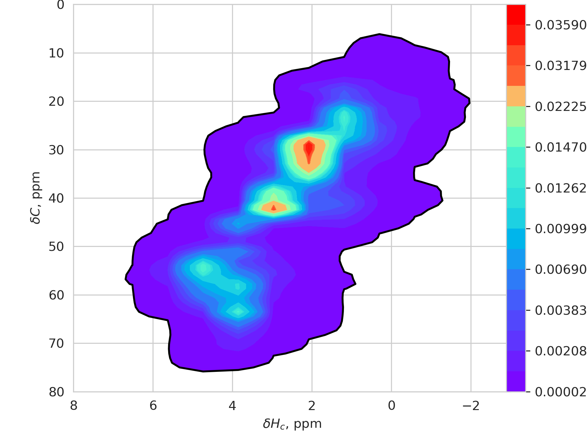

# Theory

* There is a slight difference in terms "folded" and "aliased" peaks. It is not relevant here. 
Here we'll use just the term "aliased" for both folded and aliased peaks.  
* Happens only in the indirect dimension: spectral width and sampling rate in the direct dimension is always enough - **is that still true for ultra-high fields like 1.2GHz???** 
## When is there sign inversion?

To be written

## How to identify aliased peaks?
* The most easy method to identify folded and aliased peaks is *experimental* 
by recording a 2D with different spectrum widths. The peaks that change their frequencies are the aliased ones.  
* If the experimental evidence is not available, one has to resort to predictions. 
* **Hint about the antiphase**: happens if there are CO resonances. 
Phase distortion happens because the peaks are so far away that only specifically designed pulse sequences can cover the entire 
frequency range of 200 ppm from aliphatic to carbonyl carbons. (On the typical spectrometers 600+ MHz)
* Sign inversion - ???

The heatmaps below show the chemical shift distribution based on a dataset of nearly 4M peaks. 

| Hn / N plane                                                 | Hc/C plane                                                     |
|--------------------------------------------------------------|----------------------------------------------------------------|
|  |  |
# Unaliasing peaks in POKY
  
* When you use restricted peak picking (`kr`), POKY will automatically check for possible aliased peaks.
If the spectrum width of the source 2D is larger than that of the nD (n=[3,4]), than
POKY will find and mark the peaks in the 3D as aliased.
  
Below are examples of the 13C-HSQC spectra with aliased peaks (in green boxes)

| Protein 1                                          | Protein 2                         |
|----------------------------------------------------|------------------------------------------------------|
|  |  |
 
----------------------------

# Unfold peaks in the HC-C dimensions
* overlay the 2D HC-C projection of the 4D HCNH NOESY spectrum with the 13C HSQC spectrum
, as described in another tutorial.
* Identify peaks that are folded or aliased. You may use the SHIFTX2 or UCBSHIFT plugins 
of POKY to obtain the CS prediction and from the infer which peaks are folded/aliased.
* Open the 4D HCNH NOESY spectrum and the 15N HSQC and align them using `yt`.

Then you have two options to proceed.

## OPTION 1
* select all peaks in the 15N HSQC
* Switch to the 4D, type , activate the "peak" radio button.
* Type `ps` to enable viewing all peaks on all the visible planes.
* type `vd` to open the "View Depth" window, and set the visible planes at the N and HN 
dimensions to 999999. Now you should see all peaks of all spin systems of the 4D on the
HC-C plane.
* The peak locations should match those in the 2D HC-C projection. So you already know
which of them require unfolding/unaliasing. You can unalias them by a1,A1,a2,A2, etc.
as described in another tutorial.

## OPTION 2
