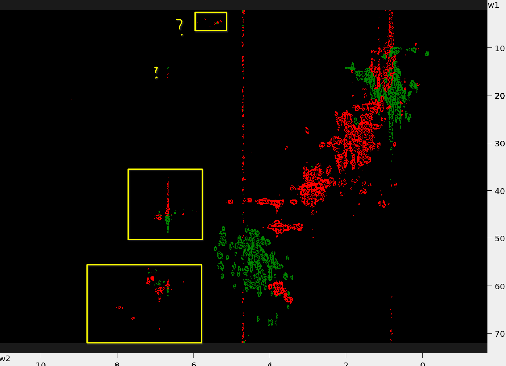

# Theory

**The peaks appear aliased/folded when** the frequency of a peak exceeds the Nyquist limit for the spectral window which is being observed. 
In the indirect dimensions, the spectral width is defined by the acquisition time (**SOME GOOD REFERENCE**), which is always limited by the available spectrometer time. 
The spectrometer time is expensive, which is one of the reasons to limit spectral width. (Another reason is the range of frequencies which can be hit by pulses). 

**The limit in spectral width is essentially the same as undersampling??**
If there are signals of a higher frequency than the maximum frequency sampled, the spectrometer “sees” their frequencies as if they were within the window by mirroring it, so it appears as a lower frequency within the observed range. 

The influence of the sampling rate is demonstrated in [this video by Zach Star](https://www.youtube.com/watch?v=Jv5FU8oUWEY)

**For nD NMR spectroscopy, this means** that peaks outside the detectable spectral window in any dimension will appear as "folded" or "aliased" peaks within the window. 
Folding in multiple dimensions, like in 2D or 3D NMR, can make spectra more complex, as folded signals from outside the spectral range appear within it, sometimes creating overlap with peaks from within the window. This folding or aliasing can complicate interpretation but may also be useful for spectral compression when controlled.

**There is a slight difference in terms "folded" and "aliased" peaks.** "Aliased" peaks typically refer to signals that appear within the observed spectral range due to frequency mirroring from outside the Nyquist range, whereas "folded" peaks are those that are mirrored back into the spectral window, 
often referring specifically to how they "fold" over the Nyquist frequency. In essence, while "aliasing" describes the appearance of an incorrect frequency, "folding" often refers to the mirroring effect specifically.

* Happens only in the indirect dimension: spectral width and sampling rate in the direct dimension is always enough - **is that still true for ultra-high fields like 1.2GHz???** 

## Phase of the folded peaks

There should be **no negative peaks** in Burker's 4D HCNH NOESY pulse sequences unless they are **aliased in the 13C or 15N dimension**.  

If a peak is located **outside the spectral width**, it will be **aliased** into the spectrum, and its **sign will be inverted**.  
For example, if the chemical shift of a nucleus is **80 ppm** and your **spectral width (SW)** is from **10 to 70 ppm**, 
a **negative signal** will appear at **20 ppm**.

This **sign inversion** occurs only for dimensions that use **delayed sampling**, where the **first complex sampling (CS) 
evolution time** is equal to **1/2 increment**. This results in a **90°/-180° zero/first order phase correction**.

Unless these peaks are **known to be aliased** and you **explicitly account for this** in your assignment algorithm 
(since they **do not appear at the expected position**), you should **most likely discard these signals**.

**Folded peaks** will still appear as **in-phase signals**, but with **inverted sign**.  
If they are **folded twice** (e.g., in **two different dimensions**), they will appear **positive again**.

**The sign of the folded peaks depends on the acquisition mode.**

In ***Echo-antiecho*** mode, the aliased signals will appear **inverted**. 

In ***States-TPPI*** the folded signals will have the **same phase**.

*States* and *TPPI* acquisition modes are inferior to *States-TPPI* and are not used in the modern NMR spectroscopy.

For more details on the acquisition modes see _J. Keeler, Understanding NMR Spectroscopy, Chapter 8.12._ 

The additional factor influencing the phase of the folded signals is their offset from the carrier - 
i.e. how far they are from the middle of the spectrum. This is mostly and especially relevant for the carbon nuclei, 
which have a particularly wide spread of frequencies. 
The excitation pulses which are commonly used in the pulse sequence to target carbon nuclei affect only a narrow width 
around the frequency of the pulse in the "clean" way, resulting in the pure absorbtion lineshape. 
> A 90 degree pulse at 120 ppm will flip the magnetization vector of the carbons at 170 ppm for roughly 90 degrees, 
> but the 30-ppm-carbons will flip to only 40 degrees. *The numbers here are not accurate. The flip angle depends on the 
> amplitude and duration of the pulse. A precise calculation is quite simple but falls out of scope of this tutorial.*
The peaks which could not be excited "cleanly" will have distorted lineshapes, i.e. mixture of absorbtion and dispersion. 

## How to identify aliased peaks?

The most easy method to identify folded and aliased peaks is *experimental*, 
by recording a 2D with different spectrum widths. The _peaks that change their positions are the aliased ones_.

_Hence, the spectroscopist in charge of recording the data checks for folded peaks in the prcess of setting up the measurement._

Lower-dimensional experiments can be recorded

If the experimental evidence is not available for any reason, one has to make assumptions on which frequencies are to be observed in the experiment. 

The heatmaps below show the chemical shift distribution based on a dataset of nearly 4M peaks. The colors inside 
the black contour show the probability density  > 0.001. The color gradient is plotted with logarithmic scaling. 

If any peaks appear outside the shaded areas, they are aliased.   

| Hn / N plane                                                 | Hc/C plane                                                     |
|--------------------------------------------------------------|----------------------------------------------------------------|
|  |  |
  
Below are examples of the 13C-HSQC spectra with aliased peaks (in yellow boxes)

| Protein 1                                          | Protein 2                         |
|----------------------------------------------------|------------------------------------------------------|
|  |  |
 

You may just as well use the chemical shift prediction algorithms, e.g. SHIFTX2 or UCBSHIFT plugins of POKY or [SPARTA+ server](https://spin.niddk.nih.gov/bax-apps/nmrserver/sparta/) 
to obtain the rough estimate of the expected peak positions.

# Unaliasing peaks in POKY
  
* Use your best judgement to identify which peaks are folded. 
  * When you use restricted peak picking (`kr`) based on the 2D spectra with the larger spectra width, 
POKY will automatically check for folding and label the peaks as `aliased`.

[screenshot of the aliased peaks](./images/aliased-label-poky.png)

# Aliasing and Unfolding Peaks in NMR Spectra

To identify aliased or folded peaks, you can shift the spectrum axes upfield or downfield using specific accelerator commands. These shifts help to visually determine whether peaks are aliased or folded and on which axis.

- **For Upfield shifts**: Use lowercase commands (`f1`, `f2`, `f3`, `f4`).
- **For Downfield shifts**: Use uppercase commands (`F1`, `F2`, `F3`, `F4`).

For example:
- To shift the **w2** axis upfield, type `f2`.
- To shift **downfield**, type `F2`.

These commands do **not** change the actual coordinates of peaks; they only affect the visual representation of spectra.

Once you've determined the correct position of an aliased peak, you may need to adjust its coordinates manually or confirm its proper placement.

To identify folded peaks in a 2D projection from a 4D HC(CC)NH or a 13C-HSQC spectrum, consider this practical guideline:

- Any peak located at **carbon frequency < 25 ppm** and **proton frequency > 3 ppm** is potentially an aliased aromatic peak.
- If you suspect folding, confirm by checking typical aromatic chemical shift ranges and use unfolding commands accordingly.

Certain spectra (e.g., acquired in TPPI mode) produce aliased peaks that appear reflected around the spectral edges (upfield or downfield). Specifically:

- **`f1`, `f2`, `f3`, `f4`** shift peaks **upfield** by one sweep width.
- **`F1`, `F2`, `F3`, `F4`** shift peaks **downfield** by one sweep width.

When you correctly unfold an aliased peak, hovering your cursor over that peak along the axis where unfolding was applied will display the annotation **"aliased"**.

## Practical Tip for **HC-C Projections** or **13C-HSQC**
Any peak with a carbon frequency `<25 ppm` and proton frequency `>3 ppm` might actually be an aromatic peak that is aliased. For example, if you have an aromatic peak at a carbon chemical shift around 130 ppm, it could appear around a much lower ppm value (due to aliasing). Verify and unfold such peaks accordingly.

### Example
- If an aromatic peak expected around ~125 ppm appears near -10 ppm, it has likely folded around the spectral edge. Use unfolding commands (`fX` or `FX`) to visually confirm this.

This procedure helps you correctly identify and handle aliased peaks, ensuring accurate peak assignments.

