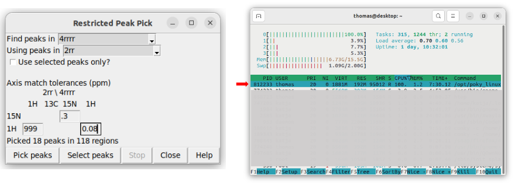
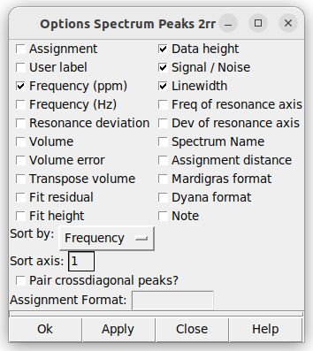
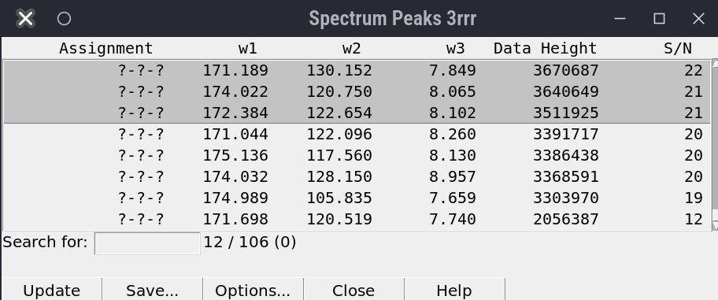
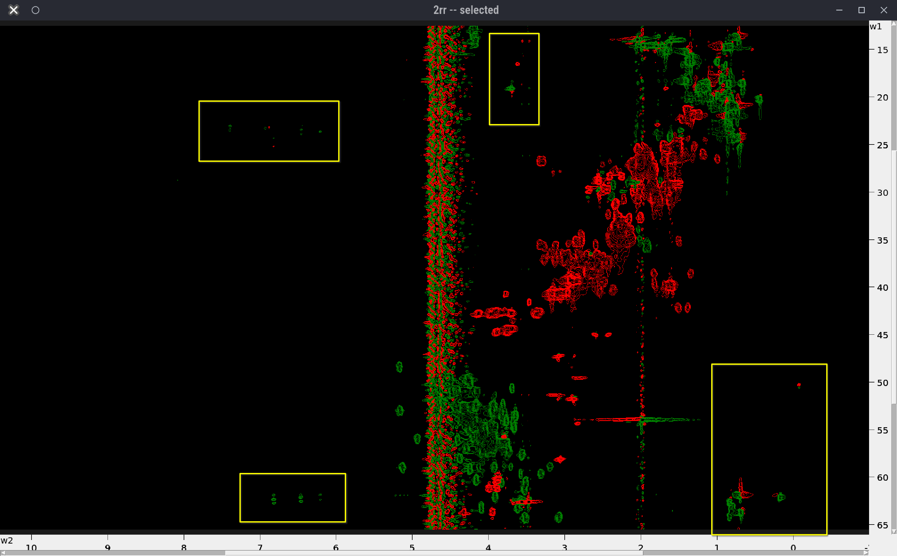
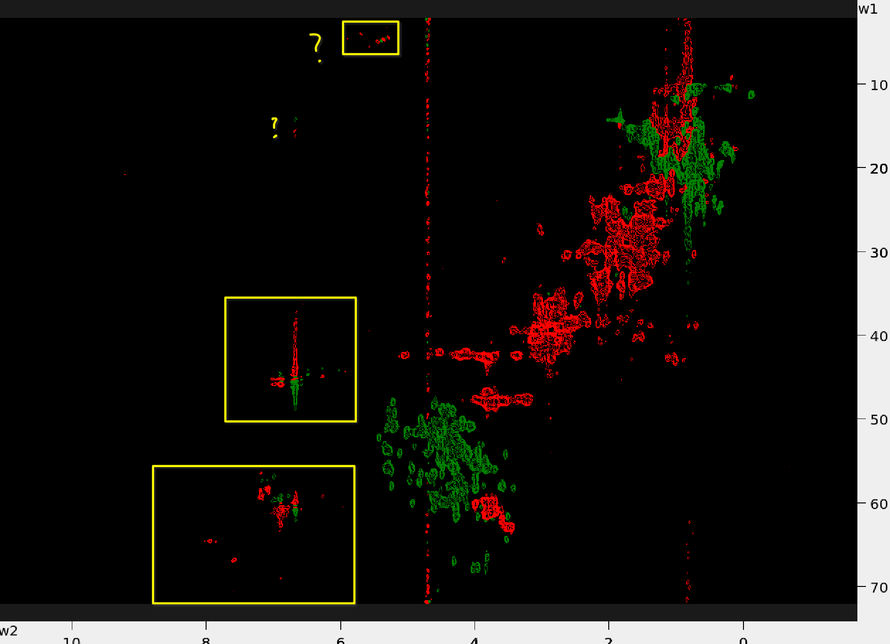

# Peak Picking in 4D Spectrum with POKY

This tutorial guides you through the process of peak picking in Poky or Sparky. We demonstrate in on an example of a 
4D HCNH NOESY spectrum and its HN projection. 

## Prerequisites

- Installation of POKY or NMRFAM-Sparky; license for POKY.
- Access to the specified Ubiquitin 4D and 15N HSQC spectrum files.

## Steps

### Reference the `HSQC` spectra in Topspin

Follow [the instructions](../TOPSPIN/Referencing_shifts/Referencing_Spectra.md) to reference the `1H-15N` and `1H-13C HSQC` in Topspin with BioTop.

### Prepare the spectra files

1. **Reference the HSQC spectra in Topspin**

   - If you don't have **BioTop** Topspin extension then install the spectrometer-related dependencies, just by running `expinstall` 
   and keeping the default values. 
   - Open the `1H-15N HSQC` spectrum and issue the command `btproc biorefonly`. If the temperature is not `298 K` then you have to 
   manually do spectral referencing by setting it in the `btproc` browser-window.
   - Do the same for the `1H-13C HSQC`. The `2rr` files will be updated automatically.
   - You don't need to do referencing of the `4D HCNH NOESY` because this will be compensated by aligning to the HSQC spectra
   during peak picking.

2. **Convert Spectra to UCSF Format**

Enter the directory where each spectrum is saved in Bruker format and run `bruk2ucsf` from there - from another directory it will fail.
E.g. to convert the `1H-15N` and `1H-13C HSQC` spectra and the 4D HCNH NOESY do:

```shell
cd 3/pdata/1
bruk2ucsf 2rr 15N_HSQC.ucsf
cd ../4/pdata/1
bruk2ucsf 2rr 13C_HSQC.ucsf
cd ../5/pdata/1
bruk2ucsf 4rrrr 4D_HCNH_NOESY.ucsf
```

Note: you can also [convert the spectra from Bruker to UCSF format in POKY/Sparky](Miscellaneous/convert_spectra_POKY.md), but you cannot rename the axes.

3. **Rename Axes**

Rename axes in the 1H-15N and 1H-13C HSQC spectra.

```shell
ucsfdata -a1 N -a2 HN 15N_HSQC.ucsf
ucsfdata -a1 C -a2 HC 13C_HSQC.ucsf
```

Print the axes values ranges of the 4D HCNH NOESY:

```shell
ucsfdata 4D_HCNH_NOESY.ucsf
```

Example output:
```shell
axis                          w1          w2          w3          w4
nucleus                       1H         13C         15N          1H
matrix size                  256         256         256         416
block size                     8           8           8          13
upfield ppm                1.194       6.301     101.402       5.279
downfield ppm              8.208      73.001     133.002      10.622
spectrum width Hz       6666.667   15939.978    3043.445    5078.125
transmitter MHz          950.374     238.980      96.311     950.374
```

From the rows `upfield` and `downfield` we can guess which is the `HC` and which the `HN` axis. In this case the following
command should rename them properly - the amidic protons have higher shift values than the aliphatic.

```shell
ucsfdata -a1 HC -a2 C -a3 N -a4 HN 4D_HCNH_NOESY.ucsf
```

> **IMPORTANT:** Make sure that axes are named accordingly in all spectra otherwise you will face problems in peak picking.

4. **Create C-HC and N-HN projections**

For a detailed tutorial look at [Create_2D_projections_from_4D_spectrum](../SPARKY_and_POKY/Create_2D_projections_from_4D_spectrum.md).
Briefly, extract the N-HN projection from the 4D HCNH NOESY. You may need to adjust the `-p[1-4]` values according to 
your 4D spectrum dimension order.
  * `ucsfdata -p1 -r -o C-N-HN.ucsf 4D_HCNH_NOESY.ucsf`
  * `ucsfdata -p1 -r -o 2D_N-HN_proj.ucsf C-N-HN.ucsf`

Similarly, for the C-HC projection:
  * `ucsfdata -p4 -r -o HC-C-N.ucsf 4D_HCNH_NOESY.ucsf`
  * `ucsfdata -p3 -r -o 2D_HC-C_proj.ucsf HC-C-N.ucsf`

### Loading the spectra

1. **Load the spectra**. 
Open the UCSF files with the `fo` command (make sure to display `Poky Spectrum` type of files in 
the pop-up browser), navigate to the folder and select your spectra. Alternatively you can copy the full path to each 
spectrum (e.g. `realpath 4D_HCNH_NOESY.ucsf` in the Shell) and paste it in the pop-up browser.

Do the same with the 2D HN projection (F3-F4) or an HSQC spectrum

> [!TIP]
> See how to make a projection in TopSpin [here](/TOPSPIN/Common_Topspin_Commands.md)

### Adjusting the Spectra

2. **Correct the Contour Levels of HSQC** Type `vC` to bring up the contour level controls. Adjust the contour levels 
for the HN spectrum as well as for the 4D. Additionally, you can type `ct` to control the contour colors and the 
other parameters. 

3. **Align the `2D_N-HN_proj` to the `15N_HSQC`** 
   - The 4D axes usually are completely off and must be aligned to the reference HSQC spectra. To achieve that we use the
2D projections.
   - Hit `fo` to load the `2D_N-HN_proj.ucsf`.
   - Hit `ol` to overlay the `2D_N-HN_proj.ucsf` onto the `15N_HSQC`.
   - For that, manually pick the most "trustworthy" peak in the HSQC (`F8` to enter the peak picking mode, `F1` to exit 
   it) and find it in the 4D. 
   - Type `al`, in the pop-up:
     - set `Align spectrum` to `2D_N-HN_proj`
     - set `using peak in` to `15N_HSQC`
     - the axes should match thanks to the renaming we did earlier
     - now hold the `Shift` button and select one "trustworthy" peak from each spectrum to be used for alignment
     - Hit `Auto align`

4. **Align the `2D_HC-C_proj` to the `13C_HSQC`** 
    - Follow the same procedure as in step 3.

5. **Reference `4D_HCNH_NOESY`**
    - Hit `st` and copy the shift values from the `2D_N-HN_proj` (aligned spectrum) to the `4D_HCNH_NOESY`. 
Make sure every time you copy a shift value from one spectrum to the other to click `Apply` otherwise the value is not saved.
    - Similarly, copy the shift values from the `2D_HC-C_proj` (aligned spectrum) to the `4D_HCNH_NOESY`.
    - When you finish, click `OK` and the `4D_HCNH_NOESY` will be referenced!
    - Now you don't need the 2D projections anymore. You can safely close the `2D_N-HN_proj` and `2D_HC-C_proj` windows if they confuse you.


### Peak Picking

4. **Pick all peaks in the reference 1H-15N HSQC** 
Go to the `15N_HSQC`, hit F8 to enter the peak picking mode, and drag a box around 
all signals. This will pick all the visible peaks. Hit F1 to enter the selection mode. Select and delete all peaks that you
deem are noise.

> [!TIP]
> Use `lt` to view the peak list. 

5. **Use those peaks to find peaks in the 4D** 

While you have only real peaks in `15N_HSQC`, type `kr` to  enter the peak transfer dialogue. 
    - Set: Find peaks in `4D_HCNH_NOESY`
    - Set: Using peaks in `15N_HSQC`
    - Adjust the tolerances: typically, 0.05 ppm for the *direct* `HN` and 0.2 ppm for `N` is fine. 
THIS IS FOR 3D SPECTRA: For the *indirect* NOE-HC dimension, set the tolerance to 999: we want to find all NOE crosspeaks, not just the diagonals! 
    - Finally, hit the `Pick peaks` button.

> The picking will take a while, but you can see the progress in the window.



6. **Pick all peaks in the reference 1H-13C HSQC**
Go to `1H-13C HSQC` and repeat step 4. Keep only those peaks that you deep to be real.

7. **Use those peaks to delete noise peaks in the 4D**

While you have only real peaks in `13C_HSQC`, type `kr` to  enter the peak transfer dialogue. 
    - Set: Find peaks in `4D_HCNH_NOESY`
    - Set: Using peaks in `13C_HSQC`
    - Adjust the tolerances: use high tolerances because the `1H-13C HSQC` spectrum is very crowded. For example, 0.1 
ppm for `C` and 0.1 ppm for `HC`.
    - Hit this time the `Select peaks` button.
    - Once the selection is finished type `pI` to invert the peak selection and click the `Delete` button to delete those noise peaks. 
    - At the end you should see only peaks that are close to contours of the `13C_HSQC`, but still there will be many peaks that fall outside
and are noise. Refine your peak selection by repeating restricted peak picking with gradually lower tolerances, invert peak selection and 
delete manually the peaks that you deem to be noise.

[FIGURE here]

### Validation tips

6. **View the C-H Plane in the 4D Spectrum**
   - Click `xr` twice on the 4D spectrum to focus on the C-H plane. Type `xx` to make the H axis horizontal and C - vertical.
	- You can type `xa` to show the nucleus types on the axes.

7. **Synchronize Spectra**
   -Click `yt` to synchronize the `N` axes of the `1H-15N HSQC` and `4D HCNH NOESY` first, and then 
   synchronize the `HN` axes of the same spectra. Remember, synchronize one axis at a time!
   - Do the same for the `1H-13C HSQC` and the `4D HCNH NOESY`.

9. Bring up the `lt` windows for the 2D as well as the 4D; sort the peaks by the direct HN or N frequency and select the useful columns to display:



LINEWIDTH SHOULD BE UNCHECKED!

Click on each peak in the 2D list and validate the peaks. 

10. **If you wish to start all over again,** type `pa` to select all peaks and hit Delete to delete all peaks. 

11. **If you want to find new peaks to the list**, *don't forget to check the `Use selected peaks only?` box in the ` kr` dialogue!*

> **View the nD spectrum from different C-H Planes** To open multiple `C-H planes`, click `vd` to duplicate the view of a 
4D spectrum into another window. In each window, you can focus on different C-H planes by selecting a different 
`15N HSQC` peak with `F1` and clicking `vc` to center it.

12. **Discard the noise-peaks** 
- Overlay the `N-HN_proj` onto the `15N_HSQC` and increase the contour levels until noise peaks start to emerge.
- Select a `15N_HSQC` peak with weak signal in `N-HN_proj` and check it's HC-C plane by switching to the `4D_HCNH_NOESY` and hitting `vc`.
- Review the picked peaks (previously picked by `kr`), play with the contour levels until all peaks that appeak have been picked.
- If you cannot achieve that then try picking another weak peak in the `15N_HSQC` and repeat the process.
- Once you achieve it then select the **weakest picked peak** and hit `ss`. This command will select all 4D peaks that have 
lower intensity than the selected one. Hit `lt` to check that.
- Click the "Delete" button to discard them.

> **Note**: it compares intensities as signed numbers: the negative peaks with large absolute intensity will be selected too! Go over them manually and deselect: hold `Ctrl` and drag over the
selected peaks with your mouse. 



(^ Should be a gif here; showing large negative peaks)

### Exporting Picked Peaks

13. **Export Picked Peaks for 4D-GRAPHS** Go to the 4D peak list (type `lt`) and select the columns `w1`, `w2`, `w3`, `w4`, and `Data Height`. Click "Apply", then "Save...".

## Notes for special cases

### Crowded 2D spectra

If there is too muchpeak overlap in the 2D spectra (or planes, or projections), it is helpful to use 
an orthogonal plane (for example, or 13C-HSQC in addition to the 15N-HSQC) to 


### Unaliasing peaks in POKY
  
* When you use restricted peak picking (`kr`), POKY will automatically check for possible aliased peaks.
If the spectrum width of the source 2D is larger than that of the nD (n=[3,4]), than
POKY will find and mark the peaks in the 3D as aliased.
  
Below are examples of the 13C-HSQC spectra with aliased peaks (in yellow boxes)

| Protein 1                                                        | Example 13C-HSQC - Protein 2                                       |
|------------------------------------------------------------------|--------------------------------------------------------------------|
|  |  |
 
----------------------------

# Authors

- Thomas Evangelidis
- Ekaterina Burakova