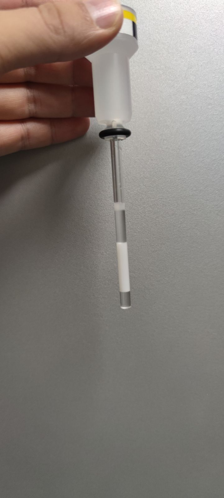

# Protein Sample Preparation for NMR Experiments

This tutorial outlines the procedure for preparing protein samples for **NMR experiments**, 
assuming the starting material is **glycerol-free**. If your protein aliquots contain glycerol, 
please follow the separate [glycerol removal tutorial](./Glycerol_Removal.md).

The process assumes you are starting with a series of protein aliquots (e.g., 6 × 100 μL, 300 μM assumed) 
and guides you through:

- Thawing frozen (-80 °C) aliquots and spinning them to remove debris
- Concentration of the protein solution  
- Measurement of protein concentration  
- Addition of Acetyl-CoA (AcCoA) to achieve a 1:1 molar ratio (if applicable)
- Final transfer into an NMR tube (Shigemi type)

---

## Equipment and Materials

- Fixed-angle centrifuge rotor
- Pipettes (ideally in 100 μL and 200 μL ranges)
- 0.5 mL centrifugal filter unit (3–100 kDa MWCO), placed inside a support Eppendorf tube
- NMR buffer (glycerol-free), e.g.: `25 mM Tris, 300 mM NaCl, 1 mM TCEP, pH 7.5`
- Protein aliquots (e.g., 6 × 100 μL, 300 μM assumed)
- Ice box
- NanoDrop spectrophotometer (for concentration measurement — see the [separate tutorial](../Misc/NanoDrop_tutorial.md))
- D<sub>2</sub>O solution
- Shigemi tubes

---

## 1. Thawing Frozen Protein Aliquots and Spinning them

If your protein aliquots were stored at −80 °C, some protein molecules may become denatured or degraded during thawing. 
This can trigger a domino effect on the remaining protein molecules, leading to rapid aggregation or contamination that 
will hamper NMR data acquisition. To prevent that:

1. **Thaw the samples slowly** in a box filled with ice.
2. Once they are fully liquid, **spin at ≥ 15,000 g and 4 °C for 10 min**, then transfer the supernatant to a new tube.  
  You will probably see a small white pellet left behind (a *good* sign), which is aggregated protein.

**DO NOT OMIT THIS STEP**, otherwise your NMR sample may soon become unsuitable for measurements. Below is what happened 
to us when we skipped the spin at ≥ 15,000 g and 4 °C for 10 min—the protein (25 kDa) completely **aggregated** in just 
3 hours (white part of the NMR tube)!




## 2. Concentration of the Protein Solution

The goal of this step is to reduce the combined volume of your aliquots (~600 μL) to approximately 
**350 μL**, which is enough to fill a Shigemi NMR tube (~300 μL) while providing some extra volume 
for measurement and transfer loss.

---

### 🔹 Step 1: Pre-wash the Filter Unit

Since the filter unit lacks volume markings, you will need to add one manually:

1. Pipette **350 μL** of NMR buffer into the filter unit.  
2. Use a marker to draw a line at the **350 μL** level. This mark will serve as a reference for 
future volume adjustments.
3. Pipette additional **150 μL** into the filter unit to reach its full capacity.
4. Insert the unit into the centrifuge rotor.
5. Centrifuge at **8,000 × g** for **10 minutes** at **4 °C**.
6. If the buffer still remains in the filter unit, centrifuge again for **5–10 minutes** 
until the unit is empty.

---

### 🔹 Step 2: Pool the Protein Aliquots

1. Remove **6 protein aliquots** from the freezer and thaw them on **ice** for approximately 
**10–15 minutes**.
2. Once thawed, pipette the contents of the first five aliquots directly into the sixth one.
3. Vortex the tube briefly to ensure thorough mixing.
4. You should now have approximately **600 μL** of sample, accounting for minor pipetting losses.

---

### 🔹 Step 3: Concentrating the Sample

In this step, you will use the **350 μL** mark made earlier to estimate the volume during concentrating.

1. Pipette **500 μL** of your protein sample into **pre-washed filter unit**.
2. Centrifuge the sample at **8,000 × g** for **1 minute** at **4 °C**.
3. After each spin, check if the volume in the filter unit is above mark.
   - If the volume is still **above** the target, continue centrifugation in **1-minute increments**.
   - Stop once the volume matches the reference level.

> ⚠️ **Avoid overdrying** the sample — stop slightly above the target volume if in doubt.

> 💡 **If your total sample volume exceeds the filter unit’s capacity (e.g., ~600 μL total), process the remaining volume like this**:
>
> - After reducing the first 500 μL to ~400–450 μL, **add the remaining ~100 μL** directly into the same filter unit.
> - Continue centrifugation in 1-minute increments as before.
> - This ensures that **all of your protein sample is retained** and concentrated together without needing a second filter unit.

4. Place the filter unit with the concentrated solution in the NMR buffer on ice and head to the NanoDrop station to measure the concentration.
---


## 3. Concentration Measurement

Measure the concentration of your sample by following the [NanoDrop tutorial](../Misc/NanoDrop_tutorial.md). This concentration will serve as a starting point for calculating how much AcCoA needs to be added to achieve the desired ratio between protein and cofactor (if needed).

## 4. Final NMR Sample preparation

After the concentration measurement, transfer 300 μL of the concentrated sample into an Eppendorf tube. This step establishes the volume of your protein stock for calculating how much AcCoA and D<sub>2</sub>O to add. If you need to add AcCoA, follow Step&nbsp;1; otherwise, skip ahead to Step&nbsp;2.

### 🔹 Step 1: Calculation of the added volume

To determine how much **AcCoA stock** to add to your sample to reach a **1:1 molar ratio** (AcCoA:protein), use the formula below.

```math
V_{AcCoA}~[μL] = \frac{C_{protein}\times V_{protein}\times 10^{-3}}{C_{AcCoA}}
```

Where:
- V<sub>AcCoA</sub> = volume of AcCoA to add (in μL)  
- C<sub>protein</sub> = protein concentration (in μM)  
- V<sub>protein</sub> = protein sample volume (in μL)  
- C<sub>AcCoA</sub> = AcCoA stock concentration (in mM)  

> ⚠️ **Units required for this formula:**
> - Protein concentration in **μM**
> - Protein volume in **μL**
> - AcCoA stock concentration in **mM**
> - Resulting AcCoA volume in **μL**

---

## 💡 Example Calculation

Assume you have:
- C<sub>protein</sub> = 400 μM  
- V<sub>protein</sub> = 300 μL  
- C<sub>AcCoA</sub> = 8 mM

Plug the values into the formula:

```math
V_{AcCoA} = \frac{400 × 300 × 10^{-3}}{8} = \frac{120}{8} = 15 μL
```

✅ **Result**: Add **15 μL** of 8 mM AcCoA to your protein sample to reach a 1:1 molar ratio.

---
### 🔹 Step 2: Addition of D<sub>2</sub>O

To enable frequency locking during NMR acquisition, add **D<sub>2</sub>O** to the sample to reach a final content of **5–10%**. A common choice is **7%**.

Use the following formula to calculate the volume of D<sub>2</sub>O to add:

```math
V_{D2O}~[μL] = \frac{p \times V_0}{1 - p}
```

Where:
- V<sub>D2O</sub> = volume of D<sub>2</sub>O to add (in μL)
- V<sub>0</sub> = current sample volume before adding D<sub>2</sub>O (in μL)
- p = desired D<sub>2</sub>O percentage as a decimal (e.g. 0.07 for 7%)

## 💡 Example Calculation

Let’s say:
- Current volume = 315 μL (300 μL protein + 15 μL AcCoA)
- Desired D<sub>2</sub>O fraction = 7% (i.e. p = 0.07)

Plug the values into the formula:

```math
V_{D2O}~[μL] = \frac{0.07 \times 315}{1 - 0.07} \approx 23.7 μL
```

✅ Result: Add 23–24 μL of D<sub>2</sub>O to your sample to reach ~7% D<sub>2</sub>O content.

This gives you a final volume of ~339 μL, suitable for Shigemi tube preparation.

### 🔹 Step 3: Final Steps

- Vortex the tube briefly to ensure thorough mixing.
- Transfer the sample into the Shigemi tube using the glass Pasteur pipette.
- Cap the Shigemi tube.
- Spin the Shigemi tube on the table rotor to get rid of the bubbles.

**The following steps should be performed by NMR facility personnel but are included here for completeness:**

- Insert the plunger so the meniscus is 2–3 mm below the rim. Be careful, no bubble must be present in the tube.
- Cap, clean the exterior, and load the tube into the spectrometer.