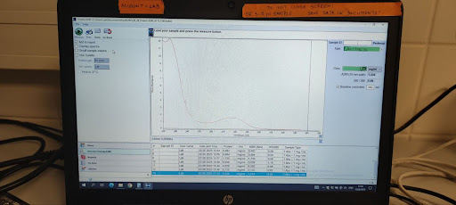

# Measurement of Protein Concetration with NanoDrop Spectrophotometer

The NanoDrop spectrophotometer uses **surface tension** to hold small liquid samples in place, eliminating the need for cuvettes or capillaries. It operates based on **UV/Vis spectroscopy**, measuring light absorbance at specific wavelengths.

This tutorial provides step-by-step instructions for measuring protein concentration at **280 nm**. In order to do that, one must also know the 
extinction coefficient of the measured protein. This can be obtained via ProtParam tool (see below).

### Equipment (available at the NanoDrop station):

- NanoDrop spectrophotometer (connected to a computer with NanoDrop GUI)
- Milli-Q detergent (for cleaning the measurement surfaces)
- Pipette set to 3 μL (the required sample volume)
- Wiping tissues

### User-provided materials/knowledge:

- NMR buffer (for blanking)
- Protein sample
- Extinction coefficient
---
## 1. Obtaining of the Ext. coefficient via ProtParam

- a) Visit the [ProtParam](https://web.expasy.org/protparam/) website.
- b) Paste the FASTA sequence of your protein into the input box and click **`Compute Parameters`**.

  

- c) In the computed results, look for the section with **Ext. coefficients**.

  

- d) Choose the appropriate coefficient that corresponds to your protein and NanoDrop settings.

---
## 2. Measurement Procedure

Follow these steps to perform the measurement:

- a) Open the spectrophotometer lid.
- b) Pipette 3 μL of Milli-Q detergent onto the lower measurement tip, close the lid, then wipe both the **top and bottom tips** thoroughly.
- c) In the NanoDrop GUI homescreen, select **`Protein A280`** to use the correct settings for protein absorbance at 280 nm.

  

- d) Pipette 3 μL of the NMR buffer onto the lower tip.
- e) Click **`Blank`** in the GUI.

  

- f) Close the lid and wait for the blanking process to complete.
- g) Reopen the lid and **wipe both tips thoroughly** using a tissue.
- h) Pipette 3 μL of the **protein sample** onto the lower tip.
- i) Click the **`Measure`** button in the GUI.

  

- j) Close the lid and wait for the measurement to complete.
- k) Divide the reported concentration by **Extinction coefficient** to calculate the correct molar concentration. Record the result.

  

- l) Return the GUI to the **Homescreen**.
- m) Pipette 3 μL of Milli-Q detergent onto the lower tip again, close the lid briefly, then wipe both tips clean for storage.

---

> **_TIP:_** Always ensure the measuring surfaces are clean before and after each measurement to avoid cross-contamination or inaccurate readings.