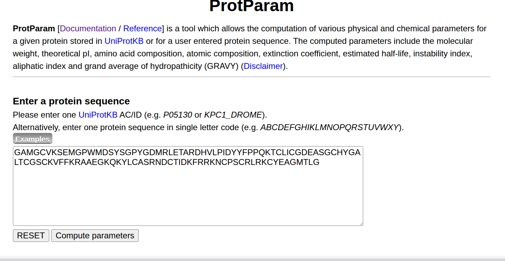
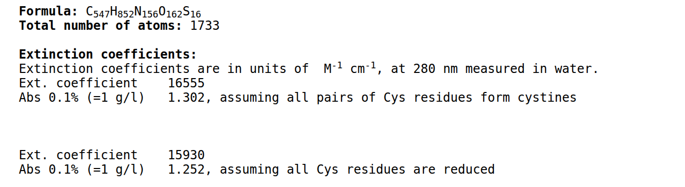
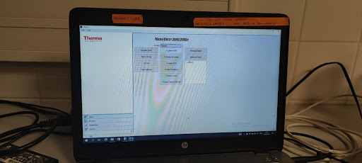
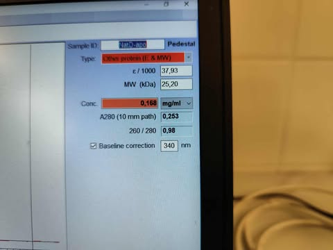
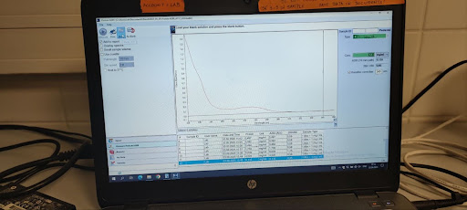
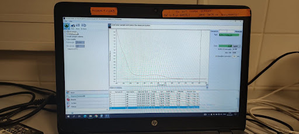

# Measurement of Protein Concentration with NanoDrop Spectrophotometer

The NanoDrop spectrophotometer uses **surface tension** to hold small liquid samples in place, eliminating the need for cuvettes or capillaries. It operates based on **UV/Vis spectroscopy**, measuring light absorbance at specific wavelengths.

This tutorial provides step-by-step instructions for measuring protein concentration at **280 nm**. To do so accurately, you must also know the **extinction coefficient** and **molecular weight** of the measured protein, which can be obtained using the **ProtParam** tool.

---

## 📦 Equipment (available at the NanoDrop station)

- NanoDrop spectrophotometer (with NanoDrop GUI)
- Milli-Q detergent (for cleaning)
- Pipettes (1–20 μL range)
- Wiping tissues

## 🧪 User-Provided Materials

- NMR buffer (for blanking)
- Protein sample
- Extinction coefficient and molecular weight (from ProtParam)

---

## 1. Obtaining the Extinction Coefficient via ProtParam

1. Visit [ProtParam](https://web.expasy.org/protparam/)
2. Paste your protein's FASTA sequence
3. Click `Compute Parameters`

<p align="center">
  
</p>

4. Locate the **Extinction Coefficient** section
<p align="center">
  
</p>

5. ✅ **If your buffer contains reducing agents (e.g., DTT or tCEP)**, choose the value assuming all Cys are **reduced**

---

## 2. Preparation of Samples for Measurement

Before performing NanoDrop measurements, the protein solution must be diluted to ensure that the absorbance at 280 nm (**A280**) falls within the linear range of the Beer–Lambert law, typically **between 0.1 and 1.0**.

Because the stock concentration is often unknown, begin with a test dilution and increase if necessary. Once you determine the correct dilution factor, prepare a triplicate set for accurate measurement.

### 📐 Useful Equations

```math
\begin{align*}
A &= c \times \epsilon \times l \\
dilution &= \frac{V_{sample} + V_{buffer}}{V_{sample}} \\  
total \ dilution &= dilution_1 \times dilution_2 × ...\\
c [μM] &= \frac{A \times 10⁶ \times dilution}{\epsilon}  \\
c [μM] &= \frac{(c_{mg/mL} \times 10⁶ \times dilution)}{MW}
\end{align*}
```

---

### 🔬 Step 1: Prepare a 20× Test Dilution Sample

- Pipette 2 μL protein and 38 μL buffer into a new Eppendorf tube → total = 40 μL  
- Dilution = **20×**  
- Put the vial into vortex and mix well

---

### 🧪 Step 2: Measure A280

- Measure **3 μL** on NanoDrop (see below).
- If **A280 < 1.0**, proceed to replicate measurements
- If **A280 > 1.0**, dilute further according to following table:

| Final Dilution | Dilution Step | Test Dilution Sample | Buffer | Total Vol |
|----------------|----------------|--------|--------|-----------|
| 30×            | 1.5×           | 6 μL   | 3 μL   | 9 μL      |
| 40×            | 2×             | 5 μL   | 5 μL   | 10 μL     |
| 50×            | 2.5×           | 4 μL   | 6 μL   | 10 μL     |

> 💡 Example: 20× → 2× → 40× total dilution. \
Always mix the new dilution table into a new Eppendorf tube.

---

### ✅ Step 3: Prepare Final Replicates

Once you’ve determined the appropriate dilution factor, prepare **three independent replicate samples** using that same dilution. Each replicate should provide at least **15 μL** of solution (sufficient for 5 × 3 μL measurements).  
For example, if the final dilution is **30×**:

- In three clean Eppendorf tubes, mix **2 μL** of protein stock with **58 μL** of NMR buffer.
- Vortex each sample thoroughly to ensure proper mixing.
- If the initial 20× test dilution yielded an acceptable absorbance (within 0.1–1.0), you may use it as **Replicate 1**, and prepare two additional samples following the same 20× protocol.

---

## 3. Measurement Procedure

1. Clean both measuring tips:
   - Open Nanodrop and pipette 3 μL of Milli-Q onto lower tip.
   - Close lid briefly
   - Wipe both tips with tissues

2. Open NanoDrop measurement settings:
   - On the GUI, Select **"Protein A280"**

<p align="center">
  
</p>

3. Under `Sample ID`, name your measurements.

4. Under `Type`, choose:
   - **"Other protein (E & MW)"**
     - Enter **ε** from ProtParam (in thousands, e.g., 21 for 21,000)
     - Enter **MW** in kDa

<p align="center">
  
</p>


5. Blank:
   - Pipette **3 μL of NMR buffer**  onto lower tip. 
   - **Close lid**, click **Blank**
   - Wait for the blanking process to finish
   - Wipe both tips with tissues


<p align="center">
  
</p>


6. Measure sample:
   - Wipe both tips with tissues
   - Pipette **3 μL of prepared protein sample** onto lower tip.
   - **Close lid**, click **Measure**
   - Wait for the measuring process to finish
   - Wipe both tips with tissues


<p align="center">
  
</p>


7. Record results:
   - **A280**
   - **Conc. mg/mL** value reported by NanoDrop

> 🧼 Only clean with Mili-Q and return to the homescreen **after final replicate**, not between every measurement

---

## 4. Calculating Protein Concentration

After collecting your NanoDrop measurements, you can calculate the protein concentration in two ways, depending on whether you recorded:

- **Absorbance values (A280)** → use the **Beer–Lambert law**
- **Mass concentration (mg/mL)** reported by NanoDrop → convert to **molar concentration**

> 🧠 **Recommendation:** Record **both** the absorbance and the reported concentration during measurement. This provides a useful cross-check and allows you to recompute values if needed.

---

### 🔹 Option 1: Calculation Based on Absorbance (A280)

If you chose to manually calculate concentration using the absorbance values, follow these steps:

1. For each replicate, **average the 5 A280 values** recorded.
2. Apply the **Beer–Lambert law**:
```math
\begin{align*}
A &= c \times \epsilon \times l \\ 
c [μM] &= \frac{(A_{avg} × 10^6 × dilution)}{ε}
\end{align*}
```
Where:
- `A` = average absorbance at 280 nm (unitless)
- `ε` = extinction coefficient in M⁻¹·cm⁻¹ (from ProtParam)
- `l` = path length in cm (NanoDrop usually auto-adjusts; use 0.1 cm unless known otherwise)
- `dilution` = total dilution factor applied to the measured sample


---

### 🔹 Option 2: Calculation Based on NanoDrop Reported Concentration

If you used **"Other protein (E & MW)"** mode, NanoDrop will report **mass concentration** in **mg/mL**.

To convert this to the final **molar concentration**, use the following formula:

```math
c [μM] = \frac{c_{NanoDrop} × 10⁶ × dilution}{MW}
```


---

> 📝 **Note:** The two methods should give you very similar results. If they differ significantly, re-check your ε, MW, dilution factor, and pipetting accuracy.

---

### ✅ Final Result

Once you've calculated the molar concentration for all three replicates:
- Average the three values to obtain your **final concentration estimate**.
- If necessary, report the standard deviation for accuracy.


## 🧠 Tips & Best Practices

- Always mix dilutions thoroughly
- Do not rely on “1 Abs = 1 mg/mL” mode
- Clean tips carefully — but only do a full reset after the full triplicate
- Use both A280 and mg/mL values when possible
- Never forget to apply the **dilution factor**


