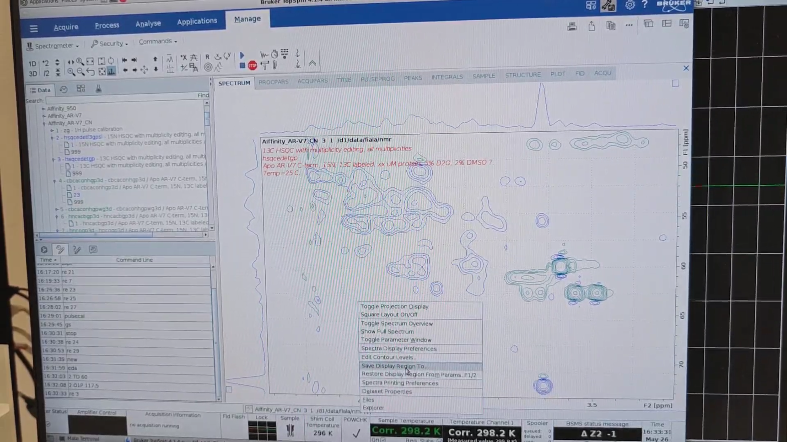
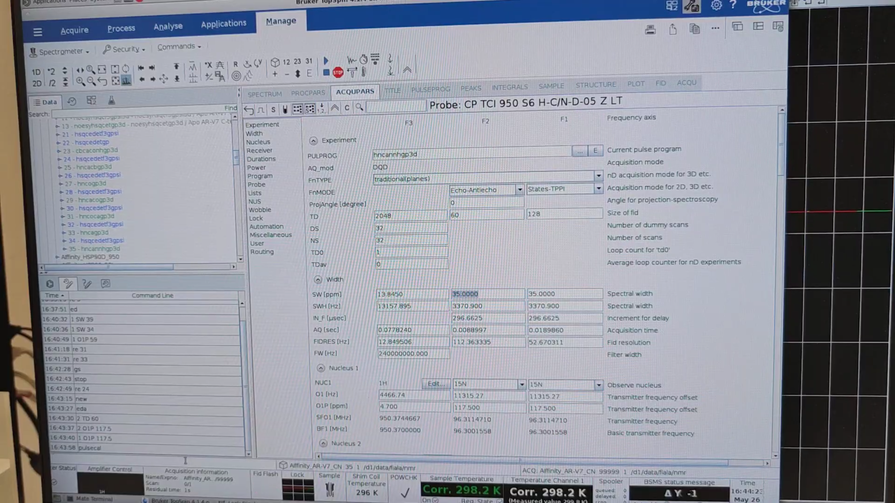

# NMR Acquisition Workflow

---

## 1 · Initial Calibrations and Test HSQCs

First we did 1H pulse calibration (experiment&nbsp;1), while for 13C and 15N we used the default parameters from `getprosol`.  
Then we measured a short 15N HSQC (experiment&nbsp;2) and a short 13C HSQC (exp.&nbsp;3) with full spectral width on N and C, respectively.

---

## 2 · CBCAcoNH N–HN Plane Comparison

We also measured the N–HN planes of two types of CBCAcoNH pulse programs, the standard version and the one with Water-Gate, and we want to select the best one for this sample.

* `xfb` – process the N–HN planes from both CBCAcoNH experiments (exp.&nbsp;4 and&nbsp;5) and then `.ph` to correct their phase.  
*  `.md` – overlay the N–HN planes from exp.&nbsp;4 and&nbsp;5, then click **“copy the contour levels from first to other datasets.”** The standard version (exp.&nbsp;4) seems to be more sensitive.

---

## 3 · Set-Up of Full-Length HSQC Experiments

  
`re 2` to display the test 15N HSQC (experiment&nbsp;2) and hit `new` to create a new 15N HSQC with the desired spectral width in the N dimension. Name it **21**.  

`re 2` again, zoom into the region of interest, then **Right-click → Save Display Region To… → Parameters ABSF1/2**. In **PROCPARS** note the N-axis boundaries, e.g. **100 ppm → 135 ppm**.  

  
`re 21`, then `eda` to open **ACQPARS**. Set  
`SW{F1}` = \(135 − 100 = 35 ppm\) and  
`O1P{F1}` = \(100 + 35 ⁄ 2 = 117.5 ppm\).  
Set `NS` = 16.  

  
`re 3`, followed by `new`, to create a full 13C HSQC from the test 13C HSQC (experiment&nbsp;3). Name it **22**.  

  
`re 3` again, zoom into the region of interest, then **Right-click → Save Display Region To… → Parameters ABSF1/2**. Record the aliphatic-C limits, e.g. **4.6 ppm → 77.5 ppm**.  

`re 22`, then `eda`, set  
`SW{F1}` = \(77.5 − 4.6 = 72.9 ppm\),  
`O1P{F1}` = \(4.6 + 72.9 ⁄ 2 = 41.05 ppm\),  
`NS` = 16, then run `expt` to estimate the experimental time.

---

## 4 · Set-Up of CBCAcoNH Experiments

  
Note the N and aliphatic-C spectral widths from the 15N HSQC (exp.&nbsp;21) and 13C HSQC (exp.&nbsp;22).  
`re 4` to load the selected Water-Gate CBCAcoNH, then `new` to create **23**. In **PROCPARS** set:

| Parameter | Value |
|-----------|-------|
| `TD{F2}`  | 60 |
| `TD{F1}`  | 128 |
| `SW{F1}`  | 73.0 ppm |
| `O1P{F1}` | 41.1 ppm |
| `SW{F2}`  | 35 ppm (keep) |
| `O1P{F2}` | 117.5 ppm |

  
Because we have already measured the N–HN plane, we do **not** repeat `pulsecal`. Run `gs` (interactive acquisition) to check that the experiment runs smoothly. TopSpin raises an error within seconds if, for example, a negative interval occurs or the signal overflows. If everything is fine, press `stop`. Ideally, monitor the first increment only.  

  
`re 21`, then `new`, to create a short QC 15N HSQC that checks protein stability. Adjust the Title, then `eda` and set `NS` = 2.

---

## 5 · General 3-D Motif

For each 3-D experiment we will:  
1. Create the full 3-D experiment.  
2. Run `pulsecal` to calibrate the 1H 90° pulse. A window shows the 90° pulse and its power level; click **OK** to accept.  
3. Record a short QC 15N HSQC.

---

## 6 · HNCACB (exp.&nbsp;25)

`re 6`, then `new` → **25**. In `eda` set `SW{F1}` = 73.0, `O1P{F1}` = 41.1, `O1P{F2}` = 117.5. Run `pulsecal` (automatic 1H 90° calibration). Default 13C and 15N parameters come from `getprosol`; optional dedicated calibrations use `zg`.  

  

Run `gs`; if no error appears, press `stop`.  
Create QC 15N HSQC: `re 24` → `new` → **26**.

---

## 7 · HNCO (exp.&nbsp;27)

  
`re 7`, `new` → **27**. In `eda` set `TD{F2}` = 60, `O1P{F2}` = 117.5, then run `pulsecal`, `gs`, `stop`.  
Create QC 15N HSQC: `re 24` → `new` → **28**.

---

## 8 · HNcaCO (exp.&nbsp;29)

  
`re 8`, `new` → **29**. Set `TD{F2}` = 60, `O1P{F2}` = 117.5, then `pulsecal`, `gs`, `stop`.  
Create QC 15N HSQC: `re 24` → `new` → **30**.

---

## 9 · HNcoCA (exp.&nbsp;31)

  
`re 3`, zoom into the CA–HA region, and save the C range (e.g. 42–76 ppm).  

  
`re 9`, `new` → **31**. In `eda` set `TD{F2}` = 60, `SW{F1}` = \(76 − 42\), `O1P{F1}` = \(42 + (76 − 42)/2\), `O1P{F2}` = 117.5; run `pulsecal`, `gs`, `stop`.  
Create QC 15N HSQC: `re 24` → `new` → **32**.

---

## 10 · HNCA (exp.&nbsp;33)

  
`re 10`, `new` → **33**. Use the same CA window (42–76 ppm); run `pulsecal`, `gs`, `stop`.  
Create QC 15N HSQC: `re 24` → `new` → **34**.

---

## 11 · hNcaNNH (exp.&nbsp;35)

  
`re 11`, `new` → **35**. Set `TD{F2}` = 60, `O1P{F1}` = 117.5, `O1P{F2}` = 117.5; leave `SW{F1}` and `SW{F2}` at 35 ppm. Run `pulsecal`, `gs`, `stop`.  
Create QC 15N HSQC: `re 24` → `new` → **36**.

---

## 12 · Queue Management

  
`re 21`, then `multiexpt 16` to estimate the total time for all 16 experiments.  

  
`re 27` to switch to HNCO (the most sensitive 3-D). In `eda` set `DS` = 4, then `zg` to acquire one increment. When finished, run `qsin`, `ft`, `.ph`. After confirming protein signal, stop with `halt` (or `stop`) and reset `DS` to 32.  

  
Finally, `re 21`, then `multizg 16` to launch all experiments serially.

---

## Notes

* The 3-D experiments **employ shaped pulses**, unlike the 2-D HSQCs. `pulsecal` optimises the 1H 90° pulse **and** recalculates all shaped pulses (including decoupling) with the new value. Otherwise, we would have to copy the calibrated 1H 90° pulse parameters from the 2-D to the 3-D experiment and optimise each shaped pulse manually.  
* HSQC spectra define the H, C and N windows (`SW`, `O1P`) that we copy into the 3-D setups.  
* `TD` (size of FID), `SW` (spectral width) and `AQ` (acquisition time) are inter-dependent: setting any two automatically determines the third in TopSpin.  
