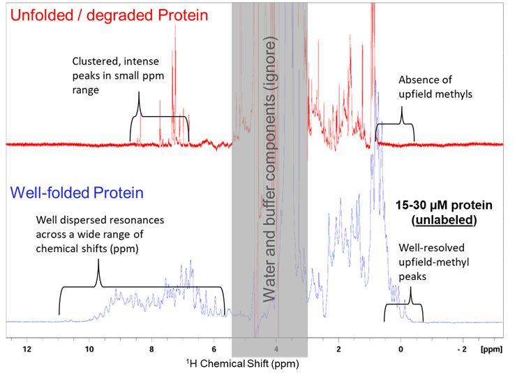

It is pretty easy to determine whether a protein is folded or unfolded in 10-15 minutes by 1D NMR. 
Requires only 15-30 uM of unlabeled protein.
Direct detection of the 1H atoms in the protein is enough!

If you just want to QC your protein sample, sometimes 15 minutes is all you need... 

---

# Authors
- Thomas Evangelidis