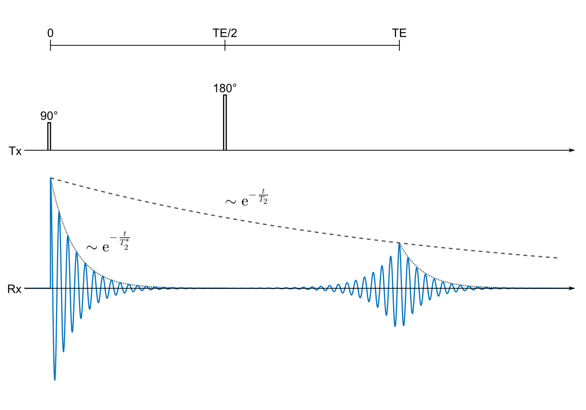

In NMR, **RF** stands for **radiofrequency**, i.e. electromagnetic waves in the MHz–GHz range used to perturb nuclear spins.

An RF pulse is a short burst of that radiofrequency energy applied to the sample via the probe’s coil. Its job is to 
“tip” the net magnetization away from its equilibrium alignment along the strong static magnetic field (B₀). By 
carefully choosing the pulse’s:

- **Frequency** (tuned to the Larmor resonance of the nucleus you want to excite, e.g. ^1H at ~600 MHz),
- **Duration** (which determines the flip angle, e.g. 90° or 180°), and
- **Amplitude** (power),

you control how far and in which direction the magnetization vector moves on the Bloch sphere. Subsequent evolution and 
detection of that tipped magnetization underlie all NMR experiments.

Below is a diagram  showing a 90° excitation pulse, a delay (τ), and a 180° refocusing pulse (the classic spin-echo sequence):

*Figure: RF pulse diagram for a 90° excitation pulse followed by a 180° refocusing pulse forming a spin echo.*

* **90° pulse** (π/2): a short RF-pulse at the Larmor frequency that tips magnetization into the transverse plane.
* **Delay (τ):** spins dephase under B₀ inhomogeneity and chemical shift.
* **180° pulse** (π): flips the dephasing spins so they rephase and produce an echo at time 2τ.
