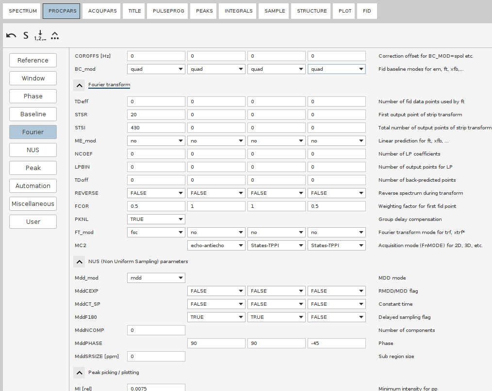
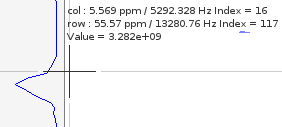
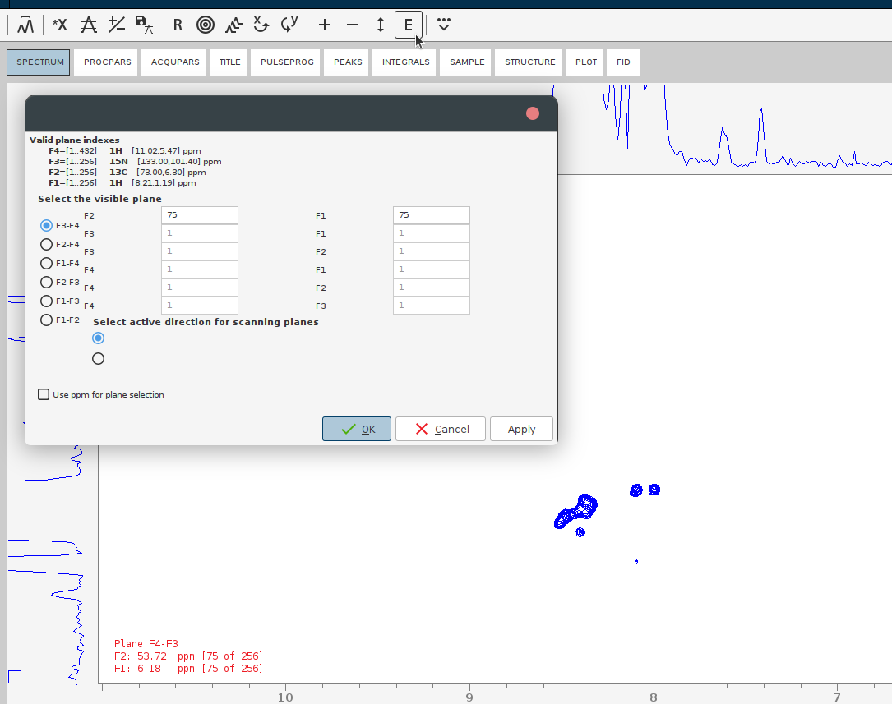

# NUS Reconstruction of 4D spectra in Topspin

### Table of contents
- [General workflow](#general-workflow)
	- [Troubleshooting](#troubleshooting)
		- [Post-reconstruction phasing](#post-reconstruction-phasing)
		- [The reconstructed spectrum is left in the time domain](#the-reconstructed-spectrum-is-left-in-the-time-domain)
- [Examples](#examples)
	- [Bruker 4D HCNH NOESY `hsqcnoesyhsqccngp4d`](#bruker-4d-hcnh-noesy-hsqcnoesyhsqccngp4d)
		- [Processing steps](#processing-steps)
	- [AI|ffinity custom 4D HMQC-NOESY-HSQC experiment `noehcnhwg4d_nove`](#aiffinity-custom-4d-hmqc-noesy-hsqc-experiment-noehcnhwg4d_nove)
		- [Processing steps](#processing-steps-1)
	- [Frank Lohr's implementation of 4D HMQC-NOESY-HSQC experiment `sfhmqc_noe_sfhmqc_4Dhcnh.fl`](#frank-lohrs-implementation-of-4d-hmqc-noesy-hsqc-experiment-sfhmqc_noe_sfhmqc_4dhcnhfl)
		- [Processing steps](#processing-steps-2)
- [Credits](#credits)

Tested environment:
* Topspin 4.4.0 *with commercial license* for NUS processing
* OS: AlmaLinux 9 (as an Oracle virtual machine)
* 20 CPU cores, 120 GB of RAM.

> [!WARNING]
> Not everything is thoroughly tested yet

# General workflow

1. Copy the raw 4D spectrum in a new directory by executing `wrpa` command. This will make working with the 4D neat and safe.
> [!NOTE]
> NUS FIDs before reconstruction are not that heavy: the `ser` files are usually <1 Gb. 
2. Switch to the newly copied procedure; Open up the processing parameters (`edp` or the tab `PROCPAR`). 
3. Adjust the size of the dimensions in the final spectrum with the parameter `SI`. **Always set it to a power of 2**. 
For example, if `TD` values under `ACQUPARS` is `160`, then se `SI` to `256` or `512`.
> [!IMPORTANT]
> Always set the `SI` to the next or higher power of 2, never lower than the respective `TD` value! 
> Otherwise TopSpin behaves weirdly, e.g. will leave indirect dimensions in time domain.
4. If there were recorded test 2D **planes** (or 3D cubes) with **this exact** 4D pulse program, check their processing parameters:
    * Phasing in the direct and indirect dimensions
    * Window functions (rarely changes from default)
    * Baseline correction parameters (rarely changes from default)
    * Linear Prediction (**LP**), if you use it.
> [!TIP]
> **NUS and LP should not be combined.** NUS simulates fitfully the whole FID, while LP simulates 
> the FID decay that was truncated out. As such, NUS reconstruction substitutes LP and LP must not be applied to any 
> spectrum (4D, 3D) recorded with NUS.
> If recorderd without NUS, Using LP can enhance resolution, especially if the time domain (TD) values are small or if your 
> FIDs are truncated. In TopSpin, you can use LP for improving resolution in particular dimensions during the Fourier 
> Transform process by specifying the `ME_mod` and `NCOEF` parameters for those dimensions. Note that it may cause 
> additional wiggles.



5. The NUS parameters must be set according to the `PHC0` and `PHC1` Phase angles of the indirect dimensions.
- Set the `MddPHASE{Fi}` parameter to the same value as the `PHC0{Fi}`.
- For any indirect dimension i with `PHC1{Fi} == 180`, set the `MddF180{F1}` parameter to TRUE.
6. Set the `FnMODE` according to the acquisition mode (usually the `N` dimension is `echo-antiecho` and the rest `States-TPPI`)
7. Note down the signal region in the direct dimension. It can be extracted either from the test planes or the 2D experiments (HSQC, TOCSY, etc). 
    * Go to the 2D experiment. Zoom in such that the signal-free regions are trimmed as much as possible. Issue the `.ftf2region STSR` command, it will prompt to  `Save display region to Parameters STSR\SI`.
    * Issue the `STSR` command. Note down the values for the direct dimension. Same with `STSI`
> [!TIP]
> Those values may be obtained manually: in the 1D or 2D spectrum, note the "col Index" (`16` on the screenshot). Save 
it into `STSR`. Move the coursor to the right and calculate the width of the dimension in points, save that number into `STSI`.   


    
> [!IMPORTANT]
> If you copy the FT region from the planes, make sure the spectrum windows (SW) of the 4D and the test planes are the same. If they are not, the signal regions have to be adjusted manually. 
8. Go to the `NUS` section. Set the NUS mode to `cs`. Set the phasing of the indirect dimensions to the same values as in the `Phase` section (i.e. `PH0` and `PH1`). 
9. For the CS reconstructions in Topspin, it’s a good idea to increase the number of iterations. Since 4D spectra have 
a high dynamic range, weaker peaks are typically reconstructed in later iterations. The default setting of 
`Mdd_CsNITER 200` (hidden parameter) in Topspin could be increased to `Mdd_CsNITER 400` or `Mdd_CsNITER 600` for better
results. However, this should be tested case by case. While you may be tempted to go up to 1000 iterations, this is 
likely unnecessary.
10. When everything is ready, issue 

    `ftnd 0 nusthreads 16`

* `ftnd` will run the NUS reconstruction, followed by FT all directions, with the Window Multiplication (WM) and 
baseline correction as specified in the PROCPARS. `0` stands for "all dimensions",  `nusthreads 16` allocates 16 CPU 
cores for the process (Topspin's limit). 
> [!NOTE]
> Whereas NUS reconstruction is parallelized, FT stage uses only a single thread, therefore takes multiple hours.
11. *Optionally*: adjust baseline correction parameters and apply the automatic baseline correction to the whole reconstructed 4D spectrum.
    - I am not sure whether baseline correction only in F4 or in all F1-F4 would be better - if better than without baseline correction.
Topspin offers the command `absnd` but you have to execute it for each dimension individually, which is tedious as the 
processing of each dimension lasts long. To run it on all 4 dimensions automatically we will create a new macro.
    - `edmac` to create a new macro and then File -> New. Name the new macro `abs4d` and in the window that will pop up write:
      ```
      absnd 4
      absnd 3
      absnd 2
      absnd 1
      ```
    - issue the macro command `abs4d` to launch the baseline correction in the order F4, F3, F2, F1. 
12. Evaluate the quality of the reconstructed spectrum by looking at the sum projections. You need to look at both positive and negative projections to identify the antiphase signals as well as the potentially misphased peaks. This is done by the command `projplp` and `projpln`. Run each and provide the parameters over the GUI or run the single lines such as `projplp 12 all all 21` 
    - `projplp` stands for positive projection; run `projpln` to get the negative one
    - `12` refers to keeping the first two dimensions (for standard Bruker HSQC NOESY, those are C and HC dimensions); that means, N (F3) and direct H (F4) will be summed up.
    - `all` indicates that all planes within these dimensions should be included.
    - `21` specifies the output PROCNO where the projection data will be stored. Adjust the PROCNO based on where you want to save the output.
13. Perform automatic baseline correction of the projections with `abs1` followed by `abs2`.
14. If the projections look good, evaluate the 4D spectrum. 
    * Perform a putative peak picking. For that, lower the countours such that the noise disappears, then issue `pp` and set the sensitivity to the lowest countour level. 
    
    
    * Jump to some position of the 4D which contains signals. For that, press the E button and give the plane numbers or the desired ppm.

    
15. If the phasing or other processing parameters are off, adjust them and repeat the NUS reconstruction. If the 
projections look good - congratulations!

## Troubleshooting 

### Post-reconstruction phasing
If the spectrum appears to be misphased, it has to be processed all over again. To determine the optimal phasing angles:


### The reconstructed spectrum is left in the time domain
* Run `ftnd 3`, `ftnd 2` and `ftnd 1` to reconstruct the dimensions one by one. 
  * This should not initiate NUS reconstruction, at least on the machines without the NUS license. 

# Examples

## Bruker 4D HCNH NOESY `hsqcnoesyhsqccngp4d`

The test protein is Ubiquitin measured on the 600 MHz spectrometer.

[Download the raw 4D spectrum (Topspin directory of the experiment)](https://drive.google.com/drive/folders/157ERGlGnSXP8WWvSlWETt0LL9q1B8vQZ?usp=sharing)

[Download the 13C HSQC](https://drive.google.com/drive/folders/1dtAyzUaFvscczfmIOxepYFQTJERoBzwP?usp=sharing)

[Download the 15N HSQC](https://drive.google.com/drive/folders/157ERGlGnSXP8WWvSlWETt0LL9q1B8vQZ?usp=sharing)

Axis order:

|F4|F3|F2|F1|
|---|---|---|---|
|HN|N|Hc|C|

### Processing steps

1. **Set Main Processing Parameters (`edp`):**
   

   |   | F4           |F3 |F2 |F1 |
   |---|--------------|---|---|---|
   |SI| 1024         |256|512|256|
   |PHC0| 150          |0|0  |0  |
   |PHC1| 0            |0|0  |0  |
   |PH mod| pk           |pk|pk|pk |
   |BC_mod| qfil or qpol |no|no|no|
   |STSR| 55           |0|0|0|
   |SRSI| 350          |0|0|0|
   |FCOR| 0.5          |0.5|0.5|0.5|
   |**NUS** |              ||||
   |Mdd_mod| cs           |||
   |MddF180|              |false|false|false|
   |MdPHASE|              |0|0|0|

> Note: Linear Prediction in the F1 (C) and F3 (N) dimensions is not recommended with this PP. In my experience it introduces noise.

Optionally increase the number of iterations with `Mdd_CsNITER 600`.

The following parameters are automatically set:
  - MDD_CsAlg: `IST`
  - MDD_CsVE: `true`

2. **Process 4D Spectrum:** `ftnd 0`

3. *Optional* **Baseline Correction in F4**: `absnd 4`

4. **Correct shift of HC(F2) axis**:
  * In Topspin: set `SR` (F2) to (11.9037/4)*600.05=1785.70 Hz
  * In POKY: set HC shift in `st` to -(11.9037/4)=-2.976 ppm
5. Pick the most intense peaks with `pp` interface
6. Make the projections:
   * `projplp 34 all all 43`
   * `projpln 34 all all 430`
   * `projplp 24 all all 42`
   * `projpln 24 all all 420`
   * `projplp 14 all all 41`
   * `projpln 14 all all 410`
   * `projplp 23 all all 32`
   * `projpln 23 all all 320`
   * `projplp 13 all all 31`
   * `projpln 13 all all 310`
   * `projplp 12 all all 21`
   * `projpln 12 all all 210`
7. Evaluate the projections and the spectrum visually by jumping from peak to peak 

## AI|ffinity custom 4D HMQC-NOESY-HSQC experiment `noehcnhwg4d_nove`

The test protein is Ubiquitin measured on the 600 MHz spectrometer.

[Download the raw 4D spectrum (Topspin directory of the experiment)](https://drive.google.com/drive/folders/1tW78knBfzoS_6OVu4IG6pqiW6oYzjAoM?usp=sharing)

[Download the 15N HSQC](https://drive.google.com/drive/folders/16Rm2MXc8UPj-ktU7sjWQDs_wqLr71MGM?usp=sharing)

[Download the 13C HSQC](https://drive.google.com/drive/folders/1vd_A92sEFHJdsJrCVDlAPfCYaX6m0qTj?usp=sharing)

Axis order:

|F4|F3|F2|F1|
|---|---|---|---|
|HN|N|C|Hc|

<!---
@Katja: THIS IS NOT NECESSARY FOR TOPSPIN; IS IT? Instead, THE PHASING SHOULD TAKE CARE OF IT?
<------->
### Processing steps

1. **Correct 1-Point Delay in 13C:**
    - Create a new nuslist with a 1-point shift in the 13C axis and replace the original nuslist:
      ```sh
      awk '{print $1,$2+1,$3}' nuslist > nuslist.off
      mv nuslist nuslist.back
      mv nuslist.off nuslist
      ```
    - Extend the 13C axis in Topspin by 1 complex point by changing static param NusTD(F2) from `160` (`TD(F2)` in your `ACQPARS`) to `162` (`TD(F2)+2`):
      ```sh
      2s NusTD 162
      ```
      Verify that `162` was saved in the file: `grep "NusTD" acqu3s`

      This should automatically set static TDeff(F2) also to `162` and allow processing with the adjusted nuslist.

2. **Set Main Processing Parameters (`edp`):**

   |   | F4           |F3 |F2 |F1 |
   |---|--------------|---|---|---|
   |SI| 1024         |256|256|512|
   |PHC0| -107         |0|0  |0  |
   |PHC1| 0            |0|0  |0  |
   |PH mod| pk           |pk|pk|pk |
   |BC_mod| qfil or qpol |no|no|no|
   |STSR| 55           |0|0|0|
   |SRSI| 350          |0|0|0|
   |FCOR| 0.5          |0.5|0.5|0.5|
   |**NUS** |              ||||
   |Mdd_mod| cs           |||
   |MddF180|              |false|false|false|
   |MdPHASE|              |0|0|0|

Optionally increase the number of iterations with `Mdd_CsNITER 600`.

The following parameters are automatically set:
  - MDD_CsAlg: `IST`
  - MDD_CsVE: `true`

3. **Process 4D Spectrum:** 
`ftnd 0`

4. *Optional* **Baseline Correction in F4**: 
`absnd 4`

5. **Correct Known TopSpin Bug (Badly Written CAR)** + Correct Shift by 1/4*SW in 13C:**
    - **CAR of HC Axis:** Written as 6.666 ppm, but should be 4.7 ppm
      - Total shift of HC(F1) axis:
        - In Topspin: Set SR(F1) to (6.666-4.7)*600.05 = 1179.698 Hz
          or
        - In POKY: Set HC shift in "st" to -(6.666-4.7) = -1.966 ppm
    - **CAR of 13C Axis:** Written as 39.1096 ppm, but should be 41 ppm. 13C axis is folded by 1/4*SW, relevant peaks are aliased.
      - Total shift of 13C(F2) axis:
        - In Topspin: Set SR(F2) to (58.0333/4 + (41-39.1096))*150.882693 = 2474.283 Hz
          or
        - In POKY: Set 13C shift in "st" to -(58.0333/4 + (41-39.1096)) = -16.398 ppm
6. Pick the most intense peaks with `pp` interface
7. Make the projections:
   * `projplp 34 all all 43`
   * `projpln 34 all all 430`
   * `projplp 24 all all 42`
   * `projpln 24 all all 420`
   * `projplp 14 all all 41`
   * `projpln 14 all all 410`
   * `projplp 23 all all 32`
   * `projpln 23 all all 320`
   * `projplp 13 all all 31`
   * `projpln 13 all all 310`
   * `projplp 12 all all 21`
   * `projpln 12 all all 210`
8. Evaluate the projections and the spectrum visually by jumping from peak to peak 

## Frank Lohr's implementation of 4D SOFAST-HMQC-NOESY-HSQC experiment `sfhmqc_noe_sfhmqc_4Dhcnh.fl`

The test protein is SAK 42D (15.58 kDa) measured on the 950 MHz spectrometer.

[Download the raw 4D spectrum (Topspin directory of the experiment)](https://drive.google.com/drive/folders/1Fmnfis5XBxkScLTrSko3xzxbLBZUH3t5?usp=sharing)

[Download the 15N HSQC](https://drive.google.com/drive/folders/1WYV0k1CxCduoBq0G3GUfjQqKP3RwVcr5?usp=sharing)

[Download the 13C HSQC](https://drive.google.com/drive/folders/1SzhalH-L26b4TQWdfo119p5FtyOSHLPj?usp=sharing)

Axis order:

|F4|F3|F2|F1|
|---|---|---|---|
|HN|N|C|Hc|

> On the example of the Exp. 72 (Ubiquitin) 

### Processing steps

1. **Set Main Processing Parameters (`edp`):**

   |   | F4   |F3 |F2 |F1 |
   |---|------|---|---|---|
   |SI| 1024 |128|256|256|
   |PHC0| -68  |90|90|-45|
   |PHC1| 0    |-180|-180|0  |
   |PH mod| pk   |pk|pk|pk |
   |BC_mod| no   |no|no|no|
   |STSR| 0    |0|0|0|
   |SRSI| 400  |0|0|0|
   |FCOR| 0.5  |1.0|1.0|0.5|
   |**NUS** |      ||||
   |Mdd_mod| cs   |||
   |MddF180|      |true|true|false|
   |MdPHASE|      |90|90|-45|

> [!NOTE]
> This specific phasing in the indirect dimension takes care of the 1-point delay incorporated into the pulse program in ¹³C channel. 

Optionally increase the number of iterations with `Mdd_CsNITER 600`.

The following parameters are automatically set:
  - MDD_CsAlg: `IST`
  - MDD_CsVE: `true`

2. **Process 4D Spectrum:** 
`ftnd 0`

3. *Optional* **Baseline Correction in F4**: 
`absnd 4`

4. **Correct Shift of HC(F1) Axis:**
    - In Topspin: Set SR(F1) to (O1P-CNST16)*BF1 = (4.7-2.75)*950.37 = 1853.22 Hz
      or
    - In POKY: Set HC shift in "st" to -(O1P-CNST16) = -(4.7-2.75) = -1.95 ppm

5. Pick the most intense peaks with `pp` interface

6. Make the projections:
   * `projplp 34 all all 43`
   * `projpln 34 all all 430`
   * `projplp 24 all all 42`
   * `projpln 24 all all 420`
   * `projplp 14 all all 41`
   * `projpln 14 all all 410`
   * `projplp 23 all all 32`
   * `projpln 23 all all 320`
   * `projplp 13 all all 31`
   * `projpln 13 all all 310`
   * `projplp 12 all all 21`
   * `projpln 12 all all 210`
7. Evaluate the projections and the spectrum visually by jumping from peak to peak

# Authors

- Petr Padrta, 14.6.2024
- Thomas Evangelidis
- Ekaterina Burakova
