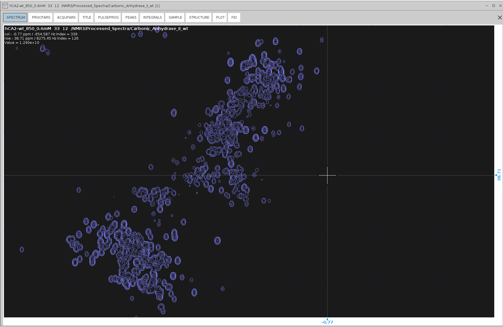
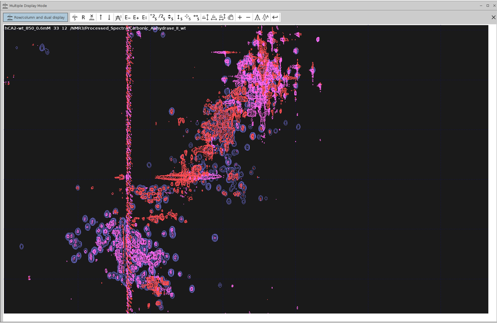

# Miscellaneous Cases

------------------------------

The Bruker 4D HCNH NOESY pulse sequence is designed so that the carrier frequency (if I remember correctly, around **0.4ppm**) 
is shifted away from the water signal. This shift, combined with the use of selective pulses, helps avoid water 
disturbance - effectively solving the water suppression issue. However, a large spectral width in the HC (**F2**) dimension 
is required to detect aliphatic proton signals without aliasing. It's also necessary to use the same spectral width for 
both HN (**F4**) and HC (**F2**), which results in a lot of empty space in the F2 dimension. The example below shows the overlay 
of the F1–F2 projection with the **¹³C HSQC**; note that below **–0.77 ppm**, there are no peaks.

Additionally, the entire F2 dimension was shifted. I had to align the F1–F2 projection with the **¹³C HSQC** by setting 
`SR{F2}` to `2837.73 Hz`. After this referencing, the water signal along F2 was at **4.6 ppm**, and the lowest aliphatic peak 
is close to the lower border of **–0.77 ppm**.

As a result, truncation of the F2 dimension is necessary to reduce the very large spectrum size. If you attempt 
NUS reconstruction by truncating the F2 dimension by setting `STSI{F2}` to a value like `341`, but you receive the message
`Parameter SI{F2} = 352 not suitable for inplace operation`.

Simply enter the "destination PROCNO" and safely ignore the warning. The number `352` is derived after rounding STSI up 
to the next multiple of 16. Since `STSI` was set to `341`, it was adjusted to `352`.

Note: PROCNO refers to the processing number in Bruker software, which allows you to specify a new dataset for 
processing without overwriting the original data.

# Authors

- Thomas Evangelidis