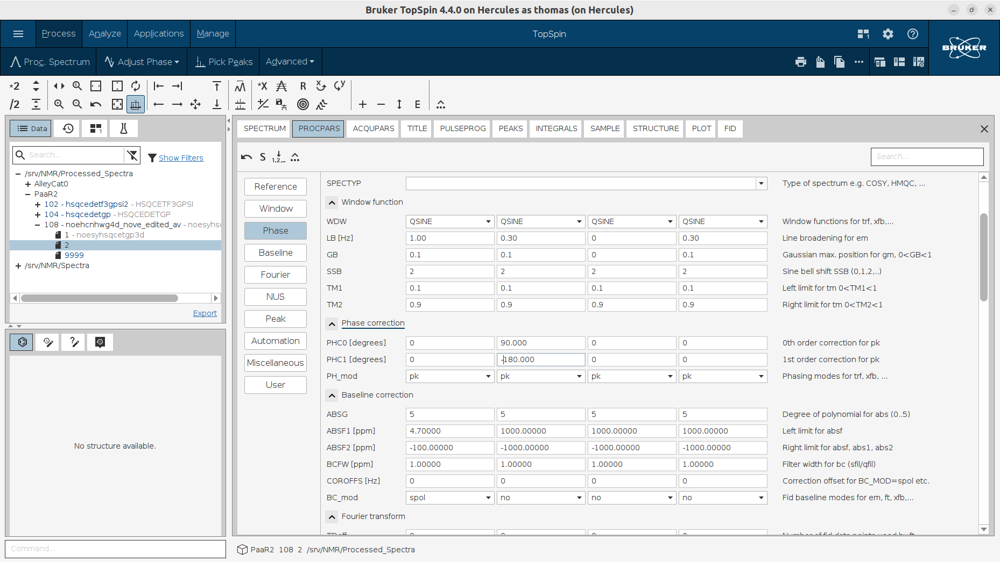

For our edited 4D HCNH NOESY pulse sequence we must set the correct parameters for for a 1-point delay in 13C.

The 1-point delay in 13C is not used in Bruker's 4D HCNH NOESY pulse sequence, therefore we can leave the default values.

The dimensions in the Bruker's 4D HCNH NOESY spectrum are F1: C; F2: HC; F3: N; F4: HN.

* Copy the raw 4D spectrum in a new directory for neatness and avoidance of overwriting. Issue `wrpa`...

* Beware that the 2D projections are not always measured with the same FID dimensions as the 4D spectrum. Therefore be very careful when you set values to STSR, STSI to truncate the NUS-reconstructed 4D.

* Open the raw 4D spectrum and issue `ftnd 0 21234 dlp nusthreads 30`. This command will process all directions including Window Multiplication (WM) and Fourier Transform (FT), and will apply LP where specified. Using linear prediction (LP) can enhance resolution, especially if the time domain (TD) values are small or if your FIDs are truncated. In TopSpin, you can use LP for improving resolution in particular dimensions during the Fourier Transform process by specifying the ME_mod and NCOEF parameters for those dimensions.

* Optionally, apply automatic baseline correction to the whole NUS recopnstructed 4D spectrum by issueing `absnd`.

* To calculate projections by summing over specific dimensions of your data. Given your dimensions (F1: C, F2: HC, F3: N, F4: HN), and wanting to project out F3 and F4 to keep F1 and F2, you would use the following syntax:
In this command: `projplp 12 all 11239121`
 - 12 refers to keeping the first two dimensions (C and HC).
 - all indicates that all planes within these dimensions should be included.
 - 1 specifies the output PROCNO where the projection data will be stored. Adjust the PROCNO based on where you want to save the output.

* Issue commands `abs1` followed by `abs2` to perform an automatic baseline correction in the F1 and F2 direction. These commands automatically subtracts a polynomial, typically of degree 5, from the rows of your processed 2D data. The polynomial degree and the correction region can be adjusted if needed through the ABSG, ABSF1, and ABSF2 parameters .

* Afterwards issue `projpln 12 all 11239122` to Generate the Negative Projection. This command works similarly but for negative peaks, storing the output in a different processing directory. Perform automatic baseline correction with `abs1` followed by `abs2`.

* Overlay the positive and negative projections to visually combine their features. As a quality control, overlay them with the 13C HSQC, too. Left click and hold on the icon with the "S" and above it the arrowed-cross to shift the 13C HSQC spectrum and place it exactly on top of the other two 2D projections.

* Repeate the same procedure for the N-HN plane and compare it with the 15N HSQC.
	- `projplp 34 all 11239341`
	- `projpln 34 all 11239342`
	- `abs1`
	- `abs2`

# Karel's commands
* `1s td`
* deactivate Linear Correction by setting "ME_mod" to "no" for F1-F4.
* Divide by 2 all 4 dimensions in SI before doing `ftnd 0` for explorative purposes - it will be faster. 
* In "STSI" at "HN" dimension write `SI/2` and click enter. It removes the 5-0 ppm Region where only water protons occur.
* Leave all "NUS" parameters to the default values.
* `levcalc` 