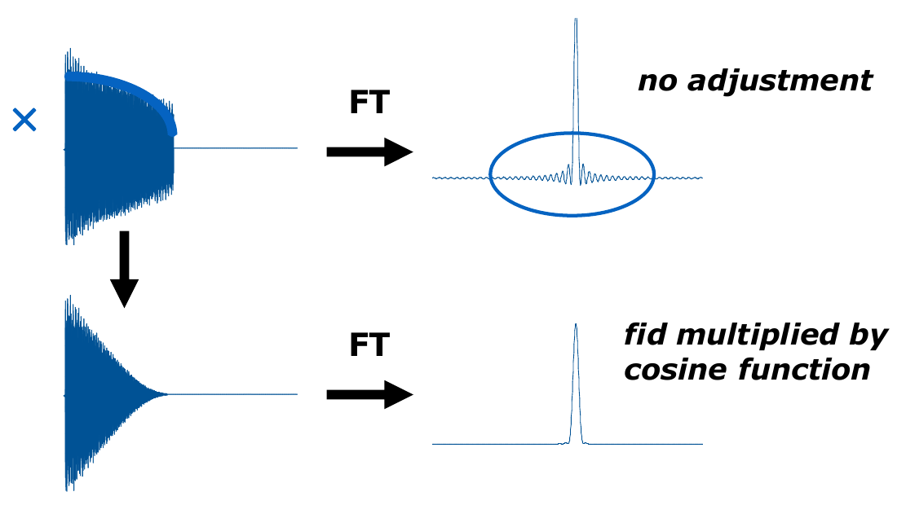
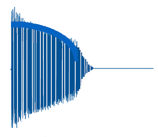

# Tutorial on 2D Protein Spectra Processing

----------------------------

## Phase Correction

   - We don't need to phase N and C dimensions.
   - Before starting processing, make a copy of your 2D with `wrpa`, zoom into a small area of overlapping peaks, open 
the original 2D in another window next to the replica, click on the "exactzoom" icon, and set the same window 
dimensions in both spectra.
   - Increase the SI size of the direct dimension up to twice the next power of 2 to increase resolution. The rest can 
be increased up to four times (zero filling). For example, if 15N is 256, it can be increased to 1024.
   - Use `xfb` for the changes to take effect. The peaks should look more rounded.
   - For further resolution, increase the SSB of the direct dimension to a value `>2.0` (e.g. try `2.2`, `2.5`, `3.0`).
   - Use `xfb` again for the changes to take effect.

------------------------

## Baseline Correction and Tidying Up the Spectrum

1. **Initial Setup**
- Open your spectrum in TopSpin and access the processing parameters window:
  - Click **PROCPARS** or type `edp`.
  - Ensure proper calibration for the F1 and F2 axes (SR [Hz]), paying attention to the nucleus type when referencing the calibration from 1D experiments.

2. **Performing Baseline Correction**

    #### Baseline Correction Overview
    There are two polynomial functions for baseline correction:
    1. **BC_mod**: Multiplies the FID (time domain) at the very beginning before the FT (takes effect after `xfb`).
    2. `abs`: Used for baseline correction on the processed spectrum (`ABSG`, `ABSF1`, `ABSF2`).

    #### Steps:
- Set the left **ABSF1** and right **ABSF2** limit in the direct dimension (F2). For 15N HSQC, cover the left side of 
the spectrum before the water line (~4.5 ppm) to avoid noise. In general, for 15N HSQC, **ABSF2** should be ≥ 5.0.
- In the indirect dimension, the default values for **ABSF1** and **ABSF2** are typically sufficient.
- Select the **qpol** function for baseline correction. Avoid using **qfil**, as it aggressively suppresses water, 
which may not be suitable for 15N HSQC spectra.
- The 13C dimension is sensitive to the **BC_mod** polynomial, so avoid applying this function in such cases.
- Perform FT using `xfb`, followed by `abs1` and `abs2` for baseline correction to achieve sharper and better-resolved 
peaks due to zero filling and increased sideband suppression (SSB).

    #### Automatic Baseline Correction for 2D Spectra:
  - `abs2`: Applies automatic baseline correction along the F2 axis.
  - `abs1`: Applies automatic baseline correction along the F1 axis.
  - Do **first** `abs2` and **then** `abs1`.

3. **Special Cases for Baseline Correction**
- **For NOESY/ROESY Spectra** (which tend to have baseline offsets, especially in t1 due to noise):
  - Use `abs1` to correct the F1 direction.
  - Use `abs2` to correct the F2 direction.
  - Apply t1-noise subtraction before baseline correction using the AU program `t1noisereduction`, which sets the 
lowest intensity peaks in each column of the 2D spectrum to zero. This ensures that only real peaks are displayed 
and reduces noise.

4. **Fine-Tuning and Tidying the Spectrum**
- **Water Suppression**: 
  - For samples in water, use `abs2.water` for baseline correction. You can also set **BC_mod=qfil** in F2 to suppress 
the central noise stripe.
  
- **Contour Level Adjustment**:
  - Manually fine-tune contour levels with the mouse button or by setting `nlev` to the desired number of levels. 
Afterward, run `levcalc` or `clev` to calculate or clear contour levels, or use `edlev` for manual adjustment.

5. **Symmetrization (for COSY, NOESY, and ROESY Experiments)**
- After noise reduction and baseline correction, symmetrization can be applied to tidy the spectrum:
  - **sym**: Used for COSY spectra.
  - **syma**: Used for phase-sensitive experiments like NOESY. However, apply this with caution, as it can create false 
peaks where noise bands correlate.

6. **Reducing t1-Noise**
- `t1noisereduction`: This program can significantly improve the tidiness of your spectra by removing low-intensity 
noise from the t1 dimension.
- For t2 noise reduction swap the t1 and t2 axes with `swapf1f2`, followed by `t1noisereduction` and `swapf1f2`
to swap the axes back.

## Linear Prediction

- Truncation artifacts of the FID decay can be reduced by using window functions that force the end of FID to zero.

- NUS and LP should not be combined. NUS simulates fitfully the whole FID (see image below), while LP simulates the FID decay that was 
truncated out. As such, NUS reconstruction substitutes LP and LP must not be applied to any spectrum (4D, 3D) recorded 
with NUS.

- LP is recommended only for the 15N and 13C dimensions without NUS, not for 1H dimensions (F2), because the 1H signal 
stops at the marked point and only noise is recorded from then on. The remaining part can be truncated to improve S/N.

- You can play with NCOEF, e.g., increase it from 32 to 48 in the indirect dimension and then use `xfb`.

## Note

1D 1H is essential for quality control. It helps determine whether the sample is clean, detect admixtures, and monitor 
the water signal. It can also detect false alarms from glycerol, histidine, or other sources, and identify degradation in the 2D.

## Phase Correction

- Use `.ph` to enter phase correction mode.
- Select two peaks from one edge of the 2D spectrum and one from the opposite edge, as well as at least one in the 
intermediate region. It is important to cover the whole spectrum to monitor the effect of phase correction on distant peaks.

-----------------------------
## Authors

- **Thomas Evangelidis**
