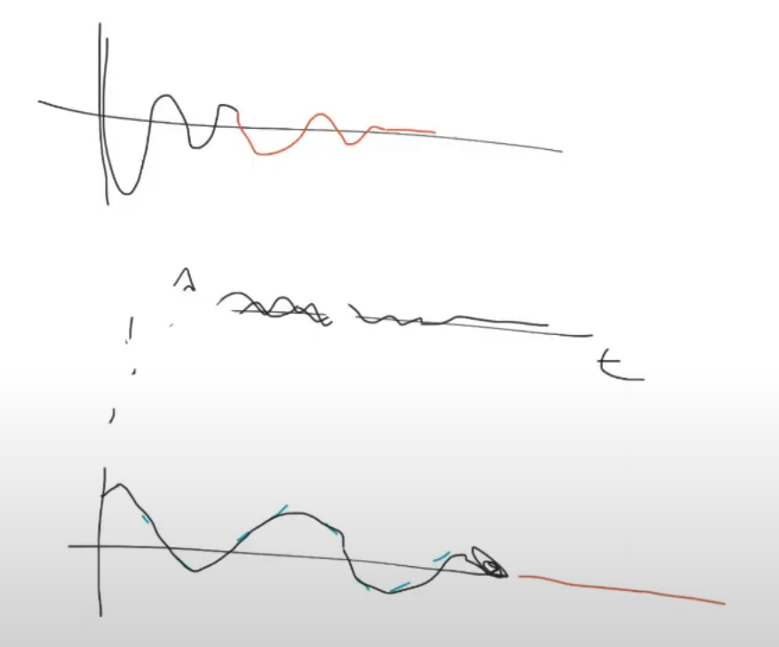
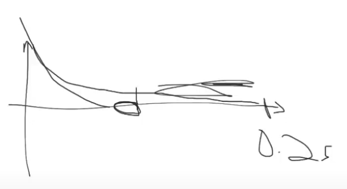
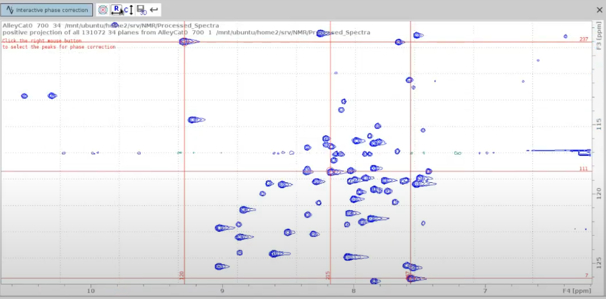

# Tutorial on Phase Correction 2D Protein Spectra

## Setting Parameters

1. **Phase Correction:**
   - We don't need to phase N and C dimensions.
   - Before starting processing, make a copy of your 2D with `wrpa`, zoom into a small area of overlapping peaks, open the original 2D in another window next to the replica, click on the "exactzoom" icon, and set the same window dimensions in both spectra.
   - Increase the SI size of the direct dimension up to twice the next power of 2 to increase resolution. The rest can be increased up to four times (zero filling). For example, if 15N is 256, it can be increased to 1024.
   - Use `xfb` for the changes to take effect. The peaks should look more rounded.
   - For further resolution, set SSB of the direct dimension to 2.2.
   - Use `xfb` again for the changes to take effect.

## Baseline Correction

There are two polynomial functions for baseline correction:
1. **BC_mod:** Multiplies the FID (time domain) at the very beginning before the FT (takes effect after `xfb`).
2. **abs:** For baseline correction on the processed spectrum (`ABSG`, `ABSF1`, `ABSF2`).

**Steps:**
- Set left `ABSF1` and right `ABSF2` limit in the direct dimension (`F2`); in 15N HSQC, cover the left side of the 
spectrum before the water line (~4.5 ppm) to avoid filling the spectrum with noise. In general, for 15N HSQC, 
`ABSF2` ≥ 5.0. In the indirect dimension, you can leave the default `ABSF1` and `ABSF2` values.
- Select `qpol` function. `qfil` suppresses water very aggressively and is not recommended for 15N HSQC.
- The 13C dimension is very sensitive to the `BC_mod` polynomial, so it is recommended to avoid it.
- Use `xfb` for FT, followed by `abs1` and `abs2` for baseline correction. This will result in sharper and 
better-resolved peaks due to zero filling and increased SSB.

## Linear Prediction

- NUS and LP should not be combined. NUS simulates fitfully the whole FID, while LP simulates the FID decay that was truncated out. As such, NUS reconstruction substitutes LP and LP must not be applied to any spectrum (4D, 3D) recorded with NUS.

At the top is a full-point sampled spectrum or traditional planes, the red line is the addition made by LP. At the bottom is a spectrum 
recorded with NUS (green dotted lines) and after NUS reconstruction (black line). Here LP has no effect (red line).

- LP is recommended only for the 15N and 13C dimensions without NUS, not for 1H dimensions (F2), because the 1H signal stops at the marked point and only noise is recorded from then on. The remaining part can be truncated to improve S/N.

- You can play with NCOEF, e.g., increase it from 32 to 48 in the indirect dimension and then use `xfb`.

## Note

1D 1H is essential for quality control. It helps determine whether the sample is clean, detect admixtures, and monitor the water signal. It can also detect false alarms from glycerol, histidine, or other sources, and identify degradation in the 2D.

## Phase Correction

- Use `.ph` to enter phase correction mode.
- Select two peaks from one edge of the 2D spectrum and one from the opposite edge, as well as at least one in the intermediate region. It is important to cover the whole spectrum to monitor the effect of phase correction on distant peaks.

-----------------------------
## Authors

- **Thomas Evangelidis**
