# Phase Correction in 3D Protein Spectra

------------------------------------------

In the 3D spectrum, phase correction is done for every dimension individually. **SOLUTION 1** is **only** for the **direct 
(F3) dimension**, while **SOLUTION 2** is for every dimension. I **strongly recommend using them in combination**.

### Table of contents

1. [SOLUTION 1: Phase-Correct the 1st FID](#solution-1-phase-correct-the-1st-fid)

2. [SOLUTION 2: Phase-Correct the F2-F3 projection of the 3D Spectrum](#solution-2-phase-correct-the-f2-f3-projection-of-the-3d-spectrum)

2. [Credits](#credits)


Tested environment:
* Topspin 4.4.0 *with commercial license* for NUS processing
* OS: AlmaLinux 9 (as an Oracle virtual machine)
* 20 CPU cores, 120 GB of RAM. 

------------------------------------------------------------------------------------------------------------------------
## SOLUTION 1: Phase-Correct the **1st FID (F3)**

The **1st (strongest) FID** always corresponds to the **direct (F3) dimension**. Therefore, you **cannot phase F2 and F3 with this solution.**

**Example Data:** N-edited 3D NOESY of Carbonic Anhydrase 2 (29 kDa)

**[Download example data](https://drive.google.com/drive/folders/10-3H7bdsclmshQy3XCQaV6QQJ84Hi71X?usp=drive_link)**

1. **Reset all phase values to `0`:**
   > **Important:** Look at the bottom of the pulse program to find the correct PHC0 and PHC1 values of **F1-F3** - if 
there are any. 
   - Set all phase values to zero with the following commands: 
```
3 PHC0 0
3 PHC1 0
2 PHC0 0
2 PHC1 0
1 PHC0 0
1 PHC1 0
```
   - Reset spectrum truncation boundaries with the following commands:
```
3 TDeff 0
2 TDeff 0
1 TDeff 0
3 STSR 0
2 STSR 0
1 STSR 0
3 STSI 0
2 STSI 0
1 STSI 0
```
   - You may want to increase the points in any dimension (`SI`) by x2 or x4 times (**zero filling**) to enhance 
resolution. Ensure that **all SI values are powers of 2** (e.g., 1024, 2048, etc.).

> **Note:** Linear Prediction is beneficial when only a few points have been recorded in a dimension, otherwise it may be 
> detrimental and thus must be turned off.

   - Navigate to `PROCPARS -> FOURIER` and set the parameter **ME_mod** to `no` for all dimensions except those that only 
a few points are recorded. In this example only F2 (`C`), which had only `64` points, and thus I quadrupled them.

2. **Extract the 1st FID:**  
  - Open the raw 3D spectrum and run `rser eao 1` to extract the 1st FID followed by `ft` to switch to the 
frequency domain. Note that for other spectra, the `eao` argument may not be appropriate (see Topspins' command manual).
  - **Alternatively**, you can create a **macro** using the command `edmac qfp`.
  - In the editor that opens, write the following commands to save and process the spectrum:
    ```sh
    qsin
    fp
    ```
  - Run the command `qfp`.
  - In the pop-up window, set `1` at `FID` and `2` at `PROCNO`.
  - Issue twice `.gr` to display denser grid lines.

[3D 1.FID](images/3D_1.FID.png)

3. **Manual Phase Correction:**  
  - Enter `.ph` for manual phase correction. Set the pivot line (right mouse click) near the right limit to modify 
only `PHC0`, not `PHC1`.
   > **Note:** Adjusting `PHC1` (1st order correction) has minimal effect on frequencies near the pivot and no effect on `PHC0`.
  - Shift baseline to bottom with `.sd` and adjust its position with the **arrow** icons.
  - Adjust only `PHC0` (0th order correction) so the FID line extends straightly and the highest peaks point upwards.  
   > **Note:** Avoid using automatic phasing (`apk` and its variants) as it generally doesn't work well.
   
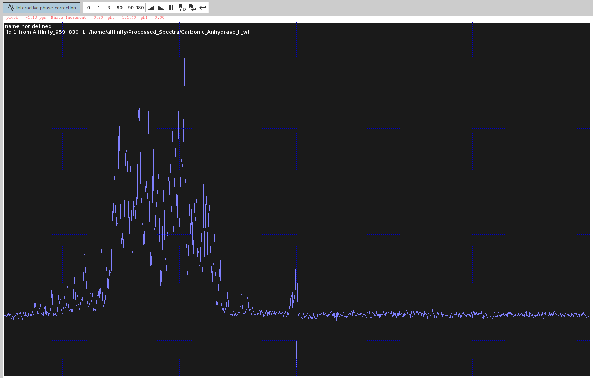

4. **Save and Apply PHC0:**  
  - Note down the optimal `PHC0` value (e.g., `151.40` degrees). Click the **Save-disk nD** icon to copy the values to 
the 3D spectrum, then click the **Return icon**. Double-click the processed 3D spectrum and ensure all `PHC0` and 
`PHC1` values except for **F3(PHC0)** are still set to `0`.
   
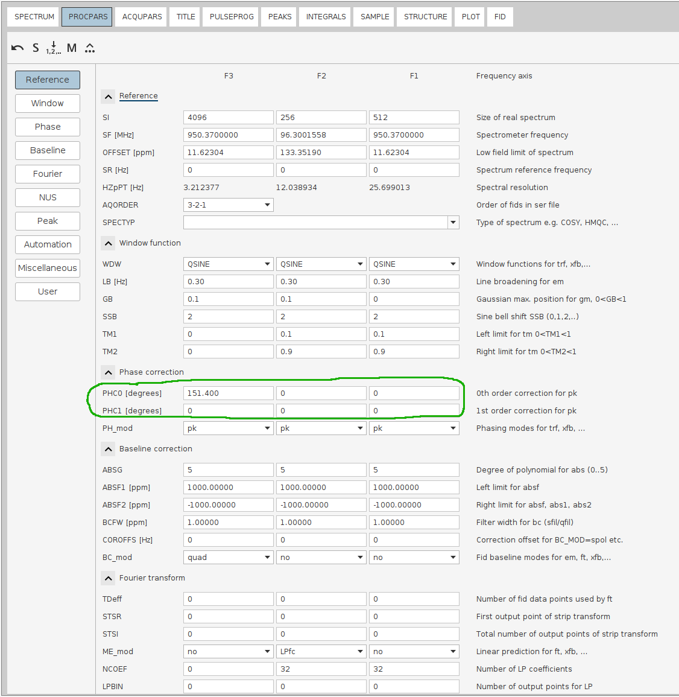

5. **Initiate NUS-reconstruction:**
  - Execute `FnTYPE`. If this option is **not** set to `non-uniform sampling` then you can safely use `ftnd 0 nusft` or just `ft3d`
instead of `ftnd 0` to skip the NUS-reconstruction in all relevant steps from this point on. But even if you run `ftnd 0`, 
Topspin will recognize it by itself and skip the otherwise tedious NUS-reconstruction. 
  - Select the `cs` method within the **NUS** section of **PROCPARS** window or simply execute `3 Mdd_mod cs`.
  - Execute the command `ftnd 0` for Fourier transformation and NUS reconstruction - it shouldn't last long in the 3D 
spectrum. This step helps in visualizing the spectrum and deciding on the dimensions to truncate.

6. **Check Visually the NUS-reconstructed Spectrum:**
  - Click on the `23` icon and navigate the **F2-F3** plane by holding left-mouse button on the **double arrow** icon and dragging your mouse. You will 
notice that there are no antiphase peak components in the **F3** dimension.

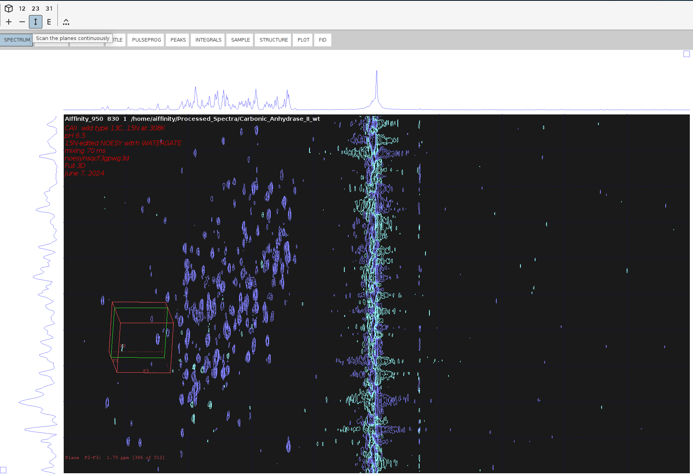

  - Do the same for the **F3-F1 plane** by clicking on the **31** icon. There are plenty of antiphase peaks in the 
**F1 dimension**, which means that the spectrum needs additional phasing.

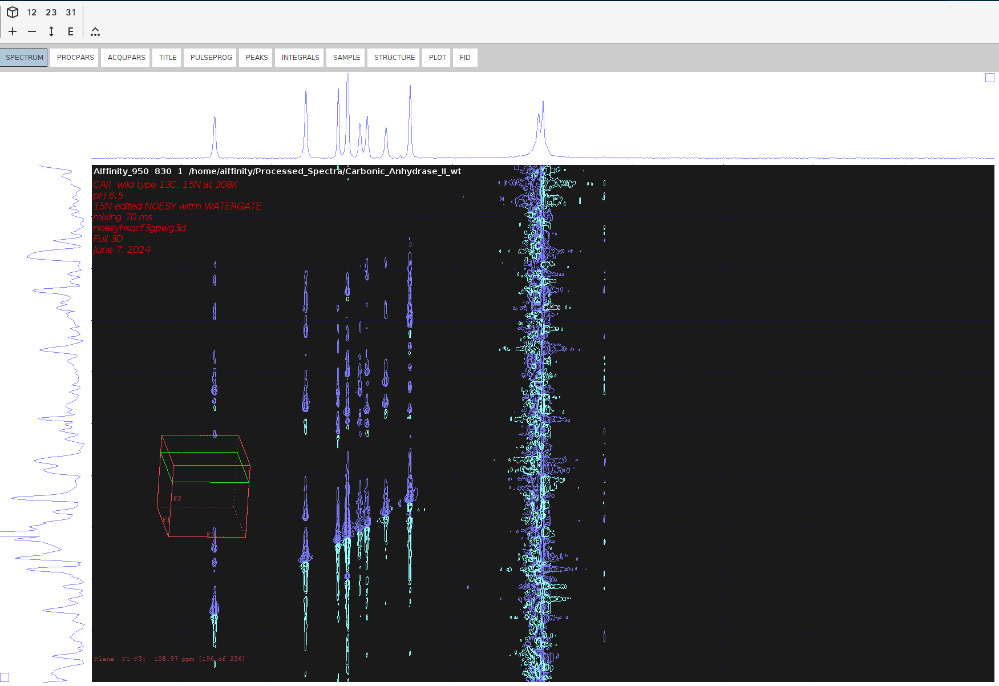

------------------------------------------------------------------------------------------------------------------------
## SOLUTION 2: Phase-Correct the F2-F3 sum projection of the 3D Spectrum.

## Summary of Commands and Steps

1. **Reset all phase values to `0`:**
  - Like **step 1** in **SOLUTION 1**.

2. **Initiate Fourier Transform with zero phase values:**
  - Like **step 5** in **SOLUTION 2**.

3. **Create the Sum Projection of F2-F3:**
  - Issue the following command to create the sum projection of F2-F3 (`N-HN`):
```
sumpl 23 all all 23230
```

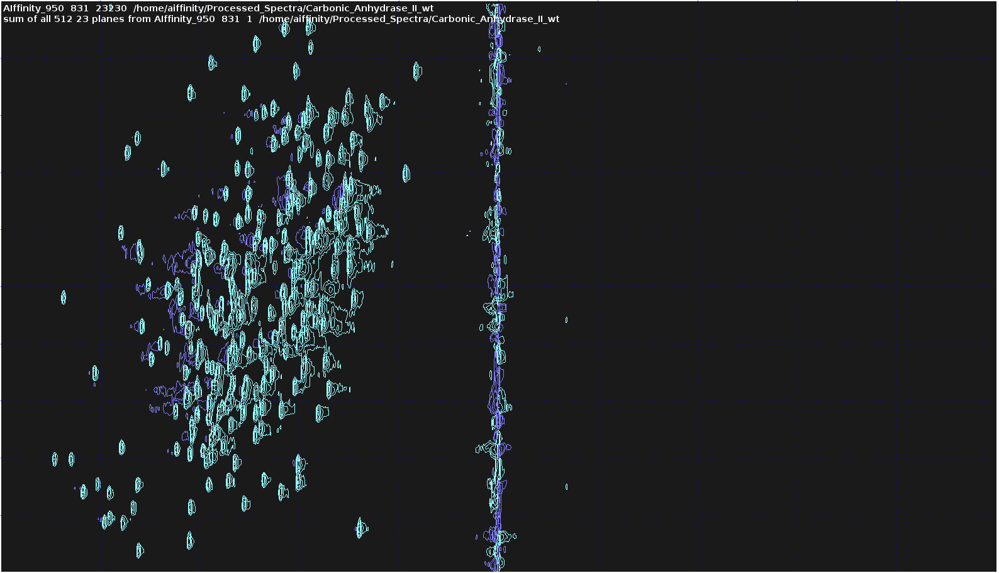

  - Switch Back to the 3D Spectrum and the following command to create the sum projection of F1-F3 (`H-HN`):
```
sumpl 13 all all 13130
```

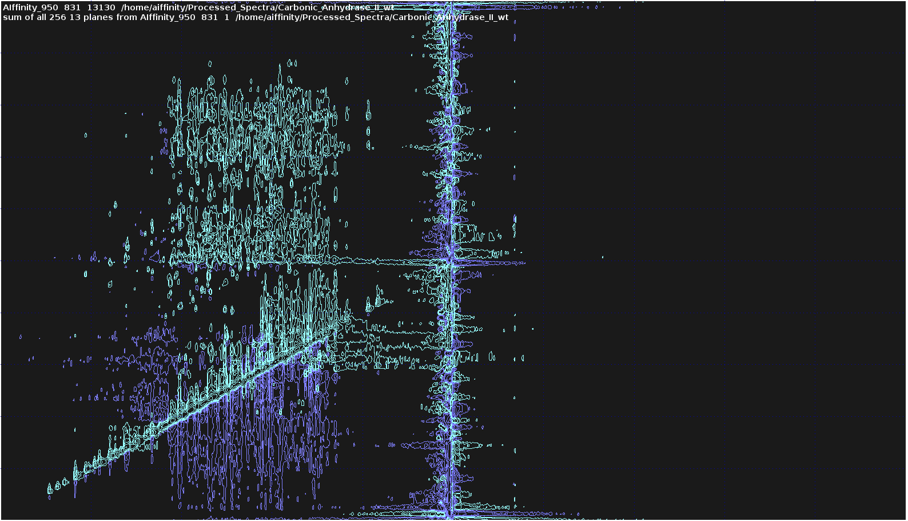

4. **Visualization and Dimension Truncation:**
  - Open the `23` sum projection. The vertical line in the center represent water signal; the pulse sequences are designed 
to be symmetrical ensuring that the space before and after the water line is the same.
  - Zoom in by selecting the region of interest (**RIO**).

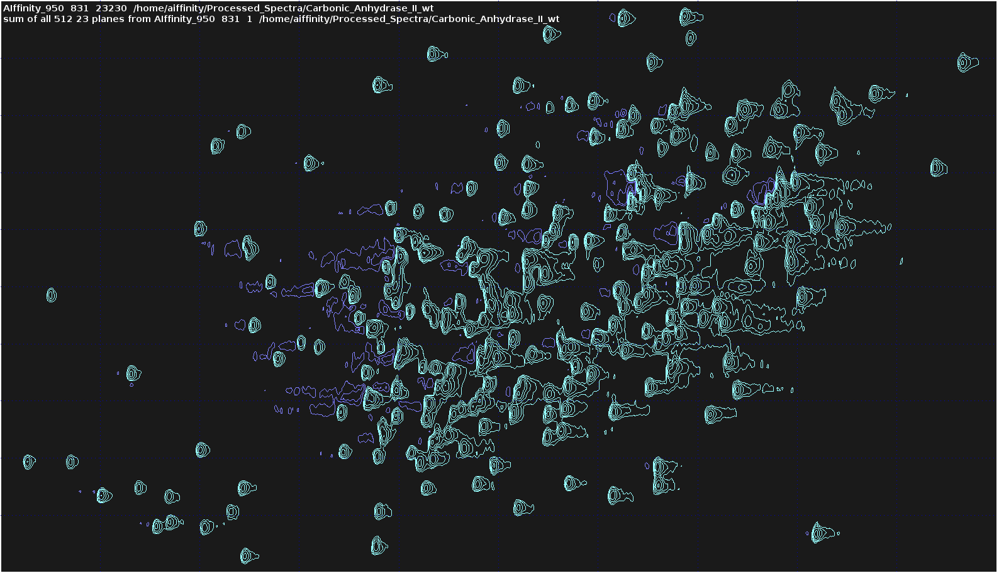

  - Right-click anywhere on the spectrum and then select `Save Display Region To -> Parameters STSR/STSI (used by strip ft)`. 
After this, the boundaries of the ROI will appear in `STSR` and `STSI` parameters under the `PROCPARS` tab.
  - Right-click again anywhere on the spectrum and this time select `Save Display Region To -> 
Parameters ABSF1/2 (e.g. used by 'absf, apkf')`. This is to ensure that the baseline correction takes place downfield (to the left)
of the water line (`~4.5 ppm` in `HN`) to avoid filling the spectrum with noise.
  - Transfer manually these values to the respective parameters of the 3D spectrum.
  - Switch back to the **23 sum projection** and issue the following commands:

```
1 ABSF1 1000
1 ABSF2 -1000
1 BC_mod no
2 BC_mod qpol
2 SSB 2.2
```

  - These commands have the following effects:
    - Leave the default `ABSF1` and `ABSF2` values in the `N` dimension.
    - Select the `qpol` polynomial function since `qfil` suppresses water very aggressively and is not recommended for the `N-HN` spectrum.
    - Set `BC_mod` to `no` in the `N` dimension due to its sensitivity to the polynomial.
    - Set the `SSB` of the direct dimension to `2.2` for further resolution.
  - Execute `xfb` followed by `abs1` and `abs2` for baseline correction. This will remove the irrelevant `HN` shift region,
including the water line, while keeping only the ROI. It will also result in sharper and better-resolved peaks due to 
zero filling and increased `SSB`.

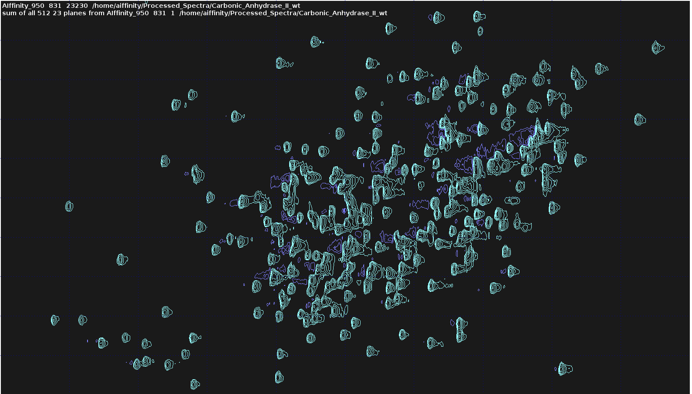

  - Repeat the same procedure for the `13` sum projection.

5. **Prepare for Manual Phase Correction in the F2 dimension:**
  - Enter `.ph` for manual phase correction.
  - Look for peaks that have an anti-phase component in the F2 dimension.
  - Place the cursor between the centers of these two peaks. Ensure the cursor is along the line connecting their centers. 
  - Right-click and select **"Add"**.

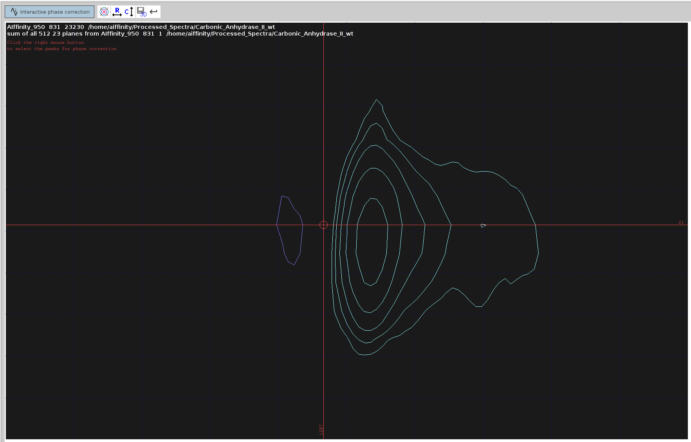

  - Try to select misphased peaks that cover the span of the whole spectrum; 4 or 5 peaks should suffice.

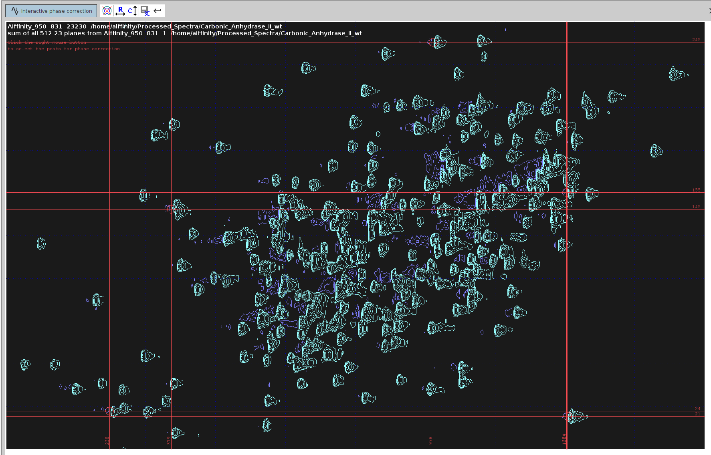

6. **Enter Phase Correction Mode:**
  - Click on the icon with the letter **"R"** to enter phase correction mode for the rows, which correspond to the 
F2 (`HN`) dimension in the `23` sum projection.

7. **Set the Pivot Point:**
  - Right-click at the left limit of the screen and select **"Set Pivot"**.
  - Place the pivot point away from the peaks to avoid hiding the frequencies we want to phase.
  - Note: Only the `PHC0` value will be adjusted, not `PHC1`, so the pivot point will not be used.

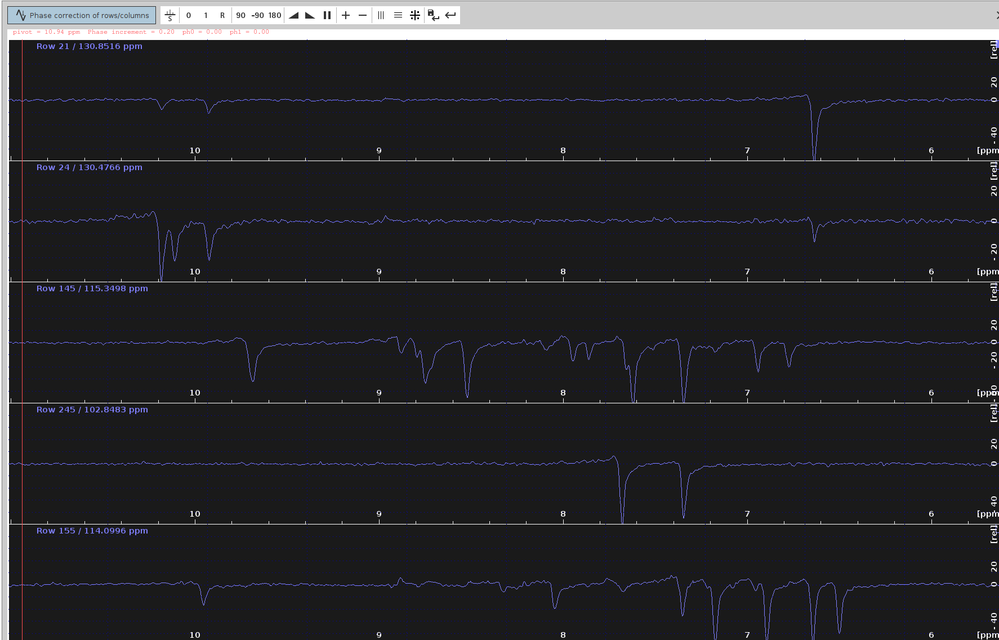

8. **Adjust the Phase:**
  - Left-button press on the **"0"** icon and drag your mouse until the strongest signals appear at the top part of each panel.
  - Ensure the frequency lines from end to end look straight and balanced.

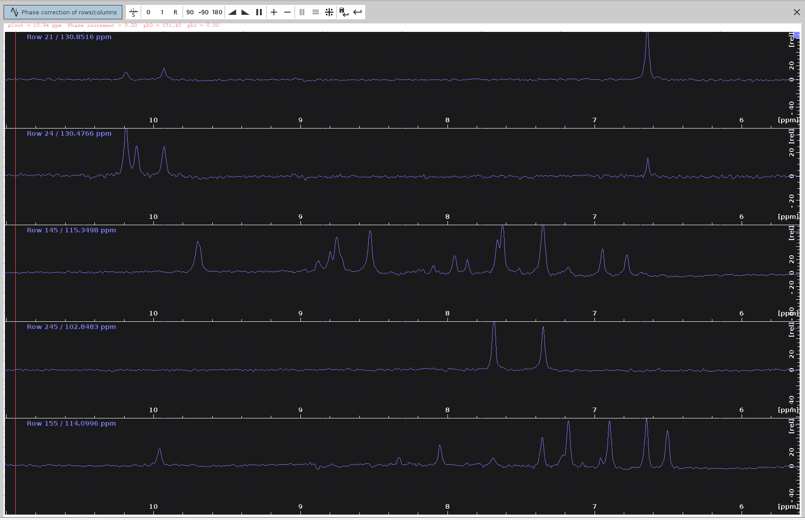

9. **Save the PHC0 Value:**
  - Note down the optimal `PHC0` value (e.g., `151.40` degrees) and click on the **"Save-disk"** icon to save the 
selected `PHC0` value to the `23` sum projection spectrum. 
  - Click the **Save-disk nD** icon to copy the `PHC0` value to the 3D spectrum.
  - Then click the **Return icon**.

10. **Verify the Phase-Corrected Spectrum:**
  - The phase-corrected `23` sum projection should now appear without any anti-phase peak components.

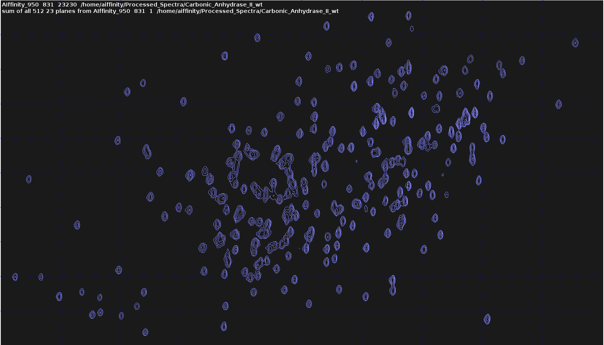

11. **Save and Apply PHC0 to 3D:**
  - Switch to the 3D spectrum and run `ft3d` for FT and phase correction with the values you provided.

12. **Review and Adjust Peaks in 3D View:**
  - Return to the 3D view to review the changes by clicking the **cube** icon.
  - Click on the **/8** icon to display the peaks. Adjust the contour levels with your mouse.
  - Click on the **aim** icon to switch to 2D plane view and then to `23`. Navigate through different 
planes using the **up and down arrows** icon. Identify a plane where peak phases are unsatisfactory. In this example,
I couldn't find a plane containing misphased peaks, but you got my point.

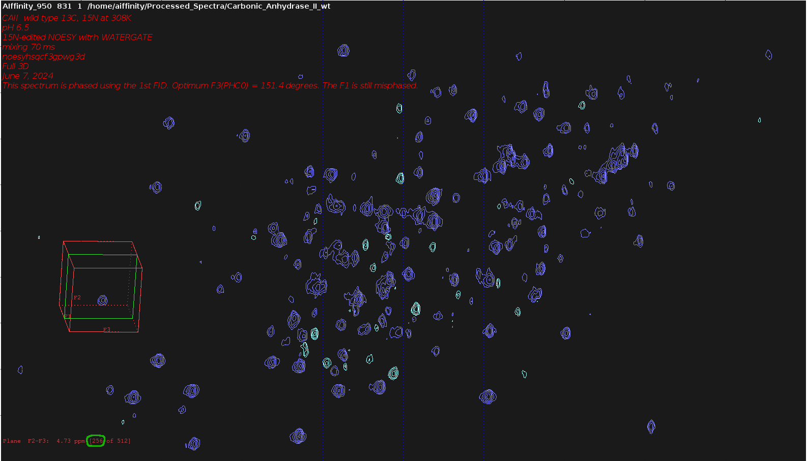

13. **Extract and Process a Specific Plane:**
  - Execute `slice` to extract the problematic plane.
  - A window will ask for the **plane number** (displayed at the bottom left in red letters; marked with green circle). 
Enter a **Destination PROCNO**, e.g. `23265`.

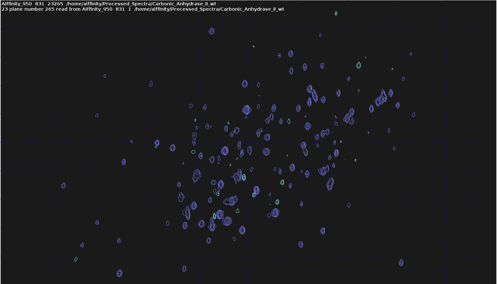

14. **Reconstruct Imaginary Dimension for Further Phase Correction:**
  - Use `xht1` followed by `xht2` or navigate through the menu `Advanced -> Special Transforms -> Hilbert in F1` and 
then `Hilbert in F2` to reconstruct the imaginary dimensions.

> **Note:** Files like `3rrr` represent the spectrum in real space, whereas files such as `3iri`, `3irr`, `3rir`, 
`3iir`, and `3iii` contain at least one imaginary dimension. Correspondingly, the command `slice` created a file `2rr` 
in the `23265` folder. The Hilbert transformation created the files with imaginary parts: 2ri, 2ir, and 2ii.

  - Repeat **steps 5-14** until you are satisfied with the phases of the **F3** and **F2 dimensions** in the 3D spectrum.
  - Repeat **steps 5-14** for the `13` sum projection until you are satisfied with the phases of the **F1 dimension**, too.
There were no misphased planes in **F1-F3** planes after phase correction. I just provide the most "weird-looking" one below for demonstration:

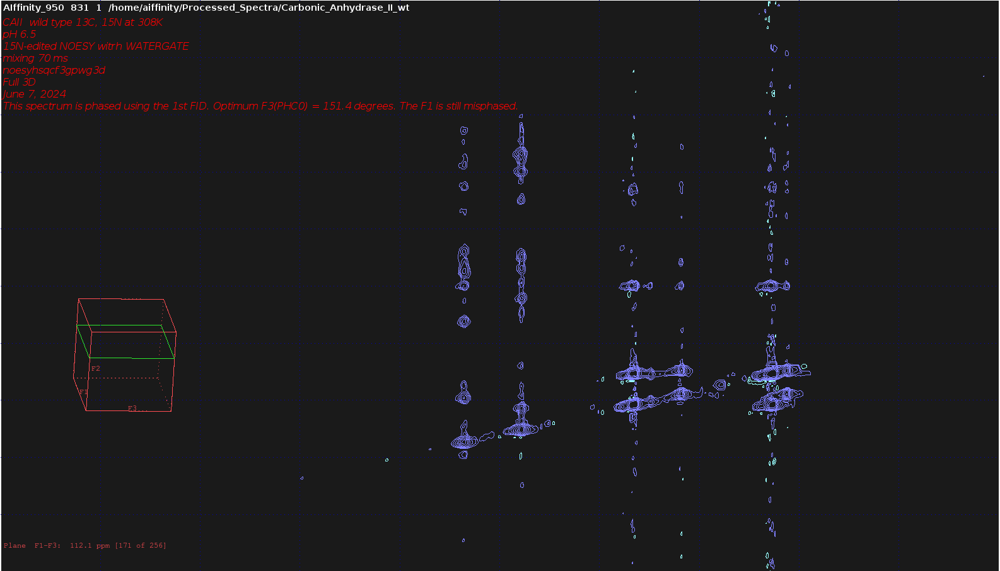

  - The optimum phase values I found for this example were `F3(PHC0)=151.40` and `F1(PHC0)=-42.60` and the 3D spectrum 
looks like this, without any visible negative signals:

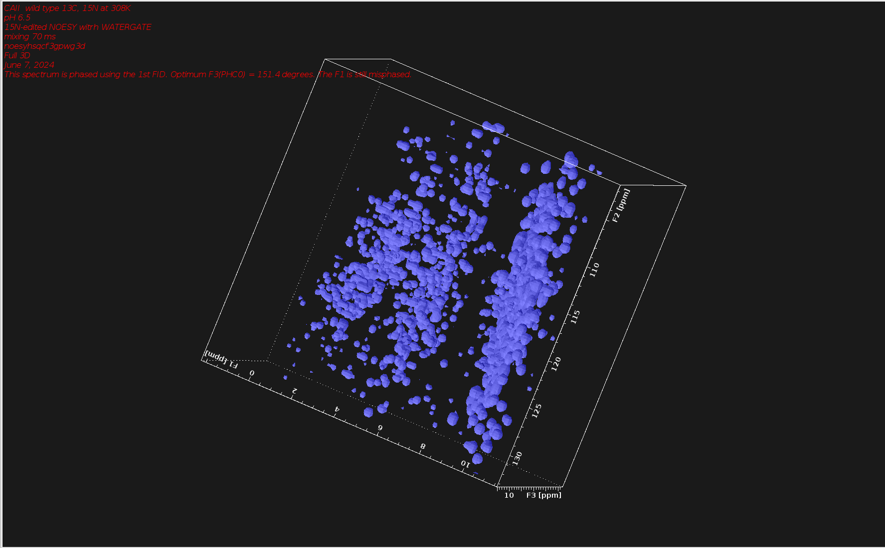

------------------------------------------------------------------------------------------------------------------------
## Baseline Correction

1. **Increase FID Dimensions:**
  - Increase FID dimensions by x2, maximum x3 (e.g., if the dimension size is 60).

2. **Set Baseline:**
  - `3 BC_mod spol`
  - Choose a baseline where there are no peaks. In the proton dimension, set `ABSF1 -> 9.0 ppm` and `ABSF2 -> -4.0 ppm`.

3. **Fourier Transform:**
  - Perform Fourier transform with `ft3d`.

4. **Contour Level Adjustment:**
  - Click on the **hill** icon, set contour level sign to positive, Level increment to 1.2, and the number of levels to 30.

5. **Navigate and Adjust Peaks:**
  - Navigate in depth (**F2 dimension**) by clicking the **+** icon until you reach two overlapping peaks.
  - Note down the plane number (e.g., 27/256).
  - Iterate with different FID sizes, window functions, and linear predictions until the peaks separate. Do **not** apply 
**linear prediction** on the **proton dimension** because many points are acquired, but it can be done in the **indirect dimension**. 
Avoid overdoing it.

6. **Baseline Correction:**
  - Perform baseline correction with the commands:
  ```sh
  tabs1
  tabs3
  ```
  - This corrects the baseline in **F1** and **F3 dimensions**.

-----------------------------
## Authors

- **Thomas Evangelidis**