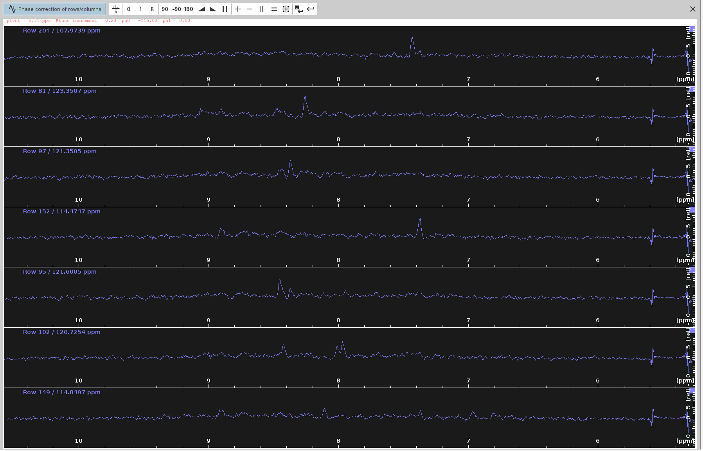

# Phase Correction in 4D Protein Spectra

--------------------
The following tutorial refers to the **4D HCNH NOESY** spectrum type but the same procedure can be applied for other 4D spectra.
Specifically for **4D HCNH NOESY**, we need to phase only the **F4(PCH0)** value. There are several ways to do that. I strongly
recommend using the combination of **SOLUTIONS 1-3** for certainty.

### Table of contents

1. [Solution 1: Phase-Correct the 1st FID](#solution-1-phase-correct-the-1st-fid)

2. [Solution 2: Phase-Correct the Measured 2D Plane of the 4D Spectrum](#solution-2-phase-correct-the-measured-2d-plane-of-the-4d-spectrum)

3. [SOLUTION 3: Phase-Correct the F3-F4 Sum Projection of the 4D Spectrum](#solution-3-phase-correct-the-f3-f4-sum-projection-of-the-4d-spectrum)

4. [SOLUTION 4: Phase-Correct the F3-F4 Projections' Sum of the 4D Spectrum](#solution-4-phase-correct-the-f3-f4-projections-sum-of-the-4d-spectrum)

5. [Baseline Correction](#baseline-correction)

6. [Credits](#credits)


Tested environment:
* Topspin 4.4.0 *with commercial license* for NUS processing
* OS: AlmaLinux 9 (as an Oracle virtual machine)
* 20 CPU cores, 120 GB of RAM. 

----------------------------------------------------------------------
## Solution 1: Phase-Correct the 1st FID

**Example Data:** (13C)HSQC-NOESY-(15N)HSQC on human Carbonic Anhydrase II (850 MHz)

> **[Download example data](https://drive.google.com/drive/folders/1wUE3Uohbz1U3PTEVbe4Gfs0hZXWIk782?usp=drive_link)**

1. **Reset all F4 phase values to `0`:**
   > **Important:** Look at the bottom of the pulse program to find the correct PHC0 and PHC1 values of F1-F3 - if 
there are any. Read the [NUS-reconstruction tutorials](../NUS_reconstruction/4D.md) for details. Briefly the pulse programs 
`hsqcnoesyhsqccngp4d` and `noehcnhwg4d_nove` require zero values, while `sfhmqc_noe_sfhmqc_4Dhcnh.fl` the following:
 
   |   |F4 |F3 |F2 |F1 |
   |---|---|---|---|---|
   |PHC0|<P0>|90|90|-45|
   |PHC1|0  |-180|-180|0  |

Where `P0` is the value you will find after phase correction.

  - Unless you use `sfhmqc_noe_sfhmqc_4Dhcnh.fl`, set all phase values to zero with the following command: 
```
4 PHC0 0
4 PHC1 0
3 PHC0 0
3 PHC1 0
2 PHC0 0
2 PHC1 0
1 PHC0 0
1 PHC1 0
```

2. **Extract the 1st FID:**  
  - Open the raw 4D spectrum and run `rser eao 1` to extract the 1st FID (see [when to use `rser 1` and when `rser eao 1`](definitions/rser_command_usage.md)).

3. **Switch to the Frequency Domain:**  
  - Use `ft` to switch to the frequency domain.

4. **Phase Correction:** 
  - Try first the automated 0th order phase correction with `apk0` that will try to create an entirely absorptive 
lineshape in the spectrum.
  - If you are not entirely satisfied with the automatic phasing, enter `.ph` for manual phase correction. Set the 
pivot line (right mouse click) near the left limit end to modify only `PHC0`, not `PHC1`.  
   > **Note:** Adjusting `PHC1` (1st order correction) has minimal effect on frequencies near the pivot and no effect on `PHC0`.  
   

5. **Adjust PHC0:**  
  - Adjust only `PHC0` (0th order correction) so the FID line extends straight and the highest peaks point upwards.  
   > **Note:** Avoid using automatic phasing (`apk` and its variants) as it generally doesn't work well.  
   
   
6. **Save and Apply PHC0:**
   - Click the **Save-disk nD** icon to copy the values to the 4D spectrum, then click the **Save and Return** icon. 
Issue `PHC0` and note down the value (here, `-115.0` degrees). Double-click the processed 4D spectrum and ensure all 
`PHC0` and `PHC1` values except for F4 (PHC0) are set to `0`; unless you used **sfhmqc_noe_sfhmqc_4Dhcnh.fl** (!).

   

7. **Initiate NUS-reconstruction:**
  - Follow the instructions at [NUS-reconstruction tutorials](../NUS_reconstruction/4D.md). Once all
parameters are set correctly, issue `ftnd 0`. 

--------------------------------------------------------------------------
## Solution 2: Phase-Correct the Measured 2D Plane of the 4D Spectrum

**Example Data:** HN plane of a (13C)HSQC-NOESY-(15N)HSQC on human Carbonic Anhydrase II (850 MHz)

**[Download example data](https://drive.google.com/drive/folders/1IavT1ruo4iyUS05rCRD4KzN0BhopaNb6?usp=drive_link)**

This assumes you have measured the **F3-F4 (N-HN) plane** with the same pulse sequence before recording the whole 4D spectrum.

1. **Prepare the Experiment:**
  - Use the **F3-F4 plane** for phase correction.
  - Run `wrpa` to create a copy of the whole experiment; name it `61`.

2. **Transform the 2D Plane:**
  - Open the raw 2D plane in experiment `61` and set all phase values to zero with the following command: 
```
4 PHC0 0
4 PHC1 0
3 PHC0 0
3 PHC1 0
2 PHC0 0
2 PHC1 0
1 PHC0 0
1 PHC1 0
```
  - Run `xfb` for FT transform.


  - Select the region of interest (RIO) to zoom in.


  - Right-click anywhere on the spectrum and then select `Save Display Region To -> Parameters STSR/STSI (used by strip ft)`


After this, the boundaries of the ROI will appear in `STSR` and `STSI` parameters under the `PROCPARS` tab.

  - Right-click again anywhere on the spectrum and this time select `Save Display Region To -> 
Parameters ABSF1/2 (e.g. used by 'absf, apkf')`. This is to ensure that the baseline correction takes place downfield (to the left)
of the water line (`~4.5 ppm` in `HN`) to avoid filling the spectrum with noise. 
  - Transfer manually these values to the respective parameters of the 4d spectrum.
  - Switch back to the 34 plane and issue the following commands:

```
1 ABSF1 1000
1 ABSF2 -1000
1 BC_mod no
2 BC_mod qpol
2 SSB 2.2
2 SI SI*2
1 SI SI*4
```

- These commands have the following effects:
  - Leave the default `ABSF1` and `ABSF2` values in the `N` dimension.
  - Select the `qpol` polynomial function since `qfil` suppresses water very aggressively and is not recommended for the `N-HN` spectrum.
  - Set `BC_mod` to `no` in the `N` dimension due to its sensitivity to the polynomial.
  - Set the `SSB` of the direct dimension to `2.2` for further resolution.
  - Increase the `SI` size of the direct dimension by 2 times to enhance resolution.
  - Increase the indirect dimension size by four times (zero filling). Ensure that **all SI values are powers of 2** (e.g., 1024, 2048, etc.).

- Execute `xfb` followed by `abs2` and `abs1` for baseline correction. This will remove the irrelevant HN shift region,
including the water line, while keeping only the ROI. It will also result in sharper and better-resolved peaks due to 
zero filling and increased SSB.

3. **Prepare for Manual Phase Correction in the F2 dimension:**
  - Enter `.ph` for manual phase correction.
  - Look for peaks that have an anti-phase component (signals of dispersion character) in the F2 dimension.
  - Place the cursor between the centers of these two peaks. Ensure the cursor is along the line connecting them. 
  - Right-click and select **"Add"**.


  - Try to select peaks that cover the span of the whole spectrum; 4 or 5 peaks should suffice.
  > **Note:** it is useful to note the approximate F2 chemical shifts and index of the selected peaks. Knowing the frequency of 
  > the target peaks will help distinguishing them from the slices of other, non-target, peaks which may also appear 
  > in the 1D traces. The index along th F2 axis will also help you distinguish the severely misphased peaks from those
  > that are slightly misphased.


4. **Enter Phase Correction Mode:**
  - Click on the icon with the letter **"R"** to enter phase correction mode for the rows, which correspond to the F2 dimension.

5. **Set the Pivot Point:**
  - Right-click at the left limit of the screen and select **"Set Pivot"**.
  - Place the pivot point away from the peaks to avoid hiding the frequencies we want to phase.
  - Note: Only the `PHC0` value will be adjusted, not `PHC1`, so a pivot line is not necessary.


6. **Adjust the Phase:**
  - Left-button press on the **"0"** icon and drag your mouse until the strongest signals appear at the top part of each panel.
  - Ensure the frequency lines from end to end look straight and balanced.


7. **Save the PHC0 Value:**
  - Click on the **"Save-disk"** icon to save the selected `PHC0` value (e.g., `-115` degrees) to the N-HN plane spectrum.
  - Then click the **Return icon**.

8. **Verify the Phase-Corrected Spectrum:**
  - The phase-corrected spectrum should now appear without any anti-phase peak components.


9. **Save and Apply PHC0:**
  - Note down the optimal `PHC0` value (e.g., `-115.0` degrees) and click the **Save-disk nD** icon to copy the values 
to the 2D plane. Then click the **Return icon**.
  - Transfer the phasing coefficients `PHC0` and, if used, `PHC1` to the raw 4D (unprocessed) spectrum

10. **Next Steps:**
  - You are now ready for concomitant NUS-reconstruction and phase correction as described in the [NUS-reconstruction tutorials](../NUS_reconstruction/4D.md).

------------------------------------------------------------------------------------------------------------------------
## SOLUTION 3: Phase-Correct the F3-F4 sum projection of the 4D Spectrum.

**Example Data:** Raw_Spectra/Carbonic_Anhydrase_2/hCA2-wt_850/9

**[Download example data](https://drive.google.com/drive/folders/1wUE3Uohbz1U3PTEVbe4Gfs0hZXWIk782?usp=drive_link)**

1. **Spectrum processing without NUS reconstruction:**
  - **Reset all phase values** to `0` as described in **SOLUTION 1, step 1**, unless you:
    - used **sfhmqc_noe_sfhmqc_4Dhcnh.fl** pulse program (see [NUS-reconstruction tutorials](../NUS_reconstruction/4D.md))
    - you have already found a `F4(PHC0)` value using **SOLUTION 1**, and now you want to optimize it further with this **SOLUTION**.
  - Typically, you should perform **NUS reconstruction of the 4D spectrum using the `ftnd 0` command**. However, this 
process can take anywhere from 3 to 12 hours, which may not always be practical. In some cases, you might choose to 
skip the full NUS reconstruction. By running the command `ftnd 0 nusft`, you can process the full spectrum-including 
fid baseline correction, window multiplication, Fourier transform, and phase correction—without reconstructing the 
missing data points. Use this option at your own discretion. While this method is faster than a full NUS reconstruction, 
it still requires time and may result in a lower-quality spectrum. This is especially true for 4D spectra, which 
typically use low `NusAMOUNT` values (less than 3%). If you find the quality insufficient for the next steps, you can 
reprocess the 4D spectrum using the full `ftnd 0` command.

2. **Extract Sum Projection:**
  - Use the command `sumpl 34 all all 34340` to extract the sum 34 projection, which is the sum of positive and 
negative 34 projections. It looks quite noisy with dominant negative signals, and barely resembles the
34 plane that we phased in **SOLUTION 2**. But that's OK.


3. **Create Imaginary Dimensions:**
  - Run `xht1` and `xht2` on the 34 sum projection to create the imaginary dimensions.

5. **Manual Phase Correction:**
  - Our aim is to suppress the negative signals as much as possible. For some types of spectra this doesn't imply that 
they are correctly phased, but for 4D HCNH NOESY it does.
  - Run `.ph` for manual phase correction and phase correct only on F4, as described in **SOLUTION 2, steps 3-10**. The 
only difference here is that we are processing 2D spectrum derived from a 4D spectrum measured with NUS, and hence we
cannot do zero-filling or truncate the dimensions with `xfb` command. We can only do `abs2` and `abs1` 
for baseline correction.
  - We can also manually apply different phase values (`PHC0`, `PHC1`) in F2 using the command `xf2p`.
  - Identify and select peaks with antiphase component that span as much of the spectrum as possible. Not many available in this one.


  - Switch to phase correction mode for the rows.


  - Adjust the `ph0` angle to make the strongest signals point upwards and the frequency lines from end to end to appear as 
straight as possible. The optimal `ph0` angle is around `-115` degrees, which is in agreement with **SOLUTION 1** and **2**.



  - The negative signals have been almost eliminated and the positive now appear stronger.


6. **Apply Phase Correction to 4D:**
  - Copy the `F4(PHC0)` value to the 4D spectrum.
  - Execute `pknd 4` (WARNING: very slow!; may be faster to redo `ftnd 0` or `ftnd 4`)

------------------------------------------------------------------------------------------------------------------------
## SOLUTION 4: Phase-Correct the F3-F4 projections' sum of the 4D Spectrum.
> **Warning:** This solution is not the most accurate one. Is otherwise identical to **SOLUTION 3**, but instead of creating 
> the sum projection, we create the positive and negative projections, and then we sum them.

**Example Data:** Raw_Spectra/Carbonic_Anhydrase_2/hCA2-wt_850/9

**[Download example data](https://drive.google.com/drive/folders/1wUE3Uohbz1U3PTEVbe4Gfs0hZXWIk782?usp=drive_link)**

1. **Spectrum processing without NUS reconstruction:**
  - Reset **all F4 phase values** to `0` as described in **SOLUTION 1, step 1**.
  - Initiate raw spectrum processing with zero phase values as described in **SOLUTION 1, step 2**.

2. **Extract Projections:**
  - Use the command `projplp 34 all all 34` to extract the positive 34 projection.


  - Use the command `projpln 34 all all 340` for the negative 34 projection.


3. **Create Imaginary Dimensions:**
  - Run `xht1` and `xht2` on the 34 projections to create the imaginary dimensions.

4. **Sum Positive and Negative Projection**  
  - Open `34` and type `wrp` to copy it to a new file named `343409`.  
  - Run `adsu`, and from the new menu bar, go to **Add -> Change constant ALPHA** and set it to `1`.  
  - Then, go to **Add -> Change constant GAMMA** and set it to `1`.  
  - Select **Define 2nd Dataset** and type the name of the negative projection (`340`).  
  - Execute the `add2d` command to add the negative projection (`340`) to the copy of the positive (`34340`).


  - Run `xht1` and `xht2` on the 34 projections to create the imaginary dimensions.   
  - Now you can phase it.

5. **Manual Phase Correction:**
  - Our aim is to suppress the negative signals as much as possible. For some types of spectra this doesn't imply that 
they are correctly phased, but for 4D HCNH NOESY it does.
  - Run `.ph` for manual phase correction and phase correct only on F4, as described in **SOLUTION 2, steps 3-10**. The 
only difference here is that we are processing 2D spectrum derived from a 4D spectrum measured with NUS, and hence we
cannot do zero-filling or truncate the dimensions with `xfb` command. We can only do `abs2` and `abs1` 
for baseline correction.
  - We can also manually apply different phase values (`PHC0`, `PHC1`) in F2 using the command `xf2p`.
  - Identify and select peaks that span the entire spectrum.


  - Switch to phase correction mode for the rows.


  - Adjust the `ph0` angle to make the strongest signals point upwards and the frequency lines from end to end appear as 
straight as possible. The optimal `ph0` angle is around `-137` degrees but the peaks don't look completely phased.


  - Note that while the positive signals should now appear stronger, some negative signals were not completely eliminated.


6. **Apply Phase Correction to 4D:**
  - Copy the `F4(PHC0)` value to the 4D spectrum.
  - Execute `pknd 4` (WARNING: very slow!; may be faster to redo `ftnd 0` or `ftnd 4`)

-----------------------------------------------------------------
# Baseline Correction

Baseline correction does not have a significant effect on 4D spectra. It should be considered a final touch that 
does not affect the peak shape.

-----------------------------------------------------------------
# Authors

  - Thomas Evangelidis @tevang2
