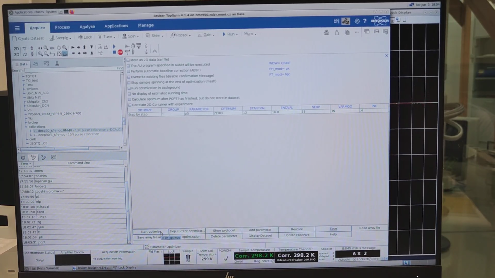

# Pulse Calibration Workflow

Experiments of a 14 kDa IDP on 850 MHz.

## 13C and 15N 90-Degree Hard Pulse Calibration

* `lock`
* `atmm`: select “1H” and match/tune; then select “13C”; then “15N.” Finally, click **Close and Store Values**.
* `loopadj`
* `topshim gui`: set **Dimension** → 1D; **Optimise for** → 1H; **After** → Z-X-Y-XZ-YZ-Z; **Only** → yes. Click **Start**.
* Once completed, set **After** → off and run:

  ```
  topshim ordmax=7
  ```

  This optimizes all parameters containing Z up to the 7th order (the maximum order of Z is 8). One strategy is to first roughly optimize Z up to 5th order, then the combinations of Y and Z up to 5th order, and finally Z up to 7th order.


* `re 1` to switch to the 1D ¹H PP; then `P1` to check that the 90° high-power pulse length is correctly set. Next, run:

  ```
  zg
  efp
  ```

  to verify that the signal from D₂O isn’t distorted (it must appear as a perfect symmetric bell shape).


### Calibrate 13C 90-Degree Hard Pulse Length

* Copy the ¹³C and ¹⁵N pulse-calibration experiments to a new directory. These contain a special pulse sequence: when the 90° high-power pulse length is optimal, the signal is zero; if shorter than optimal, the signal is positive; if longer, the signal is negative. Enter the ¹³C experiment and run:

  ```
  pulsecal
  ```

  to calibrate the ¹H pulse length (P1) first. `pulsecal` will also read and update **P3** (the 90° high-power pulse for ¹³C) from the “prosol” table.


* Run `ased` and inspect **P3**. It should be the default value from the “prosol” table (14.2 μs here). Set it to a lower value (e.g. 5.0 μs, or divide by 2) to get a spectrum you can phase—otherwise, a near-90° pulse will nullify the signal. Then run:

  ```
  zg
  qsin
  ft
  .ph
  ```

  to acquire and phase the spectrum. Correct phasing is crucial, as this spectrum feeds into the next step (`popt`); without it, signals will have dispersion character (positive and negative peaks), making the 0-signal point ambiguous.


* Zoom into the signal region to be optimized. Right-click → **Save Display Region To…** → **Parameters F1/F2** → **OK**.


* Run `popt` to open the parameter-optimization window. Set:

  * **GROUP** → 1
  * **PARAMETER** → P3
  * **OPTIMUM** → ZERO
  * **STARTVAL** → 12
  * **ENDVAL** → 16
  * **INC** → 0.4
    Then click **Save** and **Start Optimize**, overwrite → **y**.


* Run `P1` and note its value (e.g. 13.07 μs). Do the same for `PLW1` (e.g. –11.46 dB). These will be needed for `getprosol`.
* Once acquisition finishes, run:

  ```
  re 1 1
  ```

  to invert the signal sign. Skipping this means spectrum “999” won’t load correctly.



* Run:

  ```
  re 1 999
  ```

  to display a series of spectra (11 spectra with pulse lengths from 12.0 to 16.0 μs in 0.4-μs increments). If the optimizer doesn’t find an exact zero within these values, it interpolates. Here it reports an optimal **P3** value of 13.382361 μs.


* Run `P3` and note its value (e.g. 13.4 μs). Do the same for `PLW1` (e.g. –21.68 dB). These will also be needed for `getprosol`.

## Calibrate 15N 90-Degree Hard Pulse Length

* Run `re 2 1` and then `pulsecal`. Compare the output 90° pulse value (13.10 μs) with the one previously obtained—they must be very similar.
* Run `ased` and set **P21** (the parameter controlling the ¹⁵N 90° hard pulse length) to a lower value, e.g. 10.0 μs, than the default from the “prosol” table (34.0 μs). Then run:

  ```
  zg
  qsin
  ft
  .ph
  ```

  to acquire and phase the spectrum.


* Zoom into the signal region to be optimized. Right-click → **Save Display Region To…** → **Parameters F1/F2** → **OK**.


* Run `popt` to open the parameter-optimization window and set:

  * **GROUP** → 1
  * **PARAMETER** → P21
  * **OPTIMUM** → ZERO
  * **STARTVAL** → 32
  * **ENDVAL** → 36
  * **INC** → 0.4
    Then click **Save** and **Start Optimize**, overwrite → **y**.


* Once acquisition finishes, run `re 2 1` to invert the signal sign, then `re 1 999` to preview the optimization. The result may look too noisy to infer an accurate P21 value—this is because only 4 scans were used.


* Repeat the process with more scans. Run:

  ```
  NS 16
  popt
  ```

  and narrow the pulse-length range: **STARTVAL** → 33, **ENDVAL** → 37. Then click **Save** and **Start Optimize**, overwrite → **y**.


* When optimization finishes, run `re 2 1` followed by `re 2 999` (the former is required to load spectrum “999”). The 11 spectra with progressively lower signal will be better resolved, and the optimal P21 (e.g. 35.218787 μs) will be displayed—interpolated from the intensities.


* Run `P21` and note its value (e.g. 35.2 μs). Do the same for `PLW3` (e.g. –25.55 dB). These will be needed for `getprosol`.

### Apply the Optimum ¹H, ¹³C, and ¹⁵N Pulse Lengths to All Experiments

* Now apply the optimum 90° pulse lengths of ¹H, ¹³C, and ¹⁵N to every experiment you wish to record. Run:

  ```
  re 41
  getprosol 1H 13.07 -11.46 13C 13.4 -21.68 15N 35.2 -25.55
  ```

  Then, for each spectrum, repeat:

  ```
  re 42
  getprosol 1H 13.07 -11.46 13C 13.4 -21.68 15N 35.2 -25.55

  re 43
  getprosol 1H 13.07 -11.46 13C 13.4 -21.68 15N 35.2 -25.55

  re 44
  getprosol 1H 13.07 -11.46 13C 13.4 -21.68 15N 35.2 -25.55

  re 45
  getprosol 1H 13.07 -11.46 13C 13.4 -21.68 15N 35.2 -25.55

  re 46
  getprosol 1H 13.07 -11.46 13C 13.4 -21.68 15N 35.2 -25.55
  ```

  If you had run only `getprosol 1H 13.07 -11.46`, the ¹³C and ¹⁵N values would be pulled from “prosol” and would be suboptimal for this sample.


* Finally, verify that all spectra can be recorded without issues. For each experiment:

  ```
  re 41
  o1      # Check transmitter-frequency offset [F2,F1]
  gs      # “Stop”

  re 42
  o1      # optional
  gs      # “Stop”

  re 43
  o1      # optional
  gs      # “Stop”

  re 44
  o1      # optional
  gs      # “Stop”

  re 45
  o1      # optional
  gs      # “Stop”
  ```

  O1 should be identical in all experiments.


* Run:

  ```
  re 41
  multiexpt 6
  ```

  to estimate total experiment time. If satisfied, run:

  ```
  multizg 6
  ```

  to start the recordings.


### Bottom-up 13C and 15N 90° Hard Pulse Calibration on 850 MHz by Me

* `lock`
* On high-field cryo-probes, Bruker recommends doing automatic tuning-matching from the nucleus with the highest frequency to the lowest, namely `1H → 13C → 15N`. You can either select the nuclei manually or, better, issue:

  ```
  atma high
  ```

  to do it automatically.
* Once finished, hit:

  ```
  atmm
  ```

  for manual refinement. Optimize the 15N. The Wobble sweep width of 13C is very wide (12.017 MHz by default); therefore, we must zoom in on the baseline of the signal. Set it to 4.0 and click **Set**, then refine the position of the minimum. Likewise, set the Wobble sweep width of 1H to 4.0 MHz (default: 12.754 MHz) and refine manually.


* `topshim`
* `loopadj`
* `topshim gui`: set **Dimension** → 1D, **Optimise for** → 1H, **After** → Z-X-Y-XZ-YZ-Z, **Only** → yes. Click **Start**.
  The “3D” option is more thorough but much slower; it’s usually unnecessary unless you’ve recently replaced the probe. It helps for water-containing samples in wider tubes (e.g. Shigemi 5 mm), but in a 3 mm tube there’s little X-Y inhomogeneity to correct. To save time—since we already completed the 1D optimization—issue:

  ```
  topshim ordmax=7
  ```

  to optimize all Z combinations up to 7th order (default is 5th).


* Let’s measure and check the 1D proton now. Run:

  ```
  re 1
  ased
  ```

  The existing **P1** value (13.130 μs) is too high and will give a very strong signal (probably left by a previous `pulsecal` or `getprosol`). Lower it to 1.0.


* Run:

  ```
  zg
  efp
  .ph
  ```

  for manual phase correction. Zoom into the peak and verify that the shape is symmetric.


### Calibrate 13C 90° Hard Pulse Length

Nothing new.

### Calibrate 15N 90° Hard Pulse Length

Nothing new.

### Apply the Optimum ¹H, ¹³C, and ¹⁵N Pulse Lengths to All Experiments

* Run `re 1` and zoom in on the peak region. Place your cursor in the middle to see the maximum O1 value (water’s resonance frequency in this sample), here 3991.1 Hz. However, the optimum may deviate by a few Hz; therefore, issue:

  ```
  o1calib
  ```

  which calculates it. Then apply the output O1 value to the spectra you want to measure and, using:

  ```
  gs
  ```

  assess the FID shape to decide the exact O1. This is important because experiments with water-signal suppression work best when O1 is exactly at the water resonance. Here we measure only gradient-selected experiments, where it’s less critical; regardless, it’s ideal to set an accurate O1.


* When it finishes, run:

  ```
  O1
  ```

  to display the found value; in this case, 3994.21 Hz.


* Execute `getprosol` with the ¹H, ¹³C, and ¹⁵N calibrated parameters for all experiments to be measured.

* Run `re 8` to switch to the 3D experiment and experimentally find the optimum O1 value. Hit `gs`, go to the **Offset** table, enter the O1 value from `o1calib` (3994.21 Hz), and press Enter.


* Then enter the previous value, 3991.10 Hz, and press Enter. You will see a less wavy FID, indicating it is better than 3994.21 Hz. This occurs because the modular differences between observed and resonance frequencies are minimized, giving a smoother FID. In principle, one could manually alter O1 and observe its effect, but here it is redundant. Finally, click **Stop**.


* Update the `O1` value in all experiments you plan to run.