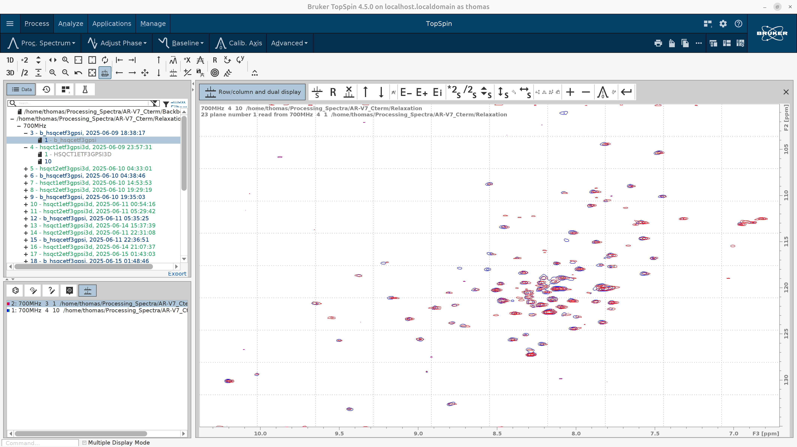
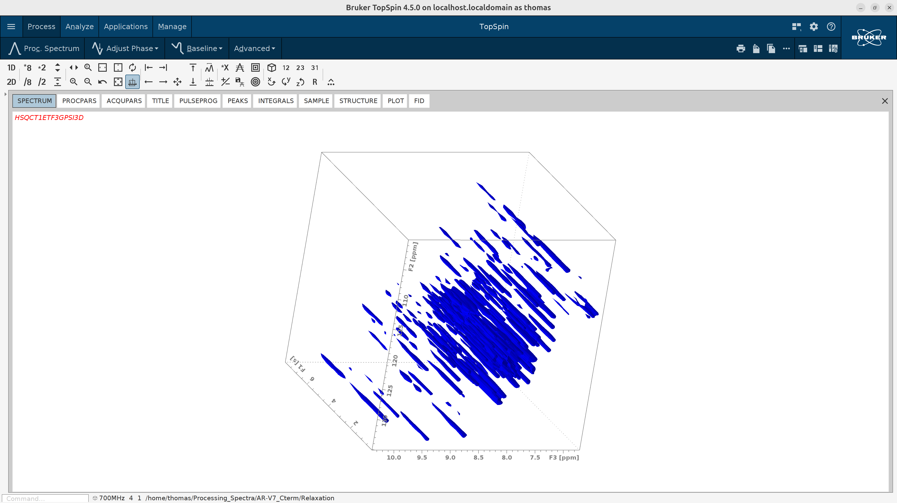
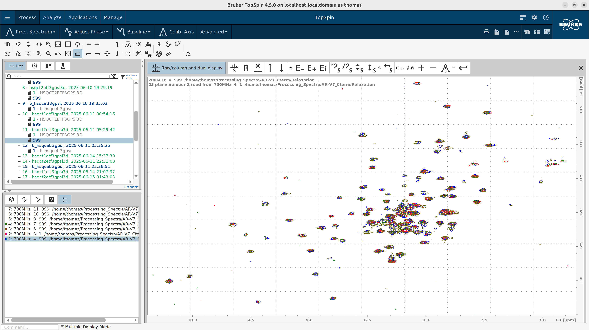
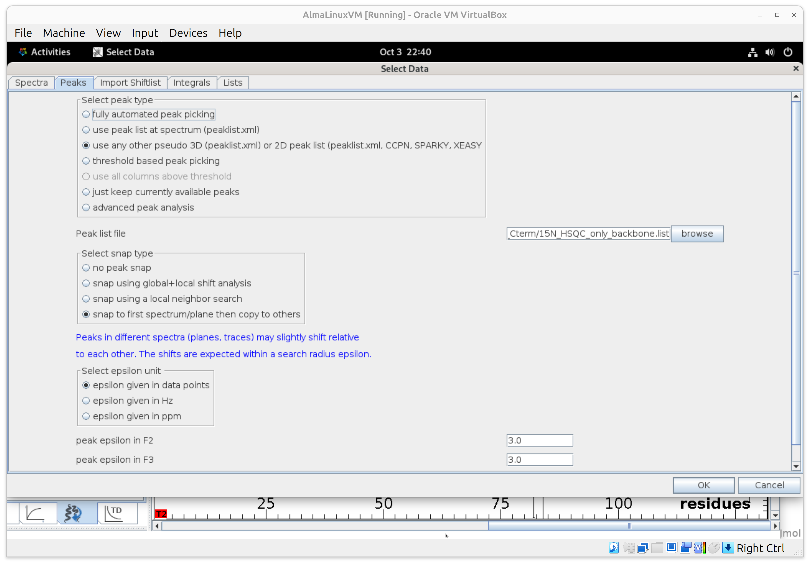
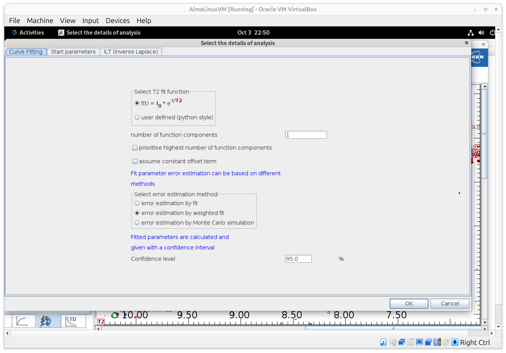
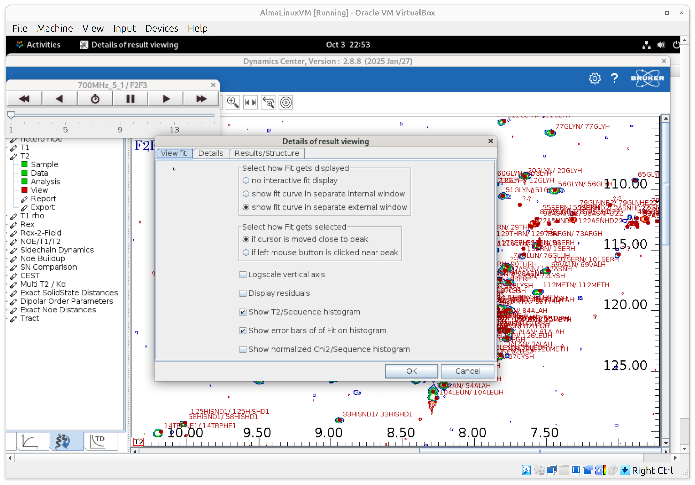
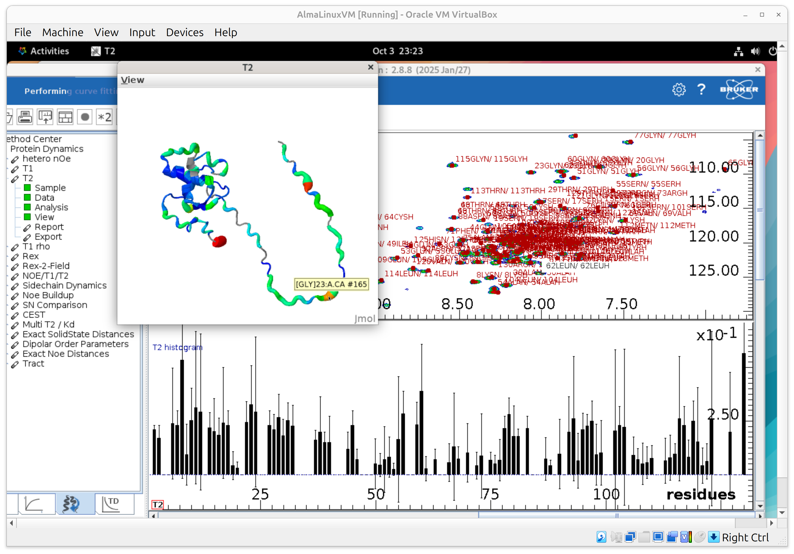
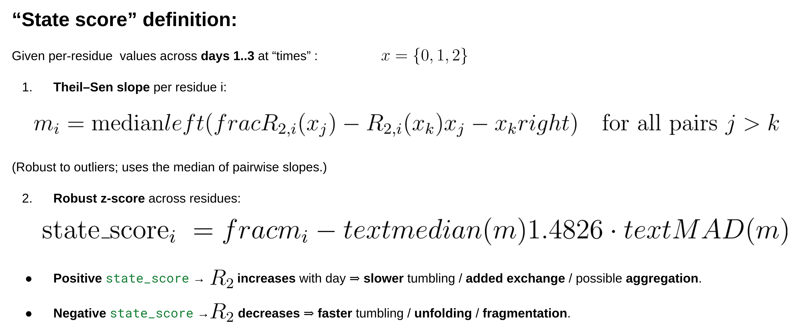
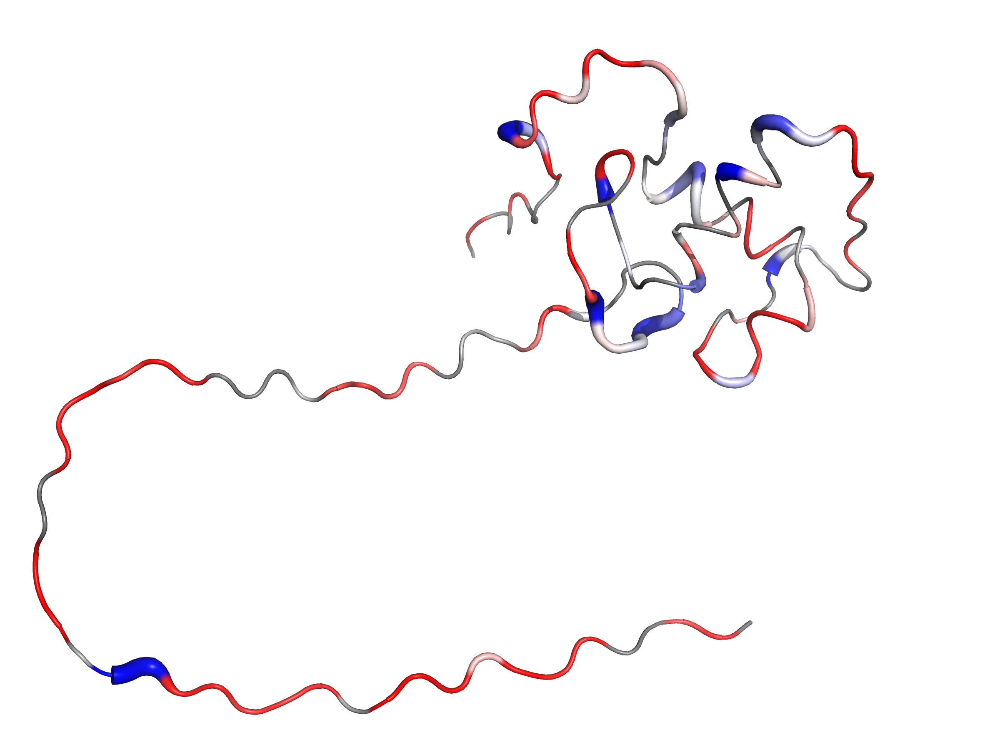
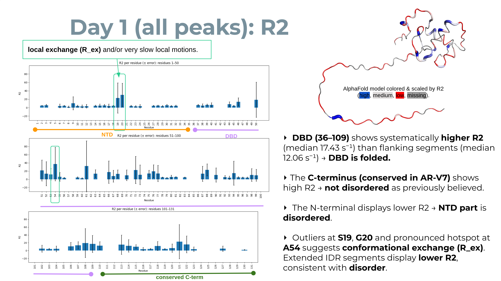

# T1/T2 ^15N relaxation tutorial: TopSpin processing → Bruker Dynamics Center

---

## What we measured

Every day for 7 days in total we measured the following spectra:

* A high-resolution 2D **^1H–^15N HSQC** for QC/peak-list reference.
* A **pseudo-3D HSQC-T1** series (arrayed delays).
* A **pseudo-3D HSQC-T2** series (arrayed delays).

> (Bruker pulse programs commonly used: `hsqct1etf3gpsi3d` and `hsqct2etf3gpsi3d` or close variants. These acquire HSQC
> planes versus relaxation delay in a pseudo-3D dataset.)

> Pseudo-3D note: the third “dimension” is a **non-frequency** delay axis, so you only Fourier-transform the frequency
> axes (^1H and ^15N), and leave the delay axis as a series of 2D planes. TopSpin and Dynamics Center are built for
> exactly this.

---

## Part A — Process each standard ^15N HSQC (QC) in TopSpin

Use standard 2D processing as described in the [15N HSQC Processing tutorial](../Titration_15N_HSQC/15N_HSQC_Processing.md). 
If you don't have it already, then save a high-quality peak list for the ^15N HSQC of day 1. This will be your 
*reference* list for all seven days in Dynamics Center.

---

## Part B — Process each pseudo-3D T1/T2 dataset in TopSpin

1. Transform the frequency axes and set phasing from a representative plane. 
Assuming that you have set `biotop` correctly (!), open the first T1 pseudo-3D dataset (experiment `4`) and issue the following commands:

```
btproc biorefonly   # referencing
3 SI 4k       ; zero filling in the direct dimension
2 SI 1k       ; zero filling in the 15N (F2) dimension
2 ME_mod LPfc ; activate linear correction in the 15N dimension
2 NCOEF 48    # increate linear prediction coefficients
tf3           ; FT in the 1H dimension
tf2           ; FT in the 15N dimension
slice         ; extract the first F2–F3 plane to process it
```

> You **do not** Fourier-transform along the delay axis (dimension F1) for pseudo-3D T1/T2; keep it as a series of 2D planes. (Dynamics
> Center will use those planes to fit intensities vs. delay.)

2. **Process the 2D plane** (orientation **23**) to phase it like a [normal ^15N HSQC](../Titration_15N_HSQC/15N_HSQC_Processing.md), 
then **store the phase back to the 3D**.

3. Overlay with the QC ^15N HSQC (experiment `3`) using `.md`, zoom into the region of interest, right-click and save the
   display region to *STSR/STSI*. Copy these numbers to the pseudo-3D spectrum.



> At the bottom left there are tryptophan side-chain amide peaks. You can safely exclude them from the focus region
> since we are interested in the relaxation properties of the backbone amides only.

> Tip — window/truncation: Zoom the **^1H (F2)** range to your HSQC window (excluding the water line ≈ 4.7 ppm) *before*
> baseline correction; this avoids water-line artifacts influencing the polynomial baseline. Then apply baseline.
> (TopSpin’s `ABSG` governs baseline polynomial degree used by `abs1/abs2`.)

4. Run baseline correction on the pseudo-3D spectrum:

```
abs3    ; on the direct dimension; we don't need to set ABSF2{F3} after the water line at ~4.7 ppm because we truncate with STSR/STSI
        ; the ABSF1{F3} must always be left to a high value like 1000 ppm.
abs2    ; we leave ABSF1{F2} and ABSF2{F2} to high values, like 1000 ppm and -1000 ppm, respectively.
```

5. Hit `edmac process_T1` to create a new macro. Then an editor will pop up.
   Adjust its contents to look like the following (SI, PHC0, STSR, STSI values will vary in your case):

```
btproc biorefonly
3 SI 4k
2 SI 1k
2 STSR 112
2 ME_mod LPfc
2 NCOEF 48
3 STSR 630
3 STSI 920
3 PHC0 120.525
tf3
tf2
tabs3
tabs2
```

Try `process_T1` macro on the first T1 experiment (`3`) to see if it works smoothly. As you see in the figure below, 
it looks like the standard ^15N HSQC measured as a time series.



6. Process all pseudo-3D T1 spectra in batch mode with the `qumulti` command. In the window that will pop up write
   `process_T1` as the command and select the individual experiments that you want to process. E.g., 4, 7, 10, 13, 16, 19, 22, 25, 28, 31, 34, 37, 40, 43.

Before you proceed to the Analysis (Part C) make sure that all spectra were correctly referenced. If not then run manually 
the `btproc biorefonly` command to all of them until the perfectly overlap.



7. Repeat steps 1-6 for the pseudo-3D T2 spectra.


---

## Part C — Analyze in Bruker Dynamics Center (Protein Dynamics)

### 1) Launch & get oriented

* Open Dynamics Center. In the lower-left, click the Protein Dynamics tab; you’ll see the method tree with T1-Relaxation 
and T2-Relaxation among the options. If you like, set a default data folder via Config → Preferences → Default Spectrum 
Path so every file dialog starts in the right place.

### 2) One-time “Sample” setup (reused for both T1 and T2)

* Go to Sample and load your AA sequence (FASTA) and a PDB with hydrogens. When you click OK, the Sample leaf turns 
green, meaning it’s ready. This saves time later because you can load this setup into other methods.

> Why this matters: the sequence aligns residue-indexed results; the H-complete PDB enables structure-aware displays 
> later if you use them.

### 3) T1 — Add data & peaks (pseudo-3D)

* Open T1-Relaxation → Data. Set Spectrum type = pseudo-3D and browse to your processed HSQC-T1 dataset.
* In Peaks, pick “use any other peak list” and point to your good 2D ^15N HSQC peak list (e.g., day-0 reference). Select 
a Sparky peak list files in the following format. Remove side-chain peaks otherwise you will get downstream the error 
"peak annotation do not have unique numbers". Moreover, we are interested in the backbone amide peaks to assess the 
disorder propensity of each residue.

```
      Assignment          w1         w2
        A54N-A54H    126.639      8.284
        A30N-A30H    126.078      8.212
        C67N-C67H    125.602      9.492
      L114N-L114H    125.437      8.974
              ?-?    123.672      9.344
      V120N-V120H    123.672      8.781
```

* Enable peak snapping and choose “Snap to first plane then copy to others” so the software follows your peaks across delay planes.



* Set Search radius ≈ 3 points per dimension.
* In Integrals, set Integral type = intensities. Click OK; Data turns green and the planes/peaks are loaded.

> Tip: If you measured the same delay multiple times, see the Lists tab (default settings are fine for most cases).

### 4) T1 — Fit the decays (Analysis)

* Open Analysis. Choose exponential decays; keep automatic starting values.
* Under fit error estimation, select the option "error estimation by weighted fit" that uses signal-to-noise and 
variance of repeat experiments; set confidence interval = 95%. Run the fit. It’s fast on typical datasets.



> Result: per-residue T1 with error bars—ready for plotting/export.

### 5) T1 — Make the display useful (View)

* In View, enable fit curves in the main window and set “update on left-click” so clicking a peak updates the fit panel.
* Turn on error bars for integrals, the T1 histogram, and error bars on the histogram.



* The cursor is linked across panels: click a peak to see its fit and highlighted bar.
* To focus on a single panel, right-click away from fit points and choose Toggle full display; repeat to restore the 
full layout.
* Preview the 3D structure colored by T2 (lowest to highest T2: blue->cyan->green->yellow->orange->red). Drag the cursor
on a residue to see its resname and resid and associated it with the barplot.



> If you ever “lose” everything, use File → Visibility of objects to bring panels back.

### 6) Save your T1 setup (project)

* Right-click T1 → Save As… and store, for example, `T1.project`. Use Save As so T1 and T2 end up as different files.

### 7) T2 — Reuse the setup, switch the data, repeat

* Open T2-Relaxation, then right-click → Open… and select your `T1.project`. This preloads Sample and your view preferences (the Sample node should turn green).
* Go to Data and update only the spectrum path to your HSQC-T2 pseudo-3D dataset; keep the same Peaks/snapping, Search radius, Integrals, and Lists settings as above.
* Run Analysis again with exponential decays, S/N-based errors, and 95% CI.
* In View, turn on the T2 histogram and error bars; use the same navigation tricks (linked cursor, toggle full display).
* Save As… `T2.project` when done.

### 8) Export results & report

* From T1 and T2, use Report to create a PDF, and **Export** to get a **.txt file** with fitted values and errors, which will be
the input to the Python script for analysis, plotting and visualization.

* For quick stats on a histogram, right-click → Properties.

---

### Mini-FAQ / sanity checks

* Why pseudo-3D? You process ^1H and ^15N as normal frequency axes; the “third” axis is delay, so Dynamics Center 
treats it as a stack of HSQC planes vs. time for fitting. (Set it explicitly in Data → Spectrum type = pseudo-3D.)

* Do I need my own peak list? Yes—use your best, clean 2D HSQC peak list so peaks can be snapped to each delay plane.

* Nothing shows / I closed everything. Use File → Visibility of objects to restore panels.

---

## Part D — Convert to rates, make summary plots, and write B-factors into a PDB

1. What’s already in your PDC report `.txt` (no work needed)

* In **SECTION: results**, each residue/peak already has:

  * T1 [s], T2 [s]
  * R1 and R2 (PDC labels “rad/s”; numerically s⁻¹)
  * standard deviations of fitted rates (e.g., “R2 sd”)
  * fitInfo (fit status) (Done/Warning/Fail)

> You do **not** need to recompute R1 = 1/T1 or R2 = 1/T2 yourself. The script will only back-compute a rate from T if 
> a report row is missing that rate.

2. What this [Python script](scripts/pdc_relax_to_bfactor.py) does for you (automatic)

* Reads the **results** tables (T1 + T2) and matches residues across days.
* **Single day:** forms **R2/R1** (unitless) per residue for a compact snapshot.

> With just one time point per residue, the most informative composite you can form from T1/T2 is the ratio R2/R1. 
> It acts as a coarse proxy for local effective correlation time (τc) because, under isotropic tumbling and in the 
> absence of strong exchange, R2/R1 rises with τc (i.e., larger apparent size / slower tumbling). This usage is 
> widespread enough that tools and notes exist specifically for estimating τc from R2/R1 (as a relative indicator).

* **Multi-day (≥2 days):** computes a robust **state_score** from the *trend* of **R2 vs. day** *(t of slope[ln R2 ~ day])*.
  (positive = R2 increases → slower tumbling/aggregation/exchange; negative = R2 decreases → faster tumbling/unfolding).



> **Why R2‑centric?** R2 is most sensitive to size‑/tumbling‑related broadening and also carries chemical‑exchange (Rex) 
> contributions on μs–ms timescales; large positive shifts in R2 across days commonly indicate aggregation/oligomerization 
> or exchange‑broadening; negative shifts indicate fragmentation/unfolding (faster tumbling).

> **Why a slope of ln(R2)?** Log‑space makes the score scale‑invariant (it reflects % change/day) and is robust when 
> different residues start at different baselines.

> **Why a t‑statistic?** It naturally downweights noisy fits by using PDC’s per‑residue uncertainties (R2 sd) as weights 
> and provides a simple “signal‑to‑noise” for the trend. (The PDC TXT “results” blocks include R2, its SD, and fit 
> flags—Done/Warning/Fail—which the script uses.)

* Writes a **PDB** with the chosen metric in the **B-factor** column (with optional normalization).

* Emits a ready-to-run **PyMOL (.pml)** and optional **PNG** plots for slides.

3. How to run the script

Run `python3 pdc_relax_to_bfactor.py -h` to see all the CLI options. Below are representative usage examples.

* **Single day** (default metric = R2/R1; normalized for visualization):

```bash
python3 pdc_relax_to_bfactor.py \
  --t1 T1_day1_report.txt \
  --t2 T2_day1_report.txt \
  --pdb-in Cterm_AF_H.pdb \
  --out-prefix ARV7_day1_R2 \
  --metric auto \
  --bf-norm minmax --norm-range 10 80 --clip-percentiles 5 95 \
  --save-plots --emit-pml --no-pdb \
  --pml-column B_written --palette red_white_blue
```

> T2 alone is often more robust for IDPs because R2/R1 inherits uncertainty from both R2 and R1 (and R1 can be noisy). 
> If your R1 errors are large, a T2 map may be crisper for presentations; the script can plot T2 (choose `--metric r2` 
> for single‑day).

* **Three days** (default metric = state_score; normalized; with plots):

```bash
python3 pdc_relax_to_bfactor.py \
  --t1 T1_day1_report.txt T1_day2_report.txt T1_day3_report.txt \
  --t2 T2_day1_report.txt T2_day2_report.txt T2_day3_report.txt \
  --labels d1 d2 d3 \
  --pdb-in Cterm_AF_H.pdb \
  --out-prefix ARV7_days1to3_state \
  --metric auto \
  --bf-norm minmax --norm-range 10 80 --clip-percentiles 0 100 \
  --save-plots --emit-pml --no-pdb --palette blue_white_red
```

> **Normalization options:**
> `--bf-norm none|minmax|zscore` (choose), `--norm-range a b` (e.g., `10 80`), `--clip-percentiles p_low p_high` (e.g., `5 95`).

4. What you get (outputs, same `<prefix>`)

* `<prefix>.pml` — PyMOL script that colors by B and enables **putty** thickness by B.
* `<prefix>.metrics.csv` (single-day) or `<prefix>.multi.csv` (multi-day) — residue values and **B_written** (what was 
written into PDB).
* (If `--save-plots`) PNGs: **R2 by residue/day** and **state_score histogram**.

---

## Visualize the PDBs in PyMOL

**What this shows:** higher **B** → more **red** and **thicker** tube (if putty on) if you have set `--palette red_white_blue`.
B equals **R2/R1** or **R2** (single day) or **state_score** (multi-day), depending on how you ran the script.

### Quickstart (use the generated `.pml`)

1. In PyMOL: `run ARV7_day1_R2.apply_b_from_txt.pml` →

> If you used `--bf-norm none`, set `minimum`/`maximum` to the actual range (see **B_written** in the CSV).

2. To save to an image do:

```
bg_color white
ray 2400, 1800
png ARV7_day1_R2.png, dpi=300
```



---

### Interpreting the metrics (one line each)

* **R2 up (T2 down) →** slower tumbling / larger effective size and/or µs–ms exchange (Rex).
* **R2 down →** faster tumbling / smaller effective size (e.g., cleavage, unfolding to small fragments).
* state_score = a robust z-score of the R2-vs-day trend.
* **Positive state_score →** R2 increases with day ⇒ slower tumbling / added exchange / possible aggregation.
* **Negative state_score →** R2 decreases ⇒ faster tumbling / unfolding / fragmentation.
* IDRs commonly resist broadening and are sensitive to proteolysis, producing new sharp peaks.


## Part E — Interpretation of relaxation plots (what T1/T2 alone can tell you)

* Below is a concise, T1/T2‑only cheatsheet. It focuses on fitted T1/T2 (and derived R1/R2)—not raw plane intensities.

**Global size / tumbling changes**

  * Aggregation / oligomerization / tighter complexes:

  * Expect shorter T2 → larger R2 (broader lines), often modest T1 changes. If R2 rises broadly across many residues 
from day‑to‑day, that’s consistent with slower tumbling (larger apparent τc) and/or added Rex. Your R2/R1 may also 
increase globally.

  * Degradation / unfolding into smaller species:

  * Expect longer T2 → smaller R2 (narrower lines) for fragments that tumble faster; R2/R1 tends to decrease. New peaks 
can appear at new positions (fragments/unfolded regions).

**Local dynamics vs. exchange (limits of T1/T2‑only)**

* Chemical exchange (Rex) inflates R2 without a matching R1 change. Residues with unusually high R2 (outliers in the 
histogram) are exchange candidates; with T1/T2 alone you can flag them, but you can’t robustly deconvolve Rex from size effects.

**What not to over‑interpret**

* Absolute τc from R2/R1 using only T1/T2 is not recommended; keep it relative across days.
* Raw intensity stacks across days are confounded by gain/SNR; rely on fitted T1/T2 (with errors) and their histograms.





**Practical readouts for your 3‑day study**

* Histogram shifts: a left shift of R2 (smaller R2 / longer T2) suggests smaller/faster species; a right shift (larger 
R2 / shorter T2) suggests larger/slower or more exchange.
* Residue‑specific flags: peaks whose R2 jumps beyond the day’s interquartile spread (and is significant within error 
bars) are potential exchange/interaction hotspots worth inspecting in spectra.

---

### FAQ (about disappearing signals and day‑to‑day changes)

* **Signals that disappear**: usually S/N dropping below the fit threshold because lines broaden (fast R2), peaks shift, or the residue changes state (exchange/aggregation). The script **never fabricates values**; missing fits remain blank (NaN), and those residues simply won’t be colored/thickened unless you choose a normalization that maps NaNs to zero.
* **Why R2/R1 for one day but “state_score” across days?**
  For a single snapshot, **R2/R1** is a compact, unitless way to visualize relative tumbling and exchange. Over several days, the **trajectory** matters, so a **robust slope** of **R2 vs. day** (converted to a robust z‑score) emphasizes residues that **change consistently**—exactly what you want to spot unfolding, degradation, or aggregation trends.

---

# Authors
- Thomas Evangelidis