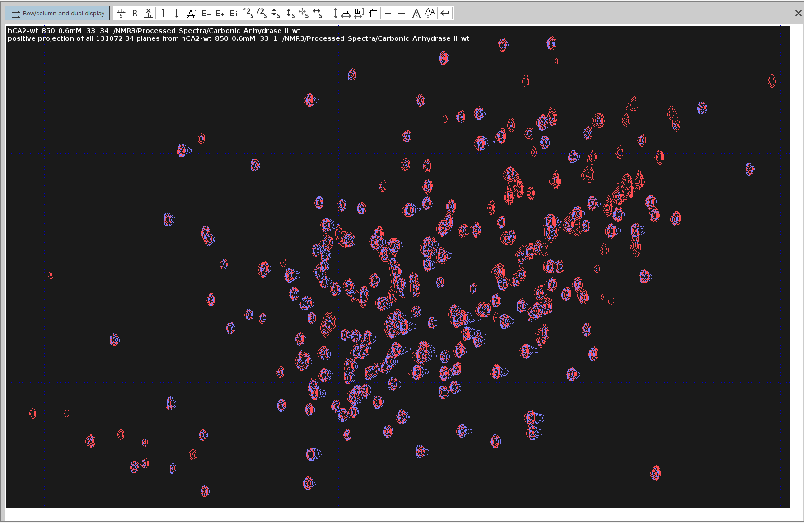
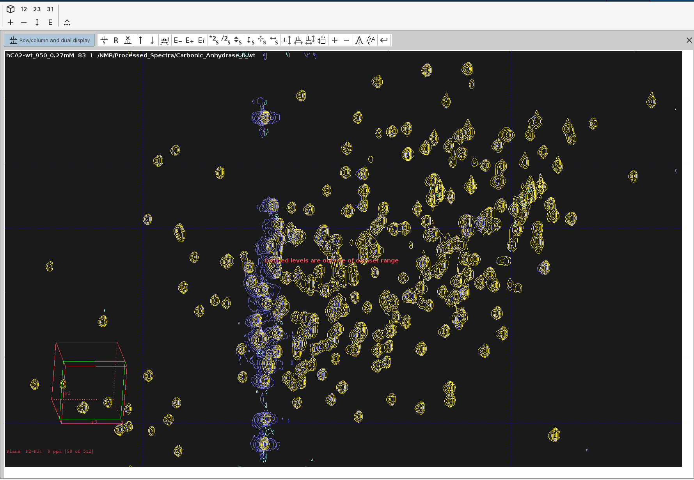
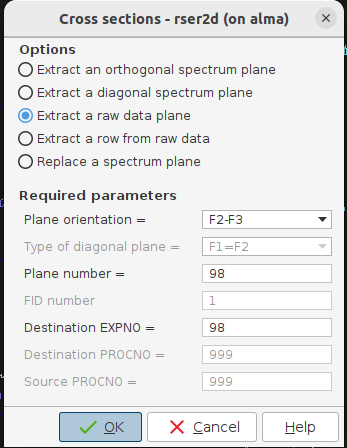
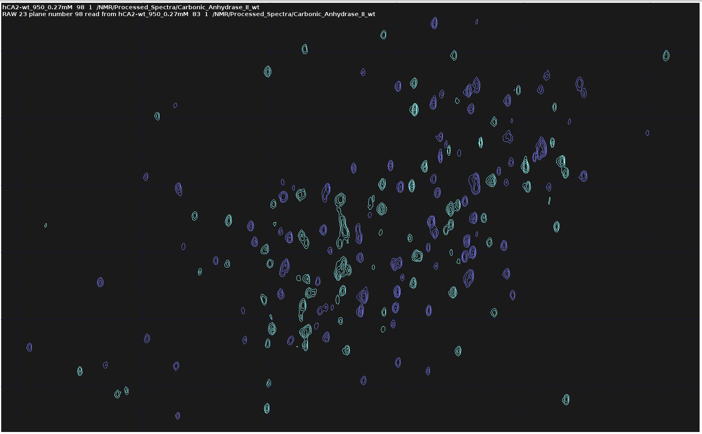
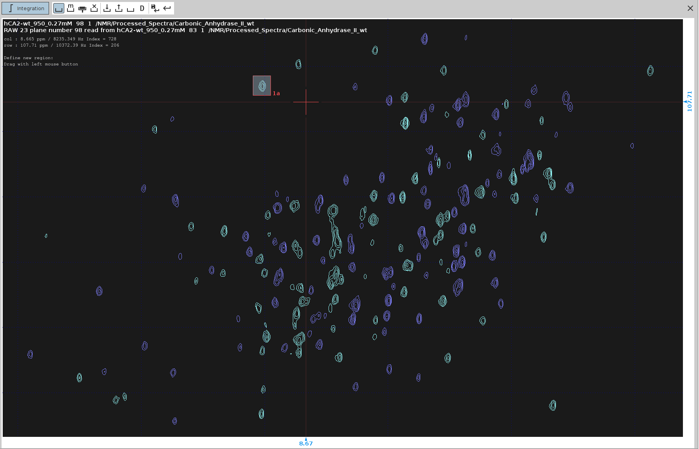
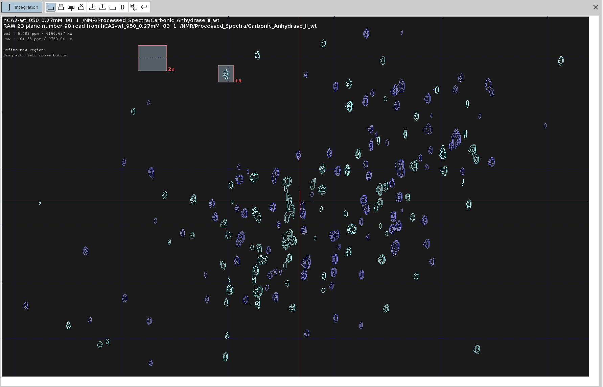
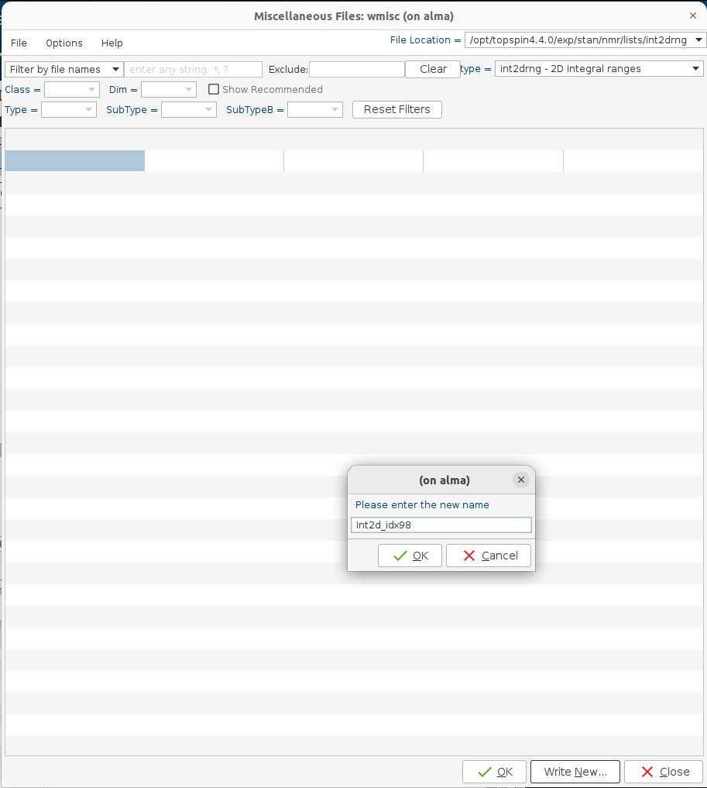
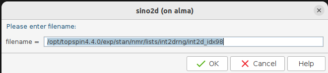
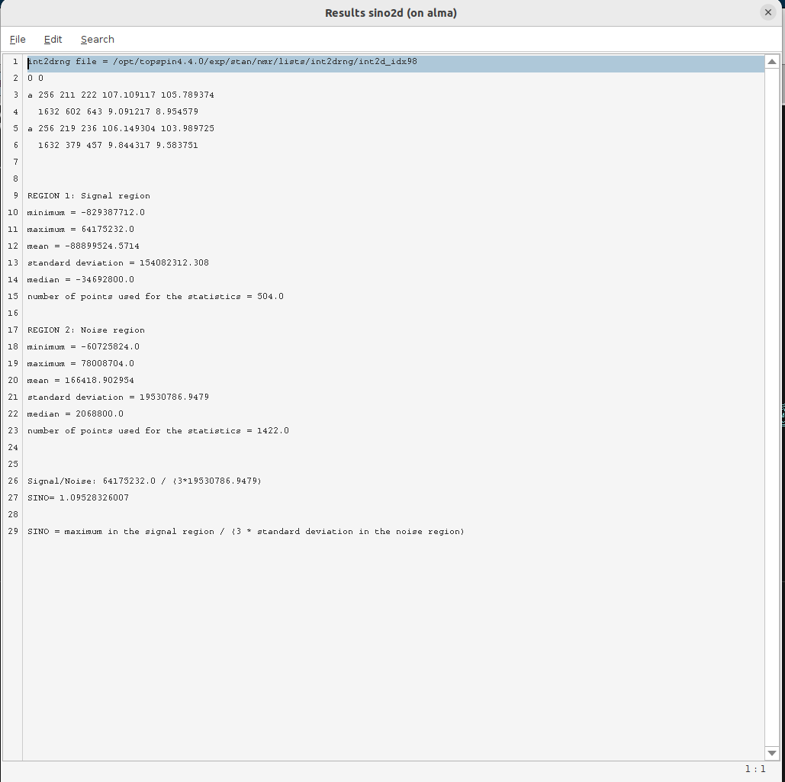

# Measurement of S/N Ratio in 15N-Edited 3D NOESY and 4D HCNH NOESY

---

## Contents

- [Spectra Dimensions](#spectra-dimensions)
- [Selection of Common Peaks](#selection-of-common-peaks)
  - [1. Identify Common Peaks](#1-identify-common-peaks)
  - [2. Overlay Projections](#2-overlay-projections)
  - [3. Navigate to Selected Peak in 3D NOESY](#3-navigate-to-selected-peak-in-3d-noesy)
  - [4. Extract 2D Plane from 3D NOESY](#4-extract-2d-plane-from-3d-noesy)
- [Signal-to-Noise Ratio Measurement](#signal-to-noise-ratio-measurement)
  - [1. Enter Interactive Integration Mode](#1-enter-interactive-integration-mode)
  - [2. Define Integration Regions](#2-define-integration-regions)
    - [a. Integrate the Signal of Interest](#a-integrate-the-signal-of-interest)
    - [b. Define the Noise Area](#b-define-the-noise-area)
  - [3. Export Integration Regions](#3-export-integration-regions)
  - [4. Perform 2D SINO Calculation](#4-perform-2d-sino-calculation)
- [Extract 2D Plane from the 4D Spectrum](#extract-2d-plane-from-the-4d-spectrum)
  - [1. Prepare the 4D Spectrum](#1-prepare-the-4d-spectrum)
  - [2. Find Coordinates of Selected Peak](#2-find-coordinates-of-selected-peak)
  - [3. Set Positions in 4D Spectrum](#3-set-positions-in-4d-spectrum)
  - [4. Extract Plane Using `rpl`](#4-extract-plane-using-rpl)
  - [5. Identify Peak in Extracted Plane](#5-identify-peak-in-extracted-plane)
  - [6. Extract 2D Plane for S/N Measurement](#6-extract-2d-plane-for-sn-measurement)
  - [7. Measure Signal-to-Noise Ratio](#7-measure-signal-to-noise-ratio)

---

In this tutorial, we'll measure the signal-to-noise (S/N) ratio in a 15N-edited 3D NOESY and a 4D HCNH NOESY spectrum. 
This involves selecting common peaks between the two spectra and performing S/N calculations.

## Spectra Dimensions

- **15N-Edited 3D NOESY**
  - **F1**: H
  - **F2**: N
  - **F3**: HN

- **4D HCNH NOESY**
  - **F1**: C
  - **F2**: HC
  - **F3**: N
  - **F4**: HN

## Selection of Common Peaks

### 1. Identify Common Peaks

- Examine the N-HN positive projections to find common peaks with strong signals in both spectra for S/N comparison.
- In the **15N-edited 3D NOESY**, execute `projplp 23 all all 23`.
- In the **4D HCNH NOESY**, execute `projplp 34 all all 34`.

### 2. Overlay Projections

- Overlay the **F2–F3** projection of the 3D NOESY onto the **F3–F4** projection of the 4D NOESY.
- Search for common, well-shaped, strong signal peaks. (Peaks selected are indicated with green circles.)

- Close all opened spectra after identifying the peaks.

### 3. Navigate to Selected Peak in 3D NOESY

- Open the processed **3D NOESY** spectrum.
- Switch to the **F2–F3 plane** representation by clicking the **"23"** toolbar button.
- Overlay the F2–F3 projection.
- Navigate through the F1 dimension:
  - Left-click and drag on the **double-headed arrow** toolbar button.
  - Continue until the first selected peak appears in the F2–F3 plane.
- Note down the index of that plane on the F1 dimension (displayed at the bottom left), e.g., **98**.

### 4. Extract 2D Plane from 3D NOESY

- Exit the overlay mode.
- Issue the command `rser2d`.
- A window will appear prompting for parameters. Set the values as required (refer to the image below) and click **"OK"**.

- In the new **EXPNO** that appears, double-click on **spectrum 1** (raw 2D plane from the 3D NOESY).
- Process the spectrum by issuing `xfb`.

## Signal-to-Noise Ratio Measurement

### 1. Enter Interactive Integration Mode

- Start the integration mode by entering `.int`.

### 2. Define Integration Regions

- Click on the **"Define new integration region"** toolbar button.

[IMAGE]

#### a. Integrate the Signal of Interest

- Identify the selected peak.
- Drag a region around it while holding down the left mouse button.
- Upon releasing, a popup menu appears. Select an **"Integrate"** entry (any will suffice).

#### b. Define the Noise Area

- Move to a signal-free region.
- Drag to mark the noise area.
- Again, select an **"Integrate"** entry when releasing the mouse button.

### 3. Export Integration Regions

- Click on the **"Export integration regions"** toolbar button.

[IMAGE]

- Choose **"Export integration regions"** from the dropdown.
- The **"wmisc"** window opens. Click on **"Write new..."**.

- Enter a filename, e.g., `int2d_idx98`.

- The file is stored in the `.../list/intrng2d` directory.
- You can inspect this directory using the `rmisc` command.
- Exit the integration mode.

### 4. Perform 2D SINO Calculation

- Issue the command `sino2d`.
- In the popup window, enter the full path of the file you just saved.
- The **"Results sino2d"** window will display the S/N ratio results.
- You can save these results to a file if desired.

## Extract 2D Plane from the 4D Spectrum
The same process with the 4D spectrum is more involved since it's not easy to navigate through F1 and F2 simultaneously.

### 1. Prepare the 4D Spectrum

- Close all open windows.
- Switch to the **4D HCNH NOESY** spectrum.

### 2. Find Coordinates of Selected Peak

- Open the **F3–F4 projection**.
- Find the index numbers of the selected peak:

  - **F4**: 134
  - **F3**: 196

### 3. Set Positions in 4D Spectrum
  
- Click on the **"E"** toolbar button in the 4D spectrum.
- Set **F3** to **134** and **F4** to **196**.

### 4. Extract Plane

- Execute `rpl`.
- In the dialog:

  - Select the **`12` plane**.
  - Assign index position **134** to **F3** and **196** to **F4**.
  - Name the new **EXPNO** as `134196`.

### 5. Identify Peak in Extracted Plane

- Open the `134196` spectrum.
- Select a strong aliphatic peak.
- Note its index positions:

  - **F1**: 86
  - **F2**: 81

### 6. Extract 2D Plane for S/N Measurement

- Return to the **4D spectrum**.
- Click on the **"E"** toolbar button.
- Set **F1** to **86** and **F2** to **81**.
- Execute `rpl`.

- In the dialog:

  - Select the **`34` plane**.
  - Assign index position **86** to **F1** and **81** to **F2**.
  - Name the new **EXPNO** as `8681`.

### 7. Measure Signal-to-Noise Ratio

- Follow the steps outlined in the [Signal-to-Noise Ratio Measurement](#signal-to-noise-ratio-measurement) section for the `8681` spectrum.

---

*Note:* **EXPNO** refers to the experiment number in Bruker software, which allows you to specify different datasets without overwriting existing data.
