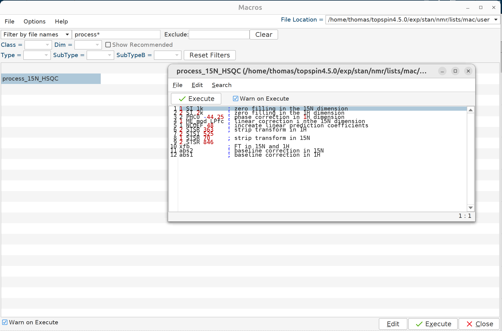

Briefly, the strategy is to do the following processing steps on the first spectrum (#0 titration) without the ligand, 
export the commands to a new macro, and apply that macro to the other spectra of this titration.  You can then just
modify the PHC0{F2} and apply the same macro to all other ligand titration spectra you measured for that protein.

Below are the commands and s brief description of each step:

```
1 SI 1k       # zero filling in the 15N dimension
2 SI 2k       # zero filling in the 1H dimension
2 PHC0 -44.25 # phase correction in 1H dimension
1 ME_mod LPfc # linear correction i nthe 15N dimension
1 NCOEF 48    # increate linear prediction coefficients
2 STSR 354    # strip transform in 1H
2 STSI 546    #
1 STSR 66     # strip transform in 15N
1 STSI 860    #
xfb           # FT in 15N and 1H
abs2          # baseline correction in 15N
abs1          # baseline correction in 1H
```

Hit `edmac` to open the macro window, select the user macros folder at the top right and add a new macro named 
`process_15N_HSQC` as shown in the figure.



Finally, process all spectra in batch mode with the `qumulti` command. In the window that will pop up write
`process_15N_HSQC` as the command and select the individual experiments that you want to process. 
E.g., 153, 155, 157, 159, 160.
