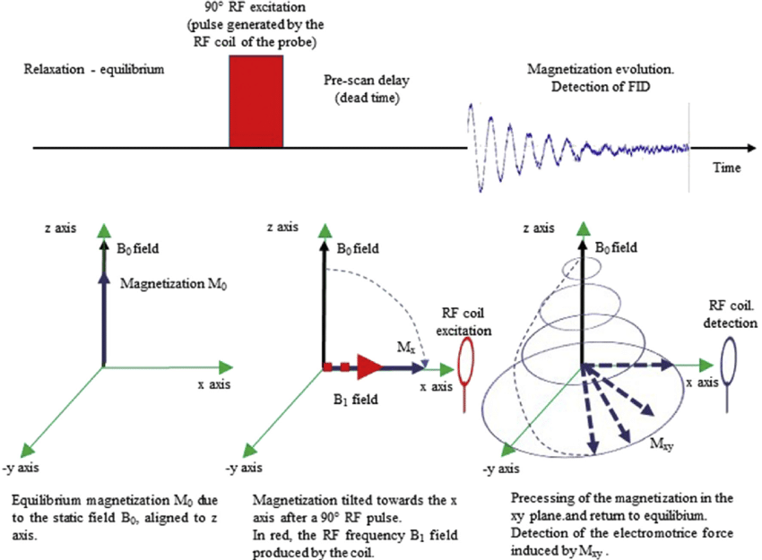

in 1D experiments the data are writen to the disk when the measurement is complete. At any moment you can write the 
data collected so far to the disk with the command `tr`.

Before the FT we apply the apodization (window) function to manouver between resolution and S/N. Stronger signal is at the 
beginning of FID which towards the ends is mostly noise. That's why we apply an exponential function that is decaying 
with the same rate as the FID. lb=0.3 (line broadening) means that every signal in the spectrum will be broadened by 0.3 Hz - for bigger molecular 
use higher value.

_Pulse-acquisition 1D NMR experiment. The macroscopic magnetization is aligned along the B 0 axis (Oz) at equilibrium 
state, ideally at the end of the relaxation delay. After an RF excitation pulse, M 0 is flipped in the Oxy plane. The 
precession of this magnetization gives the impulse response (or FID) which is detected._

---

# Authors
- Thomas Evangelidis