# How to Set Up a **¹H–¹⁵N HSQC** Experiment in TopSpin

> This tutorial walks you through every step—from loading your sample to fine-tuning shims and measuring signal-to-noise—so you can acquire high-quality HSQC data and compare the classic and BEST-HSQC variants.

---

## 1. Prepare a New Experiment Folder

1. **Copy a previously calibrated ¹H experiment**  
   - In TopSpin, select an earlier proton pulse-calibration experiment (e.g. `zg`) and press `edc`.  
   - Create a **new dataset** and copy the parameters into it.

2. **Set the temperature**  
   - Press `edte` and enter the desired temperature.

3. **Insert the sample** into the spectrometer.

4. **Lock on the solvent**  
   - Press `lock`, choose the correct solvent (e.g. `H2O+D2O`), and wait ≈ 10 min for temperature stabilization.

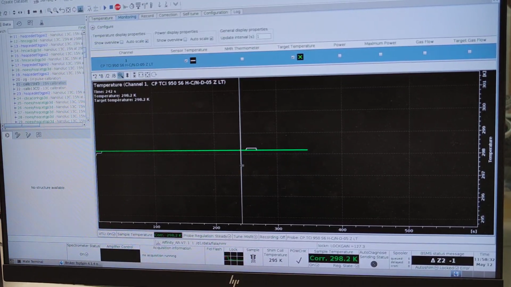

> **Tip:** While the sample equilibrates, you can start configuring the HSQC experiment.

---

## 2. Load and Configure the HSQC Pulse Program

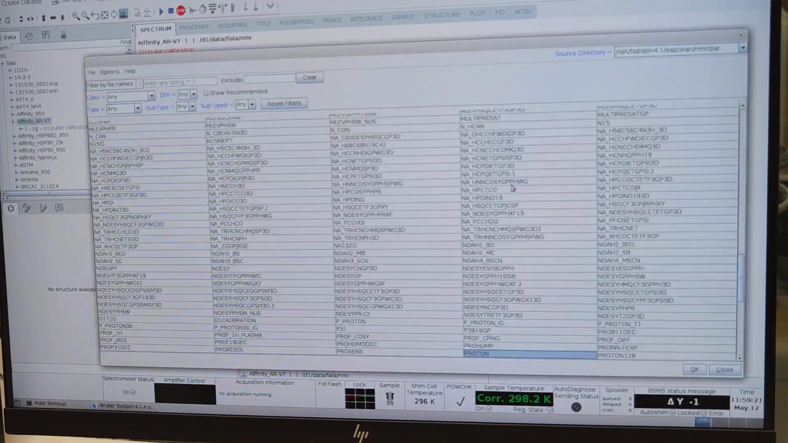

1. Press `edc` → **Read parameter set** → choose an HSQC sequence (e.g. `HSQCETF3FGPSI`).  
2. Select **Execute getprosol** to import pulse-length/power values.  
3. Enter a short description under **Title** and click **OK**.

4. **Verify acquisition channels**  
   - Press `edasp`.

5. **Set basic parameters**  
   - Press `eda` and adjust  
     - **SW** (spectral width)  
     - **O1P** (reference offset)  
     - **AQ** (acquisition time)  
     - **TD / DS / NS** as needed for total experiment time (`expt`).

---

## 3. Probe Tuning & Matching

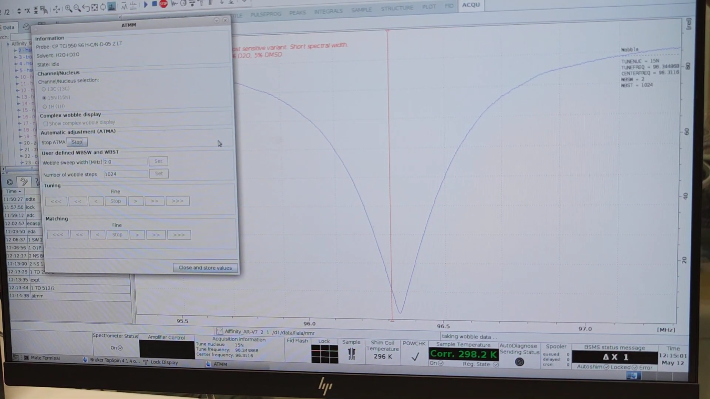

1. Press `atmm` (automatic tune/match).  
2. **Select `15N`**, click **Start**, then repeat for **`1H`**.  
3. When automatic tuning finishes, switch to **manual** mode and center the minima on both channels.

4. Press `loopadj` to refine lock parameters.

---

## 4. Automated Shimming (Shigemi Tube)

1. Launch the GUI: `topshim gui`.

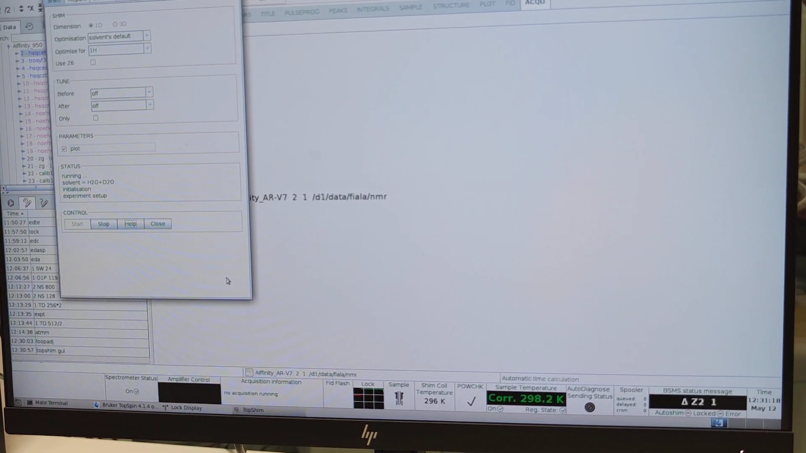

2. Under **PARAMETERS** type `plot` and start an initial shim.  
3. Examine the field profile:  
   - `TopshimData → 1D_maps_field → zg30` (see liquid range).

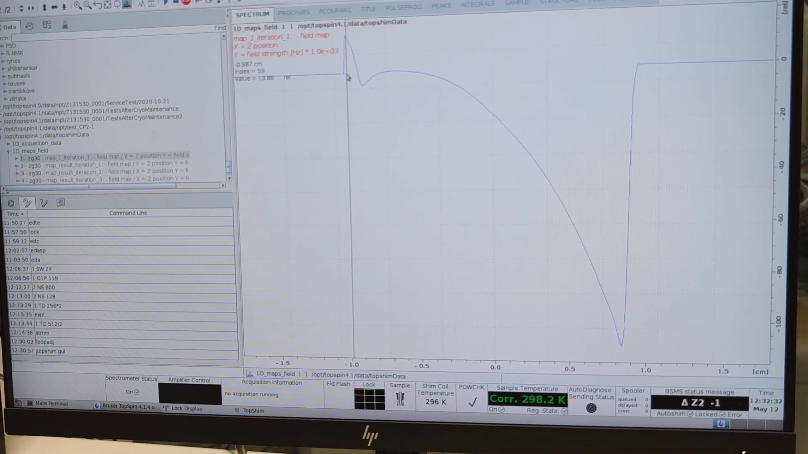

4. Run a **3D shim**:  
   - `topshim gui` → choose **3D**, enable **Use Z6**.  
   - Set **Before / After** to `Z-X-Y-XZ-YZ-Z`.  
   - Under **PARAMETERS** enter the z-range you measured, e.g. `zrange=-0.881,0.84`, then click **Start**.

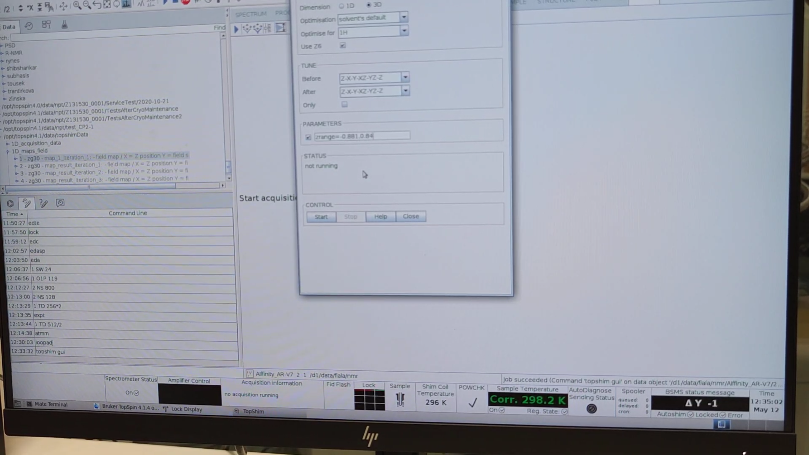

---

## 5. Fine-Tuning the ¹H Pulse Length

> The following commands were issued in the console (no screenshots):

```bash
lockdisp
loopadj
wsh
bsmsdisp
re 1          # recall the 1D proton dataset
eda
1 AQ 0.524    # extend acquisition time
1 TD 64K
pulsecalc
ased
1 P1 1
zg            # acquire 1D ¹H
gm
ft
mc
pp
````

### Calibrate P1

1. Open `ased`, set `1 P1 15.59*4`.
2. Acquire (`zg`) the 1D proton spectrum.
3. `fp` → **Check phasing**; if lock drifted (DMSO present), re-lock.
4. `.ph` → manual phase → save.
5. Repeat `zg` to iterate pulse calibration:

   * Goal: **equal positive and negative components** (ideally zero net signal).
   * If more negative, **increase P1** via `ased` (`1 P1 62.520`) and re-run `zg`.
   * Continue until balanced.

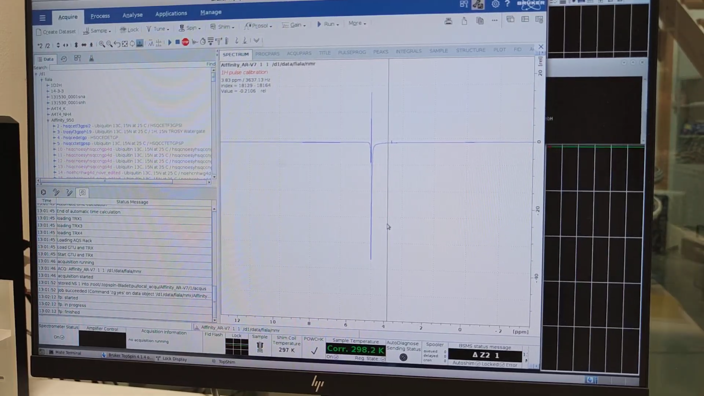

6. Divide the final P1 by 4 (90° pulse) in `eda`.

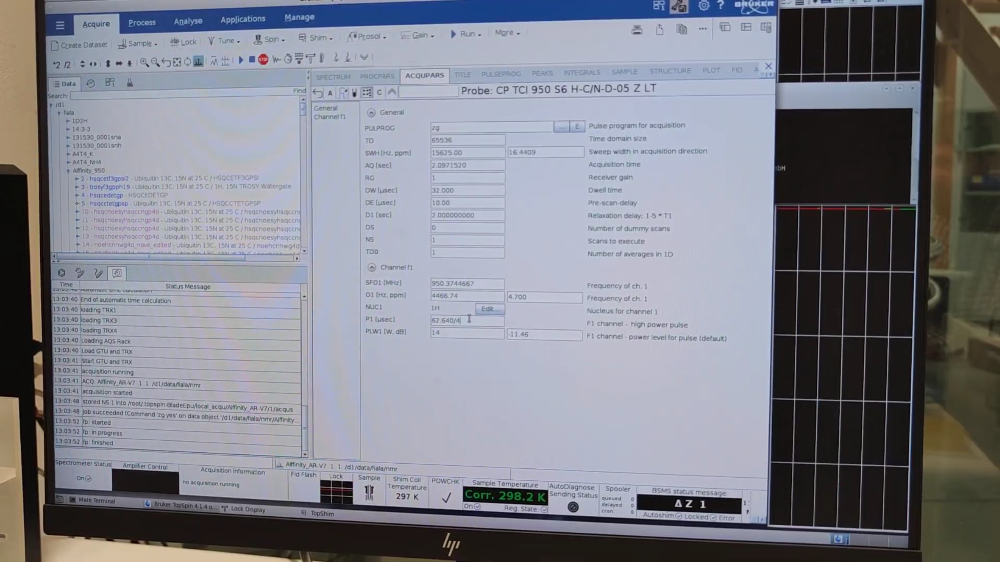

---

## 6. Water Referencing & Final HSQC Setup

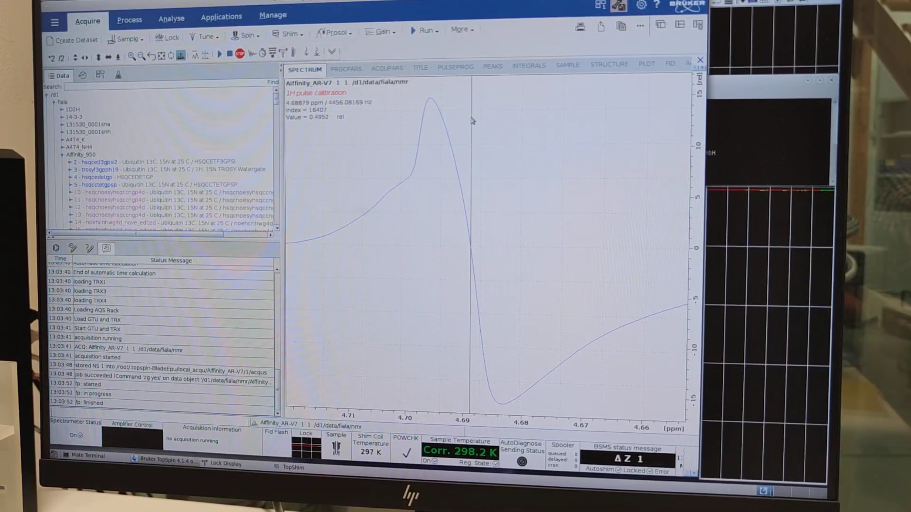

1. Zoom into the water peak, note the zero-intensity carrier (e.g. **4456.08 Hz**).

2. `re 2` → return to HSQC dataset → `eda` → set **O1{F2}** to that value.

3. Execute `getprosol 1H 15.66 14W` (15.66 µs pulse, PLW1{F2}=14 W).

4. Verify in `ased`, then start the 2-D HSQC: `zg`.

5. While acquiring, extract the 1D strip:

   * `qsin` → **OK** → peaks between 8–10 ppm confirm protein visibility.
   * Phase with `.ph` if needed.

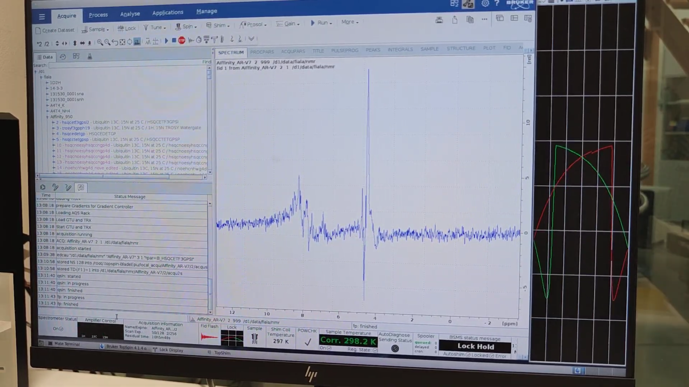

---

## 7. Setting Up the **BEST-HSQC**

1. Press `edc` → **Read parameters** → select `B_HSQCETF3GPSI` (BEST variant).
2. In `eda`, note the **shorter TD{F1}** (faster but lower resolution).

   * Adjust **TD**, **SW**, **NS** to balance time vs. resolution.

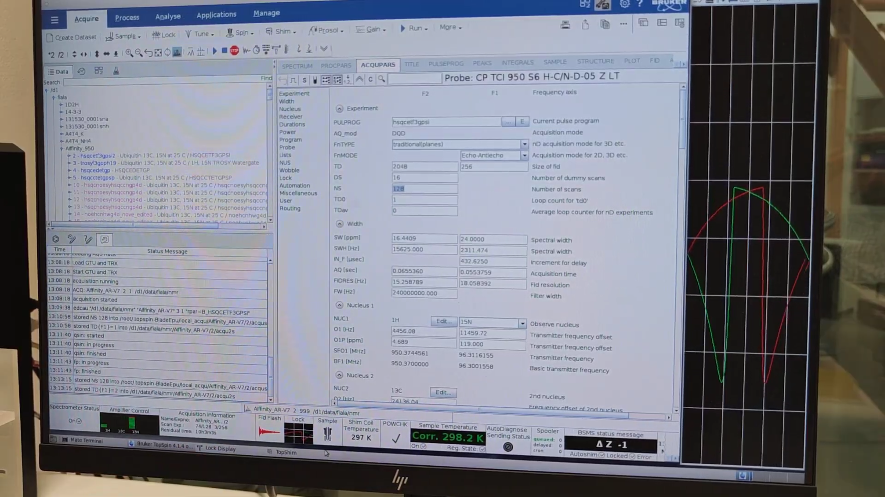

---

## 8. Measuring 2-D Signal-to-Noise (Classic vs. BEST)

1. Display both processed datasets side-by-side.
2. `xfb` → Fourier transform → `abs2` then `abs1` for baseline correction.
3. Synchronize views, pick a strong peak, record its region.
4. Create an **`int2drng`** file (`peak1.txt`) with:

   ```
   0 0
   a 2048 0 0 122.75 123.75
     16384 0 0 9.5 8.5
   a 1024 0 0 128.0 110.0
     16384 0 0 13.0 10.4
   ```

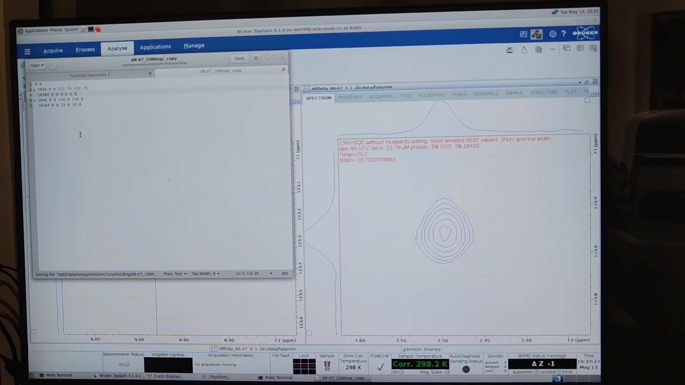

5. Run `sino2D`, choose **peak1.txt**—note **SINO** value.
6. Repeat for the other dataset and for 2–3 additional peaks to compare classic vs. BEST performance.

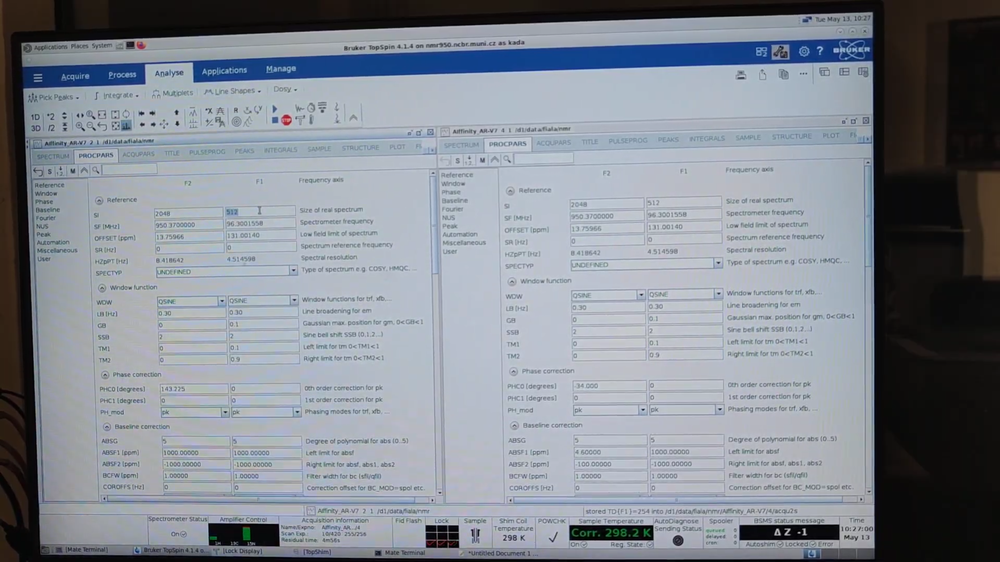

---

## 9. Summary Checklist

| Step              | Command               | Purpose                |
| ----------------- | --------------------- | ---------------------- |
| New dataset       | `edc`                 | Copy parameters        |
| Temperature       | `edte`                | Set temp               |
| Parameter check   | `edasp`, `eda`        | Verify & edit settings |
| Probe tune/match  | `atmm`                | ¹H & ¹⁵N matching      |
| Lock optimize     | `loopadj`             | Fine lock              |
| Shim              | `topshim gui`         | 1-D then 3-D shim      |
| Pulse calibration | `zg`, `ased`          | Optimize P1            |
| Water reference   | `eda`                 | Set O1{F2}             |
| Acquire HSQC      | `zg`                  | Start 2-D run          |
| BEST HSQC         | `edc` → BEST sequence | Faster variant         |
| S/N analysis      | `sino2D`              | Compare datasets       |

---

**You are now ready to run reliable ¹H–¹⁵N HSQC experiments and quantitatively compare classic and BEST pulse sequences!**
